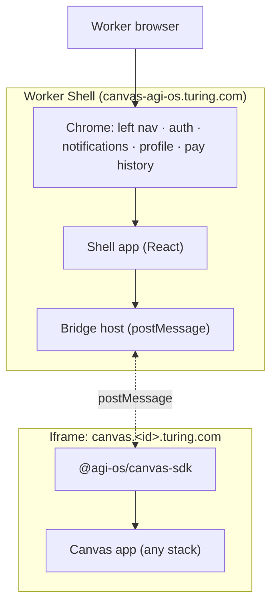
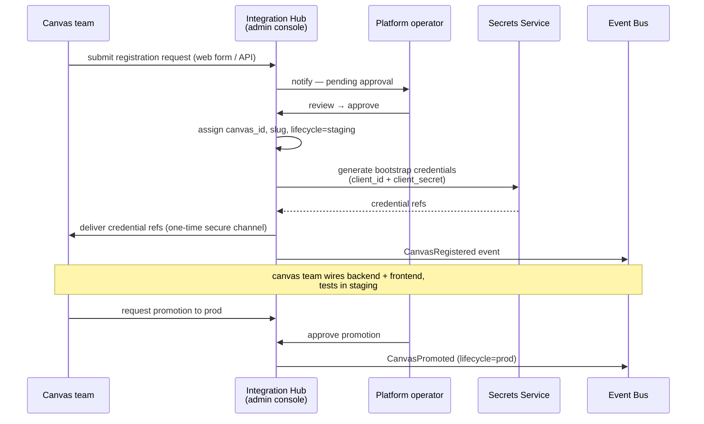
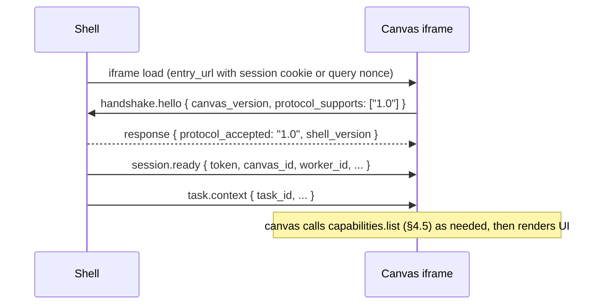
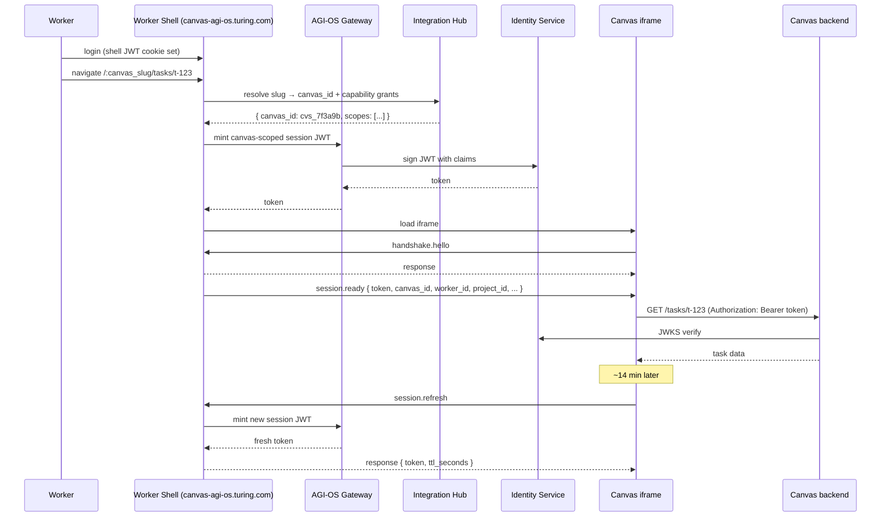
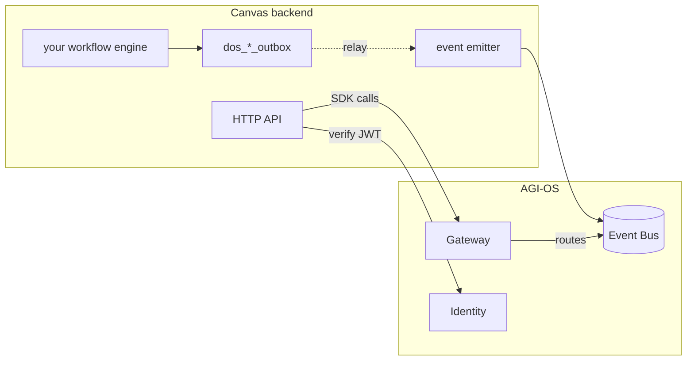

# Canvas SDK — How Task Execution Canvases Plug Into AGI-OS

> How a Task Execution Canvas (TEC) integrates with AGI-OS — at the frontend shell, at the backend gateway, and via events.

## Status

**Draft v0.5.** Worker-shell architecture: **iframe + bridge SDK**. **Canvas registration is owned by Integration Hub** (no YAML manifest — §3 is a pointer, not a schema). **Capability adoption is runtime discovery, MCP-style** (§4). v1 bridge surface is deliberately minimized (§2.5).

## 1. Introduction

A canvas brings its own:

- Task execution logic (generator, validator, packager)
- Authoring UI (worker-facing)
- Backend service(s) with its own workflow engine, database, and deploy cycle

A canvas consumes from AGI-OS:

- The worker shell chrome (left nav, notifications, auth, profile, pay history)
- The admin shell (project creation, integrations, QC config, financials)
- Managed services (user pool, QC, integration hub, notification, config, audit, …)
- The canonical event bus

And emits back:

- Canonical lifecycle events (`TaskCreated`, `TaskSubmitted`, `TaskDelivered`, …)

This document is the mechanical contract. `PLATFORM_DESIGN.md §4–§6` is the conceptual model; this doc tells you how to actually wire it.

## 2. Worker-shell architecture

Canvases load into the worker shell as **iframes**, with a platform-supplied **bridge SDK** for shell ↔ canvas communication. The worker lands at `canvas-agi-os.turing.com`; the shell owns chrome; each canvas owns its content area inside an iframe.

### 2.1 Topology



**Mechanics.** Shell mounts `<iframe src="canvas.{id}.turing.com/...">` at the `/:canvas_id/*` route. All shell↔canvas interaction is `postMessage` mediated by `@agi-os/canvas-sdk`. Auth token is minted by the shell (§5) and delivered via the bridge's first message. Chrome actions (toast, navigate, modal) are canvas → shell requests (§4.2).

### 2.2 Why this path

1. **Platform thesis match.** Zone A is data governance; Zone C is look-and-feel and framework choice. Iframe is the only loader that preserves the Zone C boundary at the frontend — any shared-heap alternative (module federation, dynamic bundle, web components) smuggles a React-version or shared-library dependency across the boundary.
2. **Polyglot frontends are allowed.** Canvas teams pick their own stack (React, Vue, Svelte, vanilla). The platform will not mandate a UI framework.
3. **Deploy independence.** Canvas teams deploy their frontend on their own cadence. No shell-side rebuild required.
4. **Security boundary is free.** Browser same-origin policy + CSP enforce isolation without platform code. When partner or acquired-team canvases arrive, the boundary already exists.
5. **Precedent.** Shopify Admin + App Bridge SDK is the same pattern, at larger scale, for the same reasons. VS Code extensions and Microsoft Teams apps are variants of the same shape.

**The risk, explicit.** A lazy `window.postMessage("hi")` bridge will feel bad and burn every canvas team. The entire value of this architecture depends on the bridge SDK being well-designed: typed envelope, request/response correlation, timeouts, structured errors, version negotiation. §4 is that specification. Budget one engineer-sprint to build it properly; do not ship a 300-line stub.

### 2.3 Reassessment trigger

Revisit only if one of these fires:

- Canvas count crosses **~50**, or
- Shell cold-start **p95 > 1.5s**, or
- A canvas team hits a UX wall that demonstrably requires shared-heap embedding (not hypothetically — a concrete user journey).

At that point: add a native loader for high-frequency first-party canvases alongside the iframe path. Nothing built now is wasted; the registry already holds the `trust` field that gates which loader is used.

### 2.4 What we commit to regardless

- Worker shell at **`canvas-agi-os.turing.com`** (public worker-facing).
- Admin shell at **`agi-os.turing.com`** (internal-only, per `PLATFORM_DESIGN §4.5`).
- Canvas registration via the **Integration Hub admin console** (§3). Authoritative record lives in IH's DB, not in any YAML or git repo.
- Canvas ↔ platform **backend** over HTTP+JSON through the gateway, plus events on the bus.

### 2.5 v1 Scope & Non-Goals

Inspired partly by the ICE Secure Scripting Framework model (sandboxed iframe + host/guest bridge), but v1 is deliberately **a fraction of that surface area**. We ship the smallest correct API now and grow it only when a concrete canvas team hits a wall.

**v1 ships.**

- Iframe + `postMessage` bridge — typed envelope, handshake, request/response correlation, timeouts, version negotiation (§4.1–§4.3).
- Flat message API: `bridge.send(type, payload)` + `bridge.on(type, handler)`, hand-coded wrappers for the common shell chrome calls (§4.2, §4.4).
- **Runtime capability discovery** (`capabilities.list` / `describe` / `use`), MCP-shaped — canvas discovers what the platform offers at handshake, not via a pre-declared static file (§4.5).
- Canvas-scoped JWT handoff minted by the shell, keyed to the canvas record in IH (§5).
- Registration through IH admin console (§3). No canvas-written YAML anywhere in the system.

**v1 explicitly does NOT ship.**

| Deferred | Why we can wait |
|---|---|
| **Scripting-object wrapper** (`agios.script.getObject("shell").toast(…)` à la SSF) | Pure library layer on top of flat messages. Zero migration cost if added later, provided message names stay `<noun>.<verb>`. |
| **Interactive events with veto** (host emits `precommit`, guest returns ok/cancel) | Powerful but raises bridge complexity meaningfully. No v1 use case that strictly requires it. Add when the first `beforeSubmit` hook is actually requested. |
| **Per-role object visibility enforcement at SDK layer** | Capability sets are enforced at backend + token `scope`; SDK-layer enforcement is defense-in-depth, not v1-critical. |
| **`@agi-os/canvas-cli` (scaffold, validate, replay)** | Nice DX. First canvas team ships by filling the IH registration form by hand + a Vite template. Pain points inform v2 tooling rather than guessing now. |
| **Canvas-publishes-objects-to-shell** (e.g. `canvas.review(taskId)` invoked by shell) | v1 reviewer UX = full-page reviewer route inside the same canvas. Richer inversion waits. |
| **Double-iframe HITL** (reviewer-shell chrome hosting a canvas artifact viewer in a nested iframe) | SSF proved this works in production, so the precedent exists — but v1 reviewers load the reviewer canvas standalone. Double-iframe becomes v2 if a project demands side-by-side chrome. |

**The one forward-compat invariant we keep.**

Message names are **`<noun>.<verb>`** (`shell.toast`, `task.context`, `session.ready`, `capabilities.use`). Costs nothing now, makes a future scripting-object wrapper a mechanical transform if we ever want one. Nothing else is hedged.

**Effort envelope for v1 bridge build.** ~3 engineer-weeks: 1 week shell host library, 1 week canvas SDK, 1 week integration test + first canvas wire-up + docs. Sized to ship alongside the worker shell, not ahead of it.

### 2.6 First-party worker-shell views vs canvas-owned right pane

The worker shell is **not just chrome hosting a canvas iframe**. It also serves a set of first-party views that are platform-owned, cross-canvas, and exist precisely because no individual canvas should re-invent them.

| View | URL | Owner | Consumes |
|---|---|---|---|
| **Task Marketplace** | `/tasks` | worker-experience-service (§5.15 `COMPONENT_ARCHITECTURE`) | `user-pool` claim API across all canvases the worker has grants for; live updates from hot bus |
| **Earnings** | `/earnings` | worker-experience-service (reads billing read-model) | Billing team's read-model API (canvas contract: billing is Zone A contract; AGI-OS emits, billing computes) |
| **Vetting** | `/<slug>/vetting` | Vetting service (§5.14 `COMPONENT_ARCHITECTURE`) | Quizzes, task-trial harness, golden-dataset grading |
| **Settings / Profile** | `/settings` | worker-experience-service | Identity service + IH grants |
| **Canvas task execution** | `/<slug>/*` | **Canvas** (iframe) | Canvas's own backend |

**Rule of thumb.**

- **A screen that spans canvases** (marketplace across 3 pools, earnings across 5 projects, profile settings) → first-party worker-shell view. Platform-owned.
- **A screen that is the work itself** (rating UI, ranking UI, file-review workspace, SFT authoring) → canvas. Zone C.

**Why this matters for canvas teams.** You do not build a task list. You do not build an earnings page. You do not build an authentication screen. You build **only the right-pane work surface**. The shell renders you inside its chrome; you emit `task.event` when work advances; the shell handles every surrounding concern.

**Authored decisions that are NOT canvas-configurable** (locked by the shell):

- Global navigation structure.
- Notification panel shape (§4.9 Notification Edge delivers events; shell renders them).
- Session management, login, logout.
- Left-sidebar slug list (comes from IH grants via `worker-experience-service`).

**Canvas can theme its right pane** — color, typography of the canvas-owned area — but cannot theme the shell chrome. This is a deliberate constraint: PRD §12.5 ("the trainer should never feel like they are moving between different companies"). Chrome consistency across canvases beats per-canvas brand flexibility.

---

## 3. Canvas Registration

**Canvas registration is owned by Integration Hub.** There is no YAML manifest, no `canvas-registry` repo, no CI validation step. A canvas is registered the same way a customer integration or a platform-provider integration is registered: through the IH admin console, persisted in IH's database, protected by RBAC, credentials managed by the Secrets Service.

See `COMPONENT_ARCHITECTURE.md §4.3` for the complete data model and registration flow. This section is the canvas-team-facing summary of what that process looks like.

### 3.1 Why not a static manifest

A YAML-in-repo manifest is a **deployment artifact** pattern. Canvas registration is **identity and state** — the wrong shape for YAML:

- **No RBAC.** Commit access ≠ authorization to register a canvas.
- **No cryptographic identity.** A PR claiming to be TB is trusted on social review, not crypto.
- **Credentials can't live there.** Bridge signing keys and HMAC secrets must be in a secrets store; keeping them in sync with a YAML file guarantees drift.
- **No lifecycle state.** Staging, prod, deprecated, archived belong in a DB with a state machine, not in git history.
- **Bad queries.** "Which canvases emit `TaskDelivered`?" is a SQL query, not a repo grep.

All five problems are real and all five disappear once registration lives in the Integration Hub.

### 3.2 What canvas teams provide

The canvas team fills out a **request form** (web UI in IH admin, or an API call for programmatic onboarding). The platform operator reviews and approves. The form captures:

| Field | Meaning | Who sets it |
|---|---|---|
| `display_name` | Human-readable name ("Talent Benchmark") | Canvas team |
| `requested_slug` | Preferred URL segment ("tb") | Canvas team (platform may override on conflict) |
| `version` | Semver tag for this deploy | Canvas team |
| `entry_url` | Iframe URL the shell loads | Canvas team |
| `backend_url` | Canvas backend API base URL | Canvas team |
| `health_path` | Health endpoint on backend | Canvas team (default `/health`) |
| `owners` | Engineering + product email, oncall channel | Canvas team |

That is the entire registration input. ~8 fields. **No events list. No capability adoption list. No SLO claims. No routes. No CSP config. No `canvas_id`.**

### 3.3 What the platform returns

On approval, IH:

1. **Assigns an immutable `canvas_id`** — `cvs_<short-nonce>`. Not human-readable, not user-chosen, never reused, never re-typed. Lives in tokens, events, billing records, audit rows. Canvas teams never see it as a config value.
2. **Allocates the `slug`** — uses `requested_slug` if free, otherwise appends a suffix or asks the team to pick a new one.
3. **Mints bootstrap credentials** — stored in the Secrets Service, delivered to the canvas team via a one-time secure channel. Used by the canvas backend to authenticate to platform services.
4. **Sets the lifecycle state** — initial state is `staging`. Transitions to `prod` are explicit operator actions (not merge events). Transitions to `deprecated` and `archived` are similarly explicit.
5. **Emits a registration event** — `CanvasRegistered` on the bus. Other platform components (audit log, observability) react as normal.

Nothing else. Events, capabilities, SLOs, routes — **all come from runtime, not from registration** (see §4.5 for capability discovery).

### 3.4 Registration flow



### 3.5 Lifecycle states

| State | Meaning | Who can route traffic | Transition in |
|---|---|---|---|
| `staging` | Registered but not production-eligible. Workers on staging shell only. | Staging only | Operator approval after initial registration |
| `prod` | Production-eligible. Real projects can route to it. | Prod + staging | Operator approval after successful staging canary |
| `deprecated` | No new projects, existing projects continue. Visible warning in admin. | Existing routes only | Operator decision (e.g. canvas being retired) |
| `archived` | Read-only historical record. No traffic. | None | Operator decision after full drain |

Every transition is audited: `who`, `when`, `from_state`, `to_state`, `reason`. The audit row is in `dos_ih_integration_audit`.

---

## 4. Bridge Protocol

The canvas iframe and the shell communicate via `postMessage`. The protocol wraps that primitive in typed messages, request/response correlation, timeouts, and version negotiation.

> **v1 shape.** Flat message API — `bridge.send(type, payload)` + `bridge.on(type, handler)`. No scripting-object wrapper, no interactive-events-with-veto, no CLI. See §2.5 for the explicit v1/v2 cut. The message names below use the `<noun>.<verb>` convention so a future scripting-object layer can wrap them without a wire-protocol change.

### 4.1 Envelope

Every message on the wire has this envelope:

```typescript
interface BridgeEnvelope {
  protocol: "agi-os/bridge";    // discriminator (ignore unknown)
  version: "1.0";                // protocol version
  kind: "request" | "response" | "event";
  id: string;                    // uuidv4; request/response correlate on this
  type: string;                  // e.g. "shell.toast", "auth.ready"
  timestamp: number;             // epoch ms, from sender's clock
  payload: unknown;              // typed per `type`
  error?: BridgeError;           // populated on response, kind="response" only
}

interface BridgeError {
  code: string;                  // enum, see §4.6
  message: string;               // human-readable, English
  retryable: boolean;
  details?: unknown;
}
```

Rules:

1. Every `request` expects exactly one `response` with matching `id`, within a timeout (default 10 s; overridable per message).
2. `event` has no response and no correlation — fire-and-forget broadcast.
3. Unknown `type` → responder sends `response` with `error.code = "unknown_type"`. Canvas must handle gracefully (older shell, newer canvas).
4. Version mismatch is handled at handshake (§4.3), not per-message.

### 4.2 Message catalog

Shell → Canvas messages:

| Type | Kind | Purpose | Payload |
|---|---|---|---|
| `session.ready` | event | First message after handshake; delivers token + worker + canvas context | `{ token, worker_id, project_id, canvas_id, ttl_seconds }` |
| `session.refreshed` | event | New token issued; canvas swaps in | `{ token, ttl_seconds }` |
| `task.context` | event | Current task ref (route changed, task assigned) | `{ task_id, pool_id, metadata }` |
| `notification.message` | event | Platform notification relevant to the canvas's current view | `{ severity, body, action_url? }` |
| `canvas.dispose` | event | Worker is navigating away; canvas should persist state and stop | `{ reason }` |

Canvas → Shell messages:

| Type | Kind | Purpose | Payload |
|---|---|---|---|
| `handshake.hello` | request | Opens the session; canvas version negotiation only (canvas identity comes from the token) | `{ canvas_version, protocol_supports: ["1.0"] }` → `{ protocol_accepted: "1.0", shell_version }` |
| `session.refresh` | request | Token is expiring; request fresh | none → `{ token, ttl_seconds }` |
| `shell.toast` | request | Show toast in shell's chrome | `{ level: "info"\|"success"\|"warn"\|"error", body, duration_ms? }` → `{ ok: true }` |
| `shell.navigate` | request | Route the shell to a path (within allowlisted prefixes) | `{ target: "/tb/dashboard" \| "same-canvas:/tasks/123" }` → `{ ok: true }` |
| `task.event` | event | Canvas-driven task state signal; shell updates URL/breadcrumb | `{ type: "task_loaded" \| "task_submitted" \| "task_abandoned", task_id, path? }` |
| `canvas.crash` | event | Canvas hit an unrecoverable error; shell shows recovery UI | `{ error_message, support_ref }` |

**Cut from v1, kept for the record**: `shell.open_modal`, `shell.open_link` (canvas can do both in-iframe; adds shell complexity with no concrete v1 need). Will re-evaluate if a canvas team asks.

### 4.3 Handshake

Identity of the canvas is **always** established by the token, never by a client-supplied claim. The handshake negotiates protocol version only.



Handshake rules:

1. Canvas **must** send `handshake.hello` within 5 s of iframe load. Failure → shell shows "canvas unresponsive" recovery UI.
2. If no common protocol version in `protocol_supports`, shell sends error + shows incompatible-canvas UI.
3. Shell delivers `session.ready` **only after** successful handshake. The `canvas_id` in that message is platform-authoritative (from IH registration, not from anything the canvas sent).

### 4.4 SDK surface

Platform ships `@agi-os/canvas-sdk` (TypeScript). The canvas-facing API is flat: `bridge.send(type, payload)` and `bridge.on(type, handler)`. Wrappers for the most-used messages live as named helpers.

Canvas side:

```typescript
import { bridge } from "@agi-os/canvas-sdk";

await bridge.connect();

bridge.on("session.ready", ({ token, workerId, canvasId, projectId }) => {
  // store token; canvas_id is authoritative from the platform
});
bridge.on("task.context", ({ taskId }) => { /* load task */ });

await bridge.send("shell.toast", { level: "success", body: "Saved" });
await bridge.send("task.event", { type: "task_submitted", task_id: taskId });

// Token refresh
if (bridge.session.expiresInSeconds() < 60) {
  await bridge.send("session.refresh");
}
```

Shell side (same SDK package, different entry point):

```typescript
import { ShellHost } from "@agi-os/canvas-sdk/shell";

const host = new ShellHost({
  iframe: iframeEl,
  canvasRecord,  // fetched from IH by canvas_id
  mintToken: async () => await mintCanvasScopedToken({ canvasId, workerId }),
  onCrash: ({ canvasId, errorMessage }) => { /* recovery UI */ },
});

host.on("shell.toast",     async ({ payload }) => { toastService.show(payload); return { ok: true }; });
host.on("shell.navigate",  async ({ payload }) => { router.push(payload.target); return { ok: true }; });
host.on("task.event",      async ({ payload }) => { updateShellContext(payload); });
```

### 4.5 Capability discovery (MCP-shaped)

What the platform offers to a canvas — user pool, QC, IH outbound, batching, HITL, notification, artifact, config — is discovered at runtime, not declared in a static file. The pattern is MCP's: the host advertises a capability set; the client calls `list`, `describe`, and invokes.

**Messages:**

| Type | Kind | Direction | Purpose |
|---|---|---|---|
| `capabilities.list` | request | canvas → shell | Enumerate capabilities this canvas's token authorizes |
| `capabilities.describe` | request | canvas → shell | Get full method + event schema for one capability |
| `capabilities.use` | request | canvas → shell | Invoke a capability method (proxied to platform backend via gateway) |
| `capabilities.changed` | event | shell → canvas | Capability set changed mid-session (e.g. scope added, capability deprecated) |

**Example — user pool adoption, runtime:**

```typescript
const caps = await bridge.send("capabilities.list");
// → { capabilities: ["user_pool", "qc", "ih_outbound", "notification", "artifact"] }

const poolSpec = await bridge.send("capabilities.describe", { capability: "user_pool" });
// → { methods: [{name: "claim", schema: {...}}, ...], events_emitted: [...] }

const claimed = await bridge.send("capabilities.use", {
  capability: "user_pool",
  method: "claim",
  args: { pool_id: "tb-main", strategy: "SkillMatch" },
});
// → { unit_id, ttl_expires_at, metadata }
```

**What the platform does under the hood.** `capabilities.use` is not a client-side façade — it's a typed RPC. The shell forwards the call to the gateway, which routes to the owning Zone B service, which authorizes against the token's scope claim. The canvas never hits the service directly for capability calls (it still can for its own canvas-specific backend APIs).

**Authorization is scope-based, not manifest-based.** The canvas's token carries `scopes: ["user_pool:claim", "user_pool:heartbeat", "ih_outbound:emit_delivered", ...]`. Platform enforces on every call. No YAML duplication. Adding a capability for a canvas is an IH admin action (grants additional scopes); deprecating one is a scope revoke plus `capabilities.changed` push.

**Why this instead of a manifest.**

| YAML manifest adoption | Runtime capability discovery |
|---|---|
| Static declaration of intent | Actual authorization, enforced on every call |
| Requires PR + redeploy to add a capability | Platform operator flips a scope; takes effect immediately |
| Drift between YAML and reality is silent | No YAML; there is no reality to drift from |
| Cross-canvas query is a repo-wide grep | Cross-canvas query is a SQL `JOIN` against IH + scope tables |

**Not every capability is MCP-shaped.** Some are event-pipeline-shaped: **batching**, **HITL**, **audit log**. These are consumed via event subscription, not method invocation. The canvas emits into them, they emit back. Capability discovery still lists them (`capabilities.describe` returns an event-shape descriptor instead of a method list) so a canvas team can enumerate what's available uniformly.

### 4.6 Security

| Concern | Defense |
|---|---|
| Canvas impersonates another canvas | `event.origin` validated against IH-registered `entry_url` origin on every message. Identity in the token is from IH, not self-asserted. |
| Canvas reads shell DOM | Browser same-origin policy — free |
| Canvas navigates shell away via `shell.navigate` | Shell allowlists path prefixes to the canvas's own slug + a small set of shell routes |
| Canvas exfiltrates token via XSS | Token is canvas-scoped: short TTL, single project, single worker; blast radius bounded |
| Shell mints token for wrong canvas | Token `canvas_id` claim is signed by platform identity service; canvas backend verifies on every API call |
| Replay of old token after logout | Token `jti` tracked in revocation list until TTL expiry |
| Capability escalation | `capabilities.use` is authorized against the token's `scope` claim — not the canvas's self-report |

### 4.7 Error codes

| Code | When |
|---|---|
| `unknown_type` | Receiver doesn't handle that message type |
| `unauthorized` | Canvas sent a request before `session.ready`, or token is invalid |
| `forbidden` | Token valid but missing the scope for the requested capability method |
| `timeout` | Request exceeded its timeout |
| `rate_limited` | Canvas exceeded per-second message budget |
| `invalid_payload` | Payload failed schema check |
| `shell_denied` | Shell refused (e.g. navigate to non-allowlisted path) |
| `capability_unavailable` | Canvas asked for a capability not in its set, or deprecated mid-session |
| `canvas_closed` | Shell tried to send to a canvas that has sent `canvas.dispose` |

### 4.8 Versioning

Protocol version lives in the envelope `version` field. Within a major version, new message types and optional payload fields can be added (canvases/shells ignore unknown). Major bump requires full handshake recompat: shell advertises supported versions in the `handshake.hello` response, canvases pick the newest both sides support.

---

## 5. Auth Handoff

Two credential types, serving two different concerns. Do not conflate them.

| Credential | Who holds it | What it authorizes | Lifetime |
|---|---|---|---|
| **Canvas service credentials** | Canvas backend | Calling platform services (publish events, read config, call capability APIs server-to-server) | Long-lived, rotated on schedule or on demand |
| **Canvas-scoped session JWT** | Canvas frontend (iframe), via the bridge | Scoped to one worker in one project, short-lived | 15 min default, refreshable |

### 5.1 Canvas service credentials (backend-to-platform)

Issued at canvas registration (§3.3). Standard OAuth 2.0 client credentials:

- `client_id` — tied to the canvas's `canvas_id`
- `client_secret` — stored in Secrets Service, delivered to canvas team once over a secure channel, rotatable

Canvas backend exchanges these for a short-lived service access token at the identity service, uses it on platform API calls. No bridge involved. Standard server-side OAuth flow.

Scope on service credentials is **narrower than frontend scope** — canvas backend can emit events for itself and call the capability APIs it has been granted, but cannot act on behalf of an arbitrary worker.

### 5.2 Canvas-scoped session JWT (frontend, per worker)

The worker is authenticated to AGI-OS via the shell's JWT cookie (existing pattern, `services/shared/shared/auth/`). That cookie is scoped to `canvas-agi-os.turing.com`, the canvas lives at a different origin, and cross-origin cookies don't travel — which is what we want. The canvas does not need shell authority.

Shell mints a **canvas-scoped JWT** for each iframe session. Claims:

```json
{
  "iss": "https://identity.agi-os.turing.com",
  "sub": "worker:12345",
  "aud": "canvas:cvs_7f3a9b",
  "canvas_id": "cvs_7f3a9b",
  "worker_id": "12345",
  "project_id": "p-abc-123",
  "task_id": "t-xyz-789",
  "scope": ["user_pool:claim", "user_pool:heartbeat", "task:submit", "artifact:write"],
  "iat": 1761234567,
  "exp": 1761235467,
  "jti": "uuid"
}
```

Properties:

- **Short-lived.** 15-minute TTL by default.
- **Narrowly scoped.** Worker + project + canvas + optional task + explicit scope list.
- **Platform-authoritative `canvas_id`.** Not user-chosen — the IH-assigned `cvs_*` nonce (§3.3).
- **Scope reflects IH grants.** The scope list is derived from the canvas's IH-registered capability grants intersected with the worker's role.
- **Refreshable** via `session.refresh`. **Revocable** via `session.refreshed` push.

### 5.3 Flow



### 5.4 Backend verification

Canvas backends verify the session JWT via:

1. **JWKS** — shared public keys from the identity service. Standard JWT library. **Default.**
2. **Introspection endpoint** — `POST /identity/introspect`. Required only if the canvas needs sub-TTL revocation awareness.

### 5.5 Scope enforcement

The token's `scope` is the canvas's authority. Check on every request:

```python
@require_scope("task:submit")
async def submit_task(task_id: str, user: CanvasUser):
    if user.task_id != task_id:
        raise HTTPException(403, "task mismatch")
    ...
```

Scope strings are enumerated per capability. The live list is served by `capabilities.describe` (§4.5) — canvases don't hardcode it.

### 5.6 What the canvas does NOT get

- **Shell session cookie.** Different origin; can't read it.
- **Other workers' data.** Token is worker-scoped.
- **Other projects' data.** Token is project-scoped (one project per token).
- **Operator permissions.** Even if the human is also an admin operator, the session JWT carries only worker scope.
- **Capabilities not granted in IH.** `scope` claim is derived from IH grants; the canvas cannot ask for more at runtime.

---

## 6. Onboarding Playbook

End-to-end, from "we want to join AGI-OS" to "our first worker completed a task." Estimated elapsed time: **2 weeks for a team with a working backend**.

### 6.1 Phase 0 — Decide (day 0, 2 hrs)

1. Read `PLATFORM_DESIGN.md` and this document.
2. Map your existing system to the canonical state machine (`PLATFORM_DESIGN §11`). Note which internal states collapse onto which canonical state.
3. Identify which Zone A events you will emit and consume (`EVENT_CATALOG.md`).
4. Identify which Zone B capabilities you want to consume (`COMPONENT_ARCHITECTURE.md §0`).
5. Meet with platform team (60 min) — architecture review, adoption plan, capability grants requested.

### 6.2 Phase 1 — Register with Integration Hub (day 1)

1. Submit the registration form in the IH admin console (§3.2): `display_name`, `requested_slug`, `version`, `entry_url`, `backend_url`, `health_path`, `owners`.
2. Platform operator reviews — same-day in steady state. Approval is a button click, not a merge event.
3. On approval, you receive:
    - `canvas_id` (`cvs_*`), to be used in logs and support tickets — never typed into config.
    - `client_id` + `client_secret` (one-time secure delivery). Store in your secrets system; rotate on schedule.
    - List of capability scopes granted (requested in Phase 0, adjusted by ops).
4. Lifecycle state is `staging`. You are not production-reachable yet.

### 6.3 Phase 2 — Wire the backend (days 2–6)



Concrete steps:

1. Install `@agi-os/sdk` (Python or Node).
2. Exchange `client_id` + `client_secret` for a service access token (standard OAuth 2.0 client credentials). Use that to call platform APIs and publish events.
3. Implement auth on your own API: JWKS verification for incoming session JWTs.
4. Implement outbox table + relay in your service; point relay at platform Redis Streams.
5. For each canonical event you emit in your canvas flow, wire it at the correct lifecycle point (see `EVENT_CATALOG.md`).
6. Subscribe to the events you need to react to (typically `UnitClaimed`, `TaskAccepted`, `TaskDeliveryAcked`).
7. Implement `/health` — platform pings it every 30 s.
8. Integration test against **staging platform** (`staging.agi-os.turing.com`).

Exit criteria: a staging task round-trips through your canvas emitting the full event sequence.

### 6.4 Phase 3 — Wire the frontend (days 7–10)

1. Pick your stack. Any stack. React, Vue, Svelte, vanilla — all fine.
2. Serve your canvas at your `entry_url` origin. (Typically a subdomain you own — platform does not mandate a shape.)
3. Install `@agi-os/canvas-sdk`. Implement:
   ```typescript
   await bridge.connect();
   bridge.on("session.ready", ({ token, canvasId, workerId, projectId }) => { ... });
   bridge.on("task.context", ({ taskId }) => { ... });

   const caps = await bridge.send("capabilities.list");
   // use what you need via bridge.send("capabilities.use", { capability, method, args })
   ```
4. Send `handshake.hello` on load (protocol version negotiation only — identity comes from the token).
5. For canvas-initiated UX concerns (toast, navigation), use the bridge.
6. Test in the staging worker shell (`staging.canvas-agi-os.turing.com/<slug>`).

Exit criteria: a worker in staging can complete a task end-to-end in your canvas, with shell chrome working as expected.

### 6.5 Phase 4 — Sandbox test (days 11–12)

Platform provides a **sandbox test harness** that:

- Creates a synthetic customer that accepts outbound webhooks (observable + verifiable).
- Injects tasks into your canvas via staging gateway.
- Plays recorded worker interaction scripts.
- Asserts the full event sequence matches the canonical state machine.
- Verifies `TaskDeliveryAcked` arrives within SLO.

Pass the harness → canvas is ready for production canary.

### 6.6 Phase 5 — Production canary (days 13–14)

1. Request prod promotion in IH admin console; operator approves. Lifecycle transitions `staging → prod`.
2. Single pilot project routed to your canvas.
3. Dashboards watched jointly by your team and platform oncall for 48 hrs.
4. If green: open up to full production traffic.
5. If red: operator flips lifecycle back to `staging` in IH — instant; shell stops loading the canvas for prod projects.

### 6.7 Ongoing

| Concern | Platform's | Canvas's |
|---|---|---|
| Shell chrome | ✅ | — |
| Auth infra | ✅ | verify token on API |
| Event bus + outbox relay | ✅ | write outbox rows in-transaction |
| Customer delivery | ✅ (IH Outbound) | emit `TaskDelivered` |
| QC rubrics | — | implement rubrics, emit `TaskValidated` |
| Billing events | — | emit correctly per `pay_model` |
| SLO dashboards | ✅ (auto from events) | — |
| Canvas backend uptime | — | ✅ |
| Bug in canvas-specific task logic | — | ✅ |

### 6.8 Canvas-specific walkthroughs

Three examples mapping real canvases onto the playbook. Each is a sketch; the canvas team fills detail.

#### 6.8.1 TB

- **Capability grants requested.** `user_pool:*` (with strategies overridden to `SkillMatch` + `Sliding TTL` via platform config, not YAML), `qc:*`, `ih_outbound:emit_delivered`, `notification:subscribe`. HITL is TB-owned for now — emits canonical review events, does not consume the platform HITL capability.
- **Emitted.** `TaskCreated`, `TaskSubmitted`, `TaskDelivered`, `UnitCompleted`, `CandidateReviewed` (TB-specific, in canvas-namespaced catalog).
- **Consumed.** `UnitClaimed`, `TaskAccepted`, `TaskRejected`, `TaskDeliveryAcked`.
- **Migration.** Existing Temporal workflows kept; outbox added to the state-store path. Frontend already React; wraps into iframe at the TB-chosen subdomain.

#### 6.8.2 GDPVal

- **Capability grants requested.** No platform `user_pool` grant — GDPVal runs its own Firestore pool and emits canonical `Unit*` events (so downstream platform consumers remain uniform). `qc:*` requested. `ih_outbound:emit_delivered`.
- **Emitted.** Full canonical lifecycle + GDPVal-namespaced rubric events.
- **Consumed.** `TaskDeliveryAcked`.
- **Migration.** `app_configs` migrates to Config Service; Cloud Tasks workflow kept.

#### 6.8.3 OpenClaw

- **Capability grants requested.** Everything platform offers — canonical "consume the defaults" canvas. The reason the platform exists.
- **Emitted.** Full canonical lifecycle; no canvas-specific events.
- **Consumed.** `UnitClaimed`, `TaskAccepted`, `TaskRejected`, `TaskDeliveryAcked`.
- **Why defaults everywhere.** New canvas, no legacy system, no special requirements. Ships in two weeks.
