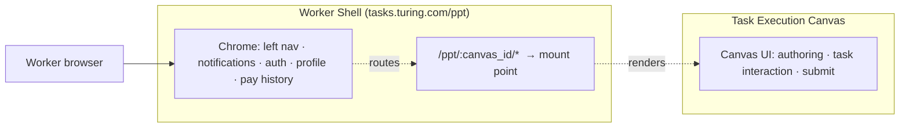
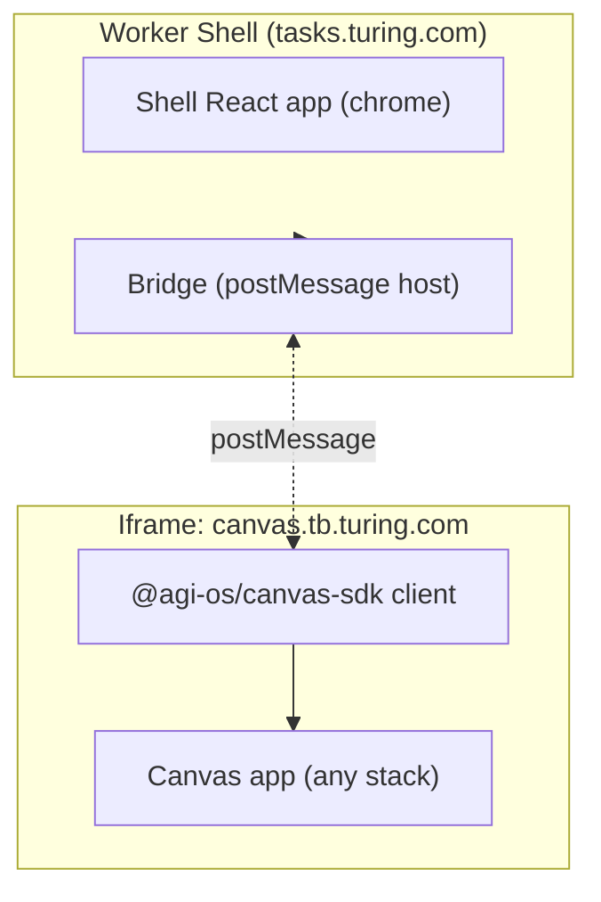
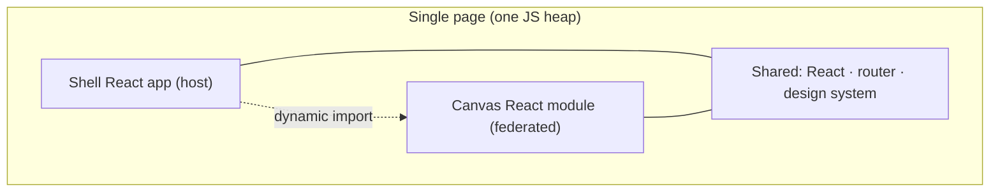
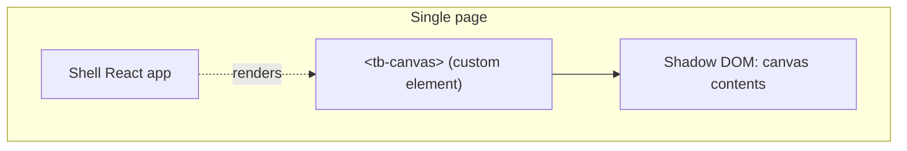
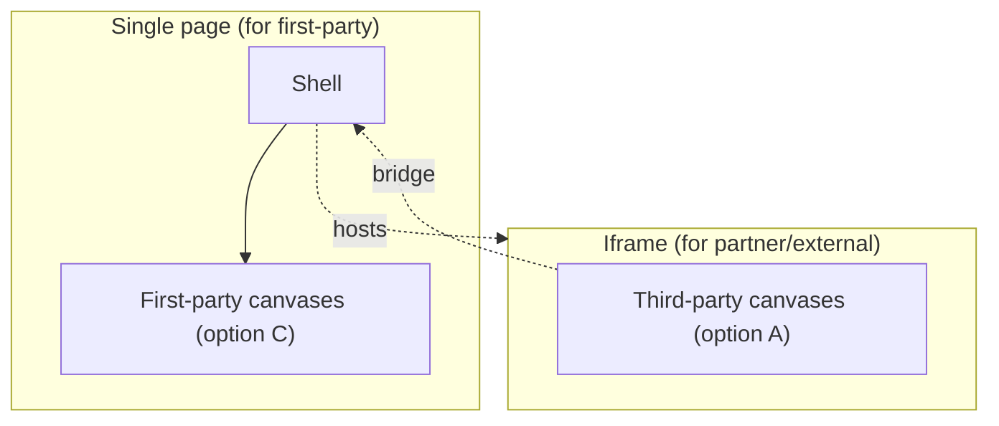
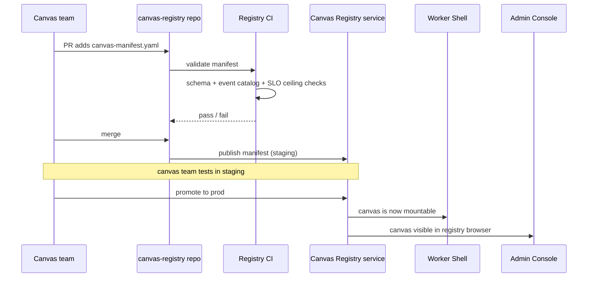
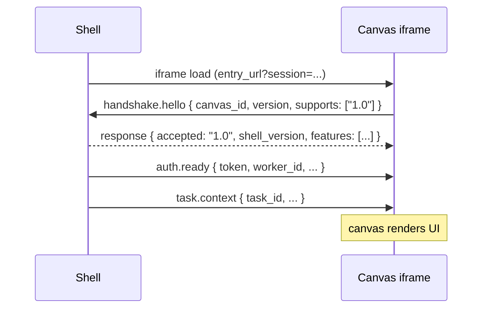
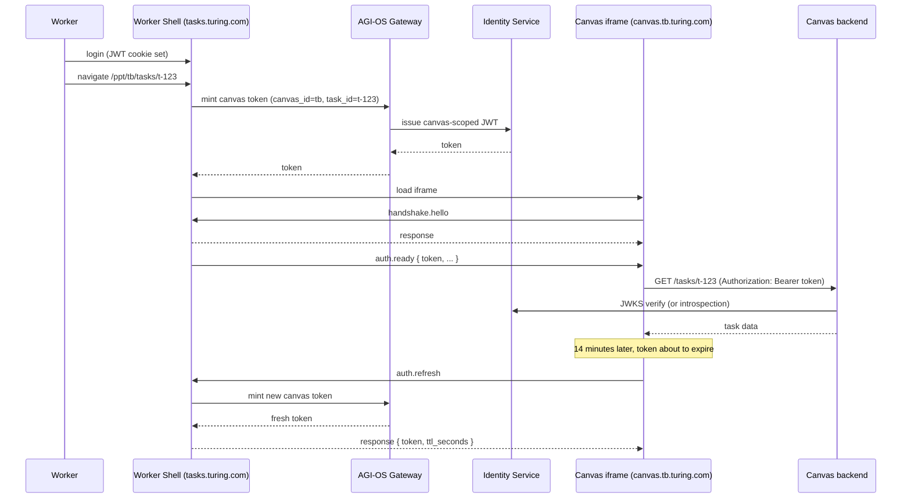
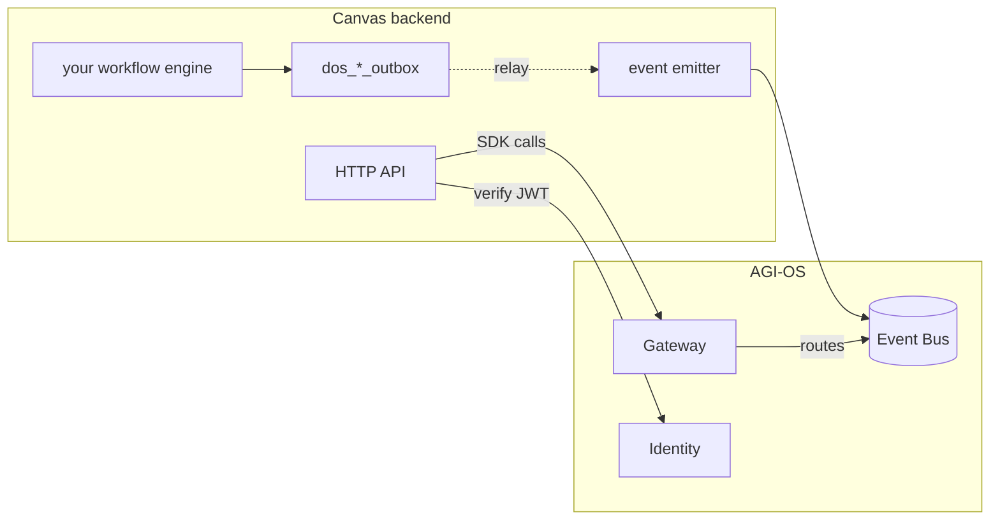

# Canvas SDK — How Task Execution Canvases Plug Into AGI-OS

> How a Task Execution Canvas (TEC) integrates with AGI-OS — at the frontend shell, at the backend gateway, and via events.

## Status

**Draft v0.3.** Worker-shell architecture **decided — Option A (iframe + bridge SDK)**. §3–§6 filled with the implementation contract. **v1 scope deliberately minimized** (see §2.8) — we ship the smallest correct surface now, grow it when adoption demands, not before.

## 1. Introduction

A canvas brings its own:

- Task execution logic (generator, validator, packager)
- Authoring UI (worker-facing)
- Backend service(s) with its own workflow engine, database, and deploy cycle

A canvas consumes from AGI-OS:

- The worker shell chrome (left nav, notifications, auth, profile, pay history)
- The admin shell (project creation, integrations, QC config, financials)
- Managed services (user pool, QC, integration hub, notification, config, audit, …)
- The canonical event bus

And emits back:

- Canonical lifecycle events (`TaskCreated`, `TaskSubmitted`, `TaskDelivered`, …)

This document is the mechanical contract. `PLATFORM_DESIGN.md §4–§6` is the conceptual model; this doc tells you how to actually wire it.

## 2. Worker-shell architecture — DECIDED: Option A (iframe + bridge SDK)

> **Decision, 2026-04-21.** Canvases load into the worker shell as iframes, with a platform-supplied bridge SDK for shell ↔ canvas communication.
>
> **Primary driver.** Zone A is data governance; look-and-feel is Zone C. That sentence only holds if canvases are free to pick their own frontend stack. Iframe is the only loader that preserves that freedom without smuggling a React-version dependency across the boundary.
>
> **Secondary drivers.** Deploy independence; free security boundary; Shopify-class industry precedent; downgrade-to-hybrid (Option E) path remains open if first-party canvases later justify a native loader at scale.
>
> **Reassessment trigger.** Canvas count crosses ~50 **or** measured shell-cold-start > 1.5 s p95. At that point, evaluate Option E (hybrid) to add a native loader for high-frequency first-party canvases alongside the iframe path. Nothing built for A is wasted.
>
> **What the brainstorm below is for.** Preserved as the decision record. Read if you want to understand *why not* the other four options. Skip if you just want the implementation contract — jump to §3.

The worker lands at `tasks.turing.com/ppt`. The shell owns chrome; the canvas owns content. The question is **how the shell loads and renders the canvas**.

### 2.1 The base picture



The shell and canvas together are one logical UX. The open question is whether they share a browser context, a JavaScript heap, or a bundle.

### 2.2 The five realistic options

Two dismissed up front:

- **Subdomain redirect** (`tasks.turing.com → canvas.tb.turing.com`). Loses the shell value; chrome duplicates per canvas. Not a shell anymore.
- **Inverted embedding** (canvas imports `@agi-os/shell-sdk` and renders its own chrome). Chrome drifts; shell stops being centralized.

The five that are worth considering:

#### Option A — Iframe + Bridge SDK



**Mechanics.** Shell hosts canvas in `<iframe src="canvas.tb.turing.com/...">`. All shell↔canvas interaction is via `postMessage` mediated by `@agi-os/canvas-sdk`. Auth token is minted by shell, passed to canvas via initial message. Chrome actions (toast, navigate, modal) are canvas → shell requests.

#### Option B — Module Federation (Webpack 5 / Vite)



**Mechanics.** Canvas is published as a federated module (remote entry URL). Shell imports at runtime. React tree is shared; props pass directly; no postMessage.

#### Option C — Dynamic route + lazy bundle

```mermaid
flowchart TB
    subgraph Page["Single page"]
        ShellApp["Shell React app"]
        Router["React Router"]
        CanvasBundle["Canvas bundle (lazy-loaded)"]
    end
    ShellApp --> Router
    Router -. React.lazy .-> CanvasBundle
```

**Mechanics.** Canvas ships one JS bundle exposing a default-exported React component. Shell lazy-imports at route entry. Simpler than module federation — no webpack remote config, just a URL and a component contract.

#### Option D — Web Components



**Mechanics.** Canvas publishes a custom element. Shell renders `<tb-canvas data-task-id="…" />`. Shadow DOM provides style isolation. Framework-agnostic.

#### Option E — Hybrid (first-party native + third-party iframe)



**Mechanics.** Canvas manifest declares `"trust": "first_party" | "partner"`. Shell picks loader based on trust level. Most complex, most flexible.

### 2.3 Comparison

| | A — Iframe | B — Module Fed | C — Dynamic Bundle | D — Web Components | E — Hybrid |
|---|---|---|---|---|---|
| Framework lock | None | **React-only, matched versions** | **React-only** | None | Mixed |
| Isolation | **Very high** (separate origin) | Low (shared heap) | Low | Medium (shadow DOM) | Mixed |
| Deploy independence | **Very high** | Medium | Medium-high | High | Mixed |
| Shared state across shell+canvas | Awkward (postMessage only) | **Trivial** (same heap) | **Trivial** | Awkward | Mixed |
| UX quality w/ good SDK | Good | **Excellent** | **Excellent** | Good | Best |
| Security boundary | **Free** (browser enforces) | Manual | Manual | Partial | Mixed |
| Debugging | Cross-frame tools needed | Single stack trace | Single stack trace | Single stack trace | Mixed |
| Tooling maturity | Mature | Mature | Mature | Growing | Custom |
| Shopify equivalent | ✅ this is Shopify Admin | ❌ | ❌ | ❌ | ❌ |
| Stripe Dashboard equivalent | ❌ | ❌ | ✅ this is Stripe | ❌ | ❌ |
| Effort (shell + SDK build) | Medium-High (postMessage SDK is real work) | Medium (build config) | **Low** | High (shadow DOM issues) | Highest |

### 2.4 Industry references

| Company | Pattern | What they optimize for |
|---|---|---|
| Shopify Admin + Apps | **A** (iframe + App Bridge SDK) | Third-party apps; any stack; isolation-as-security |
| Stripe Dashboard | **C** (dynamic bundle) | Unified team; all React; speed |
| VS Code + extensions | Process-per-extension + postMessage | Max isolation; polyglot extensions |
| Microsoft Teams | **E** (first-party native + third-party iframe) | Deliberate hybrid |
| Notion databases | **C** | First-party only |

### 2.5 Rationale recap — why A wins

Briefest form:

1. **Platform thesis match.** Zone A = data governance. Zone C = look-and-feel + framework choice. Iframe is the only loader that preserves the Zone C boundary at the frontend.
2. **Polyglot frontend is allowed.** Platform confirms no framework mandate (`PLATFORM_DESIGN §6.3`, "Authoring UI" row). Module-federation / dynamic-bundle options quietly require React-version coordination; iframe doesn't.
3. **Deploy independence.** Canvas teams deploy their own frontend on their own cadence; no shell-side rebuild required.
4. **Security boundary is free.** Same-origin policy + CSP enforce isolation automatically. When partner canvases eventually arrive (even internal-but-acquired teams count), the boundary is already there.
5. **Downgrade path preserved.** If we later hit the Option E trigger (count >50 or p95 cold-start >1.5s), adding a native loader for first-party canvases is additive. No rework of A.

**The risk, explicit.** A cheap `window.postMessage("hi")` bridge will feel bad. The value of Option A is entirely gated on the bridge SDK being well-designed (typed messages, request/response correlation, timeouts, structured errors, version negotiation). §4 specifies that SDK. **Plan for one engineer-sprint to build it properly; do not ship a 300-line postMessage stub and call it done.**

### 2.6 Inputs that drove the call

Decision dated 2026-04-21, based on three inputs:

| Input | Answer | Effect |
|---|---|---|
| Will any canvas be built by a non-Turing team? | Not now (reassess later) | Reduced isolation-as-security weight; did **not** flip the call — polyglot freedom alone is sufficient. |
| Will the platform mandate React + a shared design system? | No. Platform governs data, not visuals. | **This was decisive.** Any non-iframe option couples frontend stacks. |
| Canvas count at steady state? | Unknown; 20–50 is the realistic range. | Below the 50 reassessment trigger. |

### 2.7 What we commit to regardless

Independent of the shell-architecture choice, these remain locked:

- Worker shell is at **`tasks.turing.com/ppt`** (public worker-facing domain).
- Admin shell is at **`agi-os.turing.com`** (internal-only, per `PLATFORM_DESIGN §4.5`).
- Canvas registration is via **Canvas Manifest** declared at deploy time (§3).
- Canvas ↔ platform **backend** communication is HTTP+JSON via the gateway, plus events on the bus.

### 2.8 v1 Scope & Non-Goals

Inspired partly by the ICE Secure Scripting Framework model (sandboxed iframe + host/guest bridge), but v1 is deliberately **a fraction of that surface area**. We ship the smallest correct API now and grow it only when a concrete canvas team hits a wall.

**v1 ships.**

- Iframe + `postMessage` bridge, with typed envelope, handshake, request/response correlation, timeouts, version negotiation (§4.1–§4.3).
- One flat message API, `bridge.send(type, payload)` + `bridge.on(type, handler)`, hand-coded wrappers for the common shell chrome calls (§4.2, §4.4).
- Canvas-scoped JWT handoff (§5).
- Hand-written `canvas-manifest.yaml` + Vite/Next/any template (§3, §6.4).

**v1 explicitly does NOT ship.**

| Deferred | Why we can wait |
|---|---|
| **Scripting-object wrapper** (`agios.script.getObject("shell").toast(…)` à la SSF) | Pure library layer on top of flat messages. Zero migration cost if added later, provided message names stay `<noun>.<verb>`. |
| **Interactive events with veto** (host emits `precommit`, guest returns ok/cancel) | Powerful but raises bridge complexity meaningfully. No v1 use case that strictly requires it. Add when the first `beforeSubmit` hook is actually requested. |
| **Per-role object visibility enforcement at SDK layer** | Capability sets are enforced at backend + token `scope`; SDK-layer enforcement is defense-in-depth, not v1-critical. |
| **`@agi-os/canvas-cli` (scaffold, validate, publish, replay)** | Nice DX. First canvas team ships with hand-written manifest + Vite template. Pain points inform v2 tooling rather than guessing now. |
| **Canvas-publishes-objects-to-shell** (e.g. `canvas.review(taskId)` invoked by shell) | v1 reviewer UX = full-page reviewer route inside the same canvas. Richer inversion waits. |
| **Double-iframe HITL** (reviewer-shell chrome hosting a canvas artifact viewer in a nested iframe) | SSF proved this works in production, so the precedent exists — but v1 reviewers load the reviewer canvas standalone. Double-iframe becomes v2 if a project demands side-by-side chrome. |

**The one forward-compat invariant we keep.**

Message names are **`<noun>.<verb>`** (`shell.toast`, `task.context`, `auth.ready`). Costs nothing now, makes a future scripting-object wrapper a mechanical transform if we ever want one. Nothing else is hedged.

**Effort envelope for v1 bridge build.** ~3 engineer-weeks: 1 week shell host library, 1 week canvas SDK, 1 week integration test + first canvas wire-up + docs. Sized to ship alongside the worker shell, not ahead of it.

---

## 3. Canvas Manifest

A canvas declares itself to the platform by submitting a manifest. The manifest is:

- **Declarative.** YAML. Reviewed as code (PR to `canvas-registry` repo).
- **Versioned.** One manifest version per canvas version. Immutable once published.
- **Validated at registration.** Platform fails registration if claims don't match catalog.
- **The contract.** Anything not in the manifest is not available to the canvas.

### 3.1 Schema

```yaml
# canvas-manifest.yaml
manifest_version: "1.0"

canvas_id: "tb"                   # globally unique, lowercase, [a-z0-9-]
version: "2.3.0"                  # semver; bumps create new registry entry
trust: "first_party"              # first_party | partner (partner reserved; not used today)

display:
  name: "TB"
  description: "Talent & benchmark evaluation"
  icon_url: "https://cdn.turing.com/canvases/tb/icon.svg"

# ---- Frontend (iframe) ----
frontend:
  entry_url: "https://canvas.tb.turing.com/shell-entry"
  allowed_origins:
    - "https://canvas.tb.turing.com"
  csp:
    frame_ancestors: ["https://tasks.turing.com"]
  routes:
    - path: "/tasks/:task_id"
      label: "Task detail"
    - path: "/dashboard"
      label: "My work"
  default_route: "/dashboard"

# ---- Backend ----
backend:
  base_url: "https://canvas.tb.turing.com/api"
  health_check_path: "/health"

# ---- Capability adoption (Zone B) ----
capabilities:
  user_pool:
    level: 1                      # 0 = defaults | 1 = strategy override | 2 = replace impl
    strategies:
      claim: "SkillMatch"
      eligibility: "SkillFloor"
      ttl: "Sliding"
      mode: "Exclusive"
  qc:
    level: 0
  ih_outbound:
    level: 0
  batching:
    level: 0
  notification:
    level: 0
  hitl:
    level: 2                      # TB implements its own HITL; emits canonical events
  config:
    level: 0

# ---- Event contract (Zone A) ----
events_emitted:
  - type: "TaskCreated"
    schema_version: "1.0"
  - type: "TaskSubmitted"
    schema_version: "1.0"
  - type: "TaskDelivered"
    schema_version: "1.0"
  - type: "UnitCompleted"
    schema_version: "1.0"

events_consumed:
  - type: "UnitClaimed"
    min_schema_version: "1.0"
  - type: "TaskAccepted"
    min_schema_version: "1.0"
  - type: "TaskRejected"
    min_schema_version: "1.0"
  - type: "TaskDeliveryAcked"
    min_schema_version: "1.0"

# ---- SLO claims ----
slo:
  availability: "99.5"            # % monthly; platform validates against ceiling
  task_create_p99_ms: 500
  task_submit_p99_ms: 2000

# ---- Owners ----
owners:
  engineering: "tb-eng@turing.com"
  product: "tb-pm@turing.com"
  oncall: "#tb-oncall"
```

### 3.2 Validation rules

Registration fails if any of the following hold. The platform registry is the enforcement point.

| Rule | Why |
|---|---|
| `canvas_id` not unique | Ambiguous routing |
| `events_emitted` contains a type not in `EVENT_CATALOG.md` | Emission of non-canonical events is not allowed |
| `events_emitted.schema_version` is not a supported version | Finance / audit lag |
| `events_consumed.min_schema_version` exceeds what platform emits | Canvas will not receive anything |
| `frontend.entry_url` origin not in `frontend.allowed_origins` | Iframe sandbox mis-specified |
| `capabilities.*.level: 2` without implementing the capability's mandatory event emissions | Replacement impls still must emit canonical events |
| `slo.availability` > platform ceiling (99.9) or < floor (99.0) | SLO claims must be credible and within platform capacity |

### 3.3 Registration flow



### 3.4 Registry storage

Registry service owns `dos_registry_manifests`:

| Column | Purpose |
|---|---|
| `canvas_id` + `version` | composite key |
| `environment` | `staging` \| `prod` |
| `manifest_yaml` | raw source |
| `manifest_parsed` | JSONB |
| `published_at`, `published_by` | audit |
| `status` | `active` \| `deprecated` \| `retired` |

The worker shell and admin shell read from this registry at startup and on change-stream updates; no canvas code goes live until its manifest is `active` in the target environment.

---

## 4. Bridge Protocol

The canvas iframe and the shell communicate via `postMessage`. The protocol wraps that primitive in typed messages, request/response correlation, timeouts, and version negotiation.

> **v1 shape.** Flat message API — `bridge.send(type, payload)` + `bridge.on(type, handler)`. No scripting-object wrapper, no interactive-events-with-veto, no CLI. See §2.8 for the explicit v1/v2 cut. The message names below use the `<noun>.<verb>` convention so a future scripting-object layer can wrap them without a wire-protocol change.

### 4.1 Envelope

Every message on the wire has this envelope:

```typescript
interface BridgeEnvelope {
  protocol: "agi-os/bridge";    // discriminator (ignore unknown)
  version: "1.0";                // protocol version
  kind: "request" | "response" | "event";
  id: string;                    // uuidv4; request/response correlate on this
  type: string;                  // e.g. "shell.toast", "auth.ready"
  timestamp: number;             // epoch ms, from sender's clock
  payload: unknown;              // typed per `type`
  error?: BridgeError;           // populated on response, kind="response" only
}

interface BridgeError {
  code: string;                  // enum, see §4.6
  message: string;               // human-readable, English
  retryable: boolean;
  details?: unknown;
}
```

Rules:

1. Every `request` expects exactly one `response` with matching `id`, within a timeout (default 10 s; overridable per message).
2. `event` has no response and no correlation — fire-and-forget broadcast.
3. Unknown `type` → responder sends `response` with `error.code = "unknown_type"`. Canvas must handle gracefully (older shell, newer canvas).
4. Version mismatch is handled at handshake (§4.3), not per-message.

### 4.2 Message catalog

Shell → Canvas messages:

| Type | Kind | Purpose | Payload |
|---|---|---|---|
| `auth.ready` | event | First message after iframe load; delivers token + user context | `{ token, worker_id, project_id, canvas_scope, ttl_seconds }` |
| `auth.refreshed` | event | New token issued; canvas swaps in | `{ token, ttl_seconds }` |
| `task.context` | event | Current task ref (route changed, task assigned) | `{ task_id, pool_id, metadata }` |
| `notifications.message` | event | Platform notification relevant to the canvas's current view | `{ severity, body, action_url? }` |
| `canvas.heartbeat` | request | Shell pings canvas for liveness | none → `{ ok: true }` |
| `canvas.dispose` | event | Worker is navigating away; canvas should persist state and stop | `{ reason }` |

Canvas → Shell messages:

| Type | Kind | Purpose | Payload |
|---|---|---|---|
| `handshake.hello` | request | First message from canvas; negotiates protocol version | `{ canvas_id, version, supports: ["1.0"] }` → `{ accepted: "1.0", shell_version }` |
| `auth.refresh` | request | Canvas's token is expiring; request new | none → `{ token, ttl_seconds }` |
| `shell.toast` | request | Show toast in shell's chrome | `{ kind: "info"\|"success"\|"warn"\|"error", body, duration_ms? }` → `{ ok: true }` |
| `shell.navigate` | request | Ask shell to route — within the same canvas or to a sibling | `{ target: "/ppt/tb/dashboard" \| "same-canvas:/tasks/123" }` → `{ ok: true }` |
| `shell.open_modal` | request | Render a modal owned by the shell with canvas-supplied content | `{ title, body_html \| iframe_url, actions: [{label, action_id}] }` → `{ action_id: string \| null }` |
| `shell.open_link` | request | Open external link in new tab (security-scoped) | `{ url }` → `{ ok: true }` (denies non-allowlisted domains) |
| `canvas.crash` | event | Canvas hit an unrecoverable error; shell shows recovery UI | `{ error_message, support_ref }` |
| `canvas.task_changed` | event | Canvas-driven route change; shell updates its URL bar | `{ path, task_id? }` |

### 4.3 Handshake



Handshake rules:

1. Canvas **must** send `handshake.hello` within 5 s of iframe load. Failure → shell shows "canvas unresponsive" recovery UI.
2. If no common version in `supports`, shell sends error + shows incompatible-canvas UI.
3. Shell delivers `auth.ready` **only after** successful handshake.

### 4.4 SDK surface

Platform ships `@agi-os/canvas-sdk` (TypeScript) that wraps the envelope, handshake, and message types.

Canvas side:

```typescript
import { CanvasBridge } from "@agi-os/canvas-sdk";

const bridge = await CanvasBridge.connect({
  canvasId: "tb",
  version: "2.3.0",
});

bridge.on("auth.ready", ({ token, workerId, projectId }) => { /* store token */ });
bridge.on("task.context", ({ taskId }) => { /* load task */ });

// Canvas-driven
await bridge.shell.toast({ kind: "success", body: "Saved" });
await bridge.shell.navigate({ target: "same-canvas:/tasks/" + newId });

// Token refresh
setInterval(async () => {
  if (bridge.auth.expiresInSeconds() < 60) {
    const fresh = await bridge.auth.refresh();
  }
}, 15_000);
```

Shell side (same SDK package, different entry point):

```typescript
import { ShellHost } from "@agi-os/canvas-sdk/shell";

const host = new ShellHost({
  iframe: iframeEl,
  manifest,
  mintToken: async () => await mintCanvasScopedToken({...}),
  onCrash: ({ canvasId, errorMessage }) => { /* recovery UI */ },
});

host.on("shell.toast", async ({ payload }) => { toastService.show(payload); return { ok: true }; });
host.on("shell.navigate", async ({ payload }) => { router.push(payload.target); return { ok: true }; });
```

### 4.5 Security

| Concern | Defense |
|---|---|
| Canvas impersonates another canvas | `event.origin` validated against manifest `allowed_origins` on every message |
| Canvas reads shell DOM | Browser same-origin policy — free |
| Canvas navigates shell away via `shell.navigate` | Shell whitelists path prefixes; external redirects go through `shell.open_link` which allowlists domains |
| Canvas exfiltrates token via XSS | Token is canvas-scoped (short TTL, single project, single worker); leak blast radius limited |
| Shell mints token for wrong canvas | Token includes `canvas_id` claim; canvas backend validates on every request |
| Replay of old token after logout | Token `jti` tracked in revocation list until TTL expiry |

### 4.6 Error codes

| Code | When |
|---|---|
| `unknown_type` | Receiver doesn't handle that message type |
| `unauthorized` | Canvas sent a request before `auth.ready`, or token is invalid |
| `timeout` | Request exceeded its timeout |
| `rate_limited` | Canvas exceeded per-second message budget |
| `invalid_payload` | Payload failed schema check |
| `shell_denied` | Shell refused (e.g. navigate to non-allowlisted path) |
| `canvas_closed` | Shell tried to send to a canvas that has sent `canvas.dispose` |

### 4.7 Versioning

Protocol version lives in the envelope `version` field. Within a major version, new message types and optional payload fields can be added (canvases/shells ignore unknown). Major bump requires full handshake recompat: shell advertises supported versions in `handshake.hello` response, canvases pick the newest both sides support.

---

## 5. Auth Handoff

### 5.1 Principle

The worker is already authenticated to AGI-OS via the shell's JWT cookie (existing pattern — `services/shared/shared/auth/`). But that cookie is scoped to `tasks.turing.com`, and the canvas lives at `canvas.{id}.turing.com`. Cross-origin, so the cookie doesn't travel — and it shouldn't, because the canvas doesn't need full shell authority anyway.

The shell mints a **canvas-scoped token** for the canvas to use. The token is:

- **Short-lived.** 15-minute TTL by default.
- **Narrowly scoped.** Claims include `canvas_id`, `worker_id`, `project_id`, and the specific task the worker is currently on (if any). Not a general-purpose shell token.
- **Refreshable.** Canvas requests a fresh token before expiry via `bridge.auth.refresh`.
- **Revocable.** Shell can push `auth.refreshed` with a brand-new token if a session concern emerges.

### 5.2 Token claims

```json
{
  "iss": "https://tasks.turing.com",
  "sub": "worker:12345",
  "aud": "canvas:tb",
  "canvas_id": "tb",
  "worker_id": "12345",
  "project_id": "p-abc-123",
  "task_id": "t-xyz-789",
  "scope": ["pool:claim", "task:submit", "artifact:write"],
  "iat": 1761234567,
  "exp": 1761235467,
  "jti": "uuid"
}
```

### 5.3 Flow



### 5.4 Canvas backend verification

Canvas backends verify the token by:

1. **JWKS** — shared public keys from `identity` service. Standard JWT library. **Recommended default.**
2. **Introspection endpoint** — `POST /identity/introspect` with the token. Required only if canvas needs real-time revocation awareness beyond TTL.

Both are supported. JWKS is cheaper and the default.

### 5.5 Scope enforcement

The token's `scope` claim is the canvas's authority. The canvas backend must check scope on every request, not just parse the subject. Example:

```python
@require_scope("task:submit")
async def submit_task(task_id: str, user: CanvasUser):
    if user.task_id != task_id:
        raise HTTPException(403, "task mismatch")
    ...
```

Scope strings are enumerated per-capability; see `CAPABILITY_SCOPES.md` (TBD; lives with Canvas SDK v0 release).

### 5.6 What the canvas does NOT get

- **Shell session cookie.** Canvas has no access to it.
- **Other workers' data.** Token is worker-scoped.
- **Other projects' data.** Token is project-scoped (single project per token).
- **Operator permissions.** Even if the human is also an operator in the admin shell, the canvas token carries only worker scope.

---

## 6. Onboarding Playbook

End-to-end, from "we want to join AGI-OS" to "our first worker completed a task." Estimated elapsed time: **2 weeks for a team with a working backend**.

### 6.1 Phase 0 — Decide (day 0, 2 hrs)

1. Read `PLATFORM_DESIGN.md` and this document (you are here).
2. Map your existing system to the canonical state machine (`PLATFORM_DESIGN §11`). Note which internal states collapse onto which canonical state.
3. Identify which Zone B capabilities you will adopt at Level 0 / 1 / 2.
4. Identify which Zone A events you will emit and consume.
5. Meet with platform team (60 min) — architecture review + sanity check your adoption plan.

### 6.2 Phase 1 — Claim identity (day 1)

1. Open a PR to `canvas-registry` adding a draft `canvas-manifest.yaml`.
2. Get a `canvas_id` allocated (human review, usually same-day).
3. Merge draft (staging-only); platform issues credentials for your backend to call platform services.

### 6.3 Phase 2 — Wire the backend (days 2–6)



Concrete steps:

1. Install `@agi-os/sdk` (Python or Node).
2. Implement auth: JWKS validation on your API.
3. Implement outbox table + relay in your service; point relay at platform Redis Streams.
4. For each `events_emitted` entry in your manifest, find the canonical lifecycle point and emit.
5. For each `events_consumed` entry, subscribe and react.
6. Implement `/health` — platform pings it every 30 s.
7. Integration test against **staging platform** (`staging.agi-os.turing.com`).

Exit criteria: a staging task round-trips through your canvas emitting the full event sequence.

### 6.4 Phase 3 — Wire the frontend (days 7–10)

1. Pick your stack. Any stack. React, Vue, Svelte, vanilla — all fine.
2. Serve your canvas at `canvas.{canvas_id}.turing.com`.
3. Install `@agi-os/canvas-sdk`. Implement:
   ```typescript
   const bridge = await CanvasBridge.connect({ canvasId, version });
   bridge.on("auth.ready", ...);
   bridge.on("task.context", ...);
   ```
4. Send `handshake.hello` on load; respond to shell messages.
5. For every canvas-initiated UX concern (toast, navigation, modal), use the bridge — do not render shell chrome yourself.
6. Test in staging worker shell (`staging.tasks.turing.com/ppt/{canvas_id}`).

Exit criteria: a worker in staging can complete a task end-to-end in your canvas, with shell chrome working as expected.

### 6.5 Phase 4 — Sandbox test (days 11–12)

Platform provides a **sandbox test harness** that:

- Creates a synthetic customer that accepts outbound webhooks (observable + verifiable).
- Injects tasks into your canvas via staging gateway.
- Plays recorded worker interaction scripts.
- Asserts the full event sequence matches the canonical state machine.
- Verifies `TaskDeliveryAcked` arrives within SLO.

Pass the harness → canvas is ready for production canary.

### 6.6 Phase 5 — Production canary (days 13–14)

1. Promote manifest from staging to prod (PR merge + registry bump).
2. Single pilot project routed to your canvas.
3. Dashboards watched jointly by your team and platform oncall for 48 hrs.
4. If green: open up to full production traffic.
5. If red: roll back via registry (instant — shell stops loading the canvas).

### 6.7 Ongoing

| Concern | Platform's | Canvas's |
|---|---|---|
| Shell chrome | ✅ | — |
| Auth infra | ✅ | verify token on API |
| Event bus + outbox relay | ✅ | write outbox rows in-transaction |
| Customer delivery | ✅ (IH Outbound) | emit `TaskDelivered` |
| QC rubrics | — | implement rubrics, emit `TaskValidated` |
| Billing events | — | emit correctly per `pay_model` |
| SLO dashboards | ✅ (auto from events) | — |
| Canvas backend uptime | — | ✅ |
| Bug in canvas-specific task logic | — | ✅ |

### 6.8 Canvas-specific walkthroughs

Three examples mapping real canvases onto the playbook. Each is a sketch; the canvas team fills detail.

#### 6.8.1 TB

- **Adoption plan.** User pool Level 1 (SkillMatch + Sliding TTL). QC Level 0. IH Outbound Level 0. HITL Level 2 (TB runs its own reviewer UI but emits canonical review events).
- **Emitted.** `TaskCreated`, `TaskSubmitted`, `TaskDelivered`, `UnitCompleted`, `CandidateReviewed` (TB-specific, in canvas-namespaced catalog).
- **Consumed.** `UnitClaimed`, `TaskAccepted`, `TaskRejected`, `TaskDeliveryAcked`.
- **Migration.** Existing Temporal workflows kept; outbox added to the state-store path. Frontend already React; wraps into iframe behind `canvas.tb.turing.com`.

#### 6.8.2 GDPVal

- **Adoption plan.** User pool Level 2 (GDPVal runs its own Firestore pool; emits canonical events). QC Level 1 (custom rubric engine wrapped in Prism-compatible interface). IH Outbound Level 0.
- **Emitted.** Full canonical lifecycle + GDPVal-namespaced rubric events.
- **Consumed.** `TaskDeliveryAcked`.
- **Migration.** `app_configs` migrates to Config Service; Cloud Tasks workflow kept.

#### 6.8.3 OpenClaw

- **Adoption plan.** Level 0 across the board — this is the canonical "accept defaults" canvas and the reason the platform exists.
- **Emitted.** Full canonical lifecycle; no canvas-specific events.
- **Consumed.** `UnitClaimed`, `TaskAccepted`, `TaskRejected`, `TaskDeliveryAcked`.
- **Why Level 0 everywhere.** New canvas, no legacy system, no special requirements that justify customization. Ships in two weeks.
