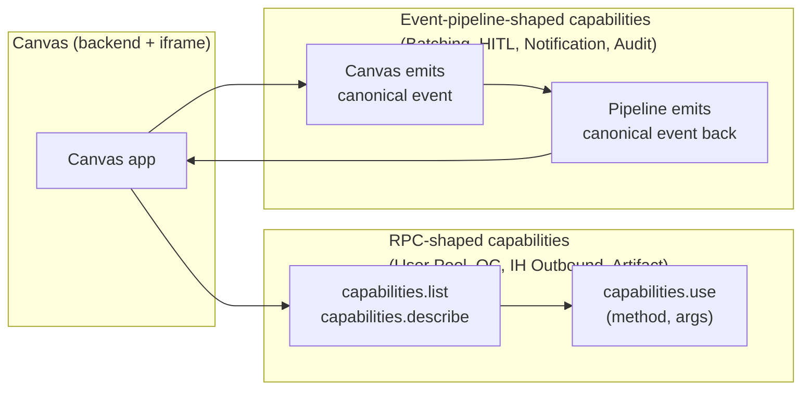
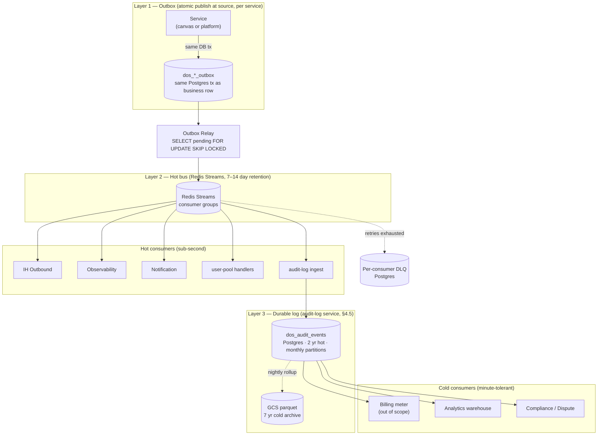
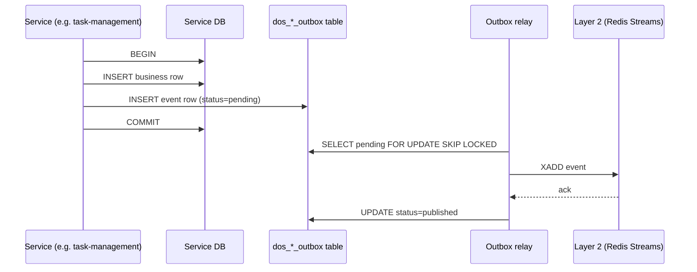
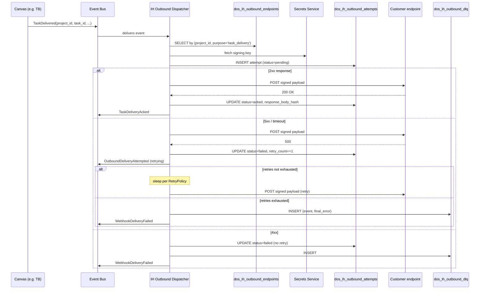
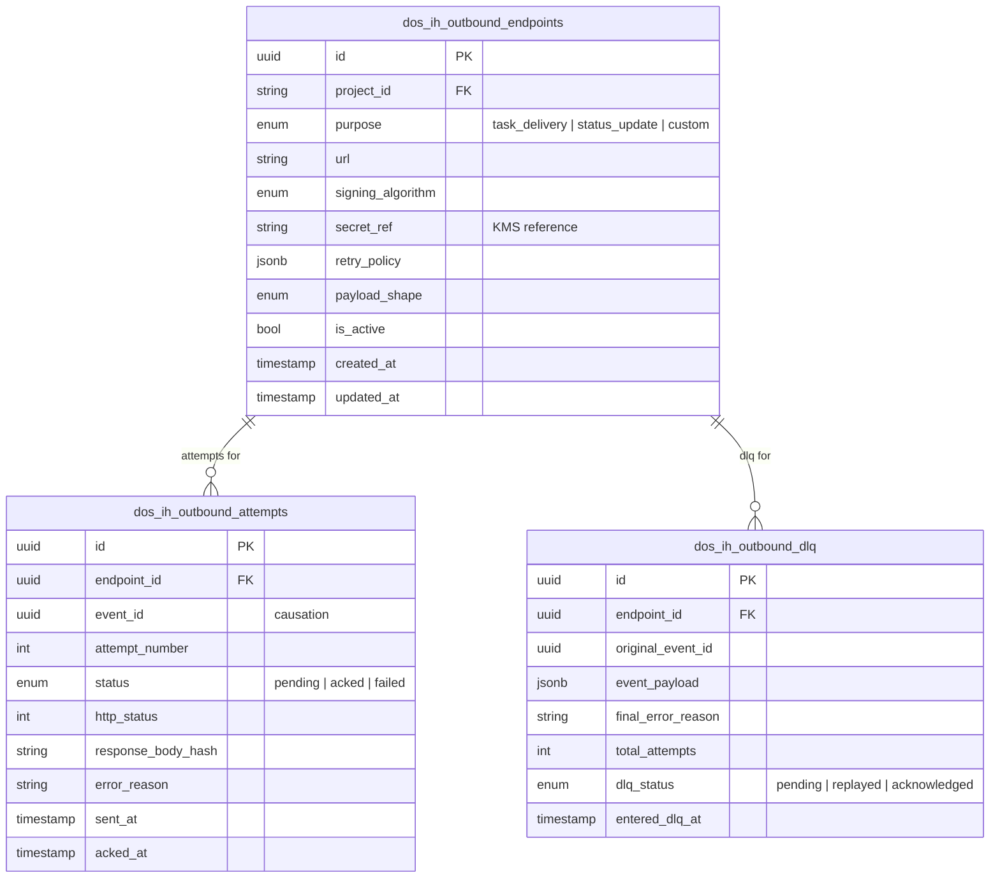
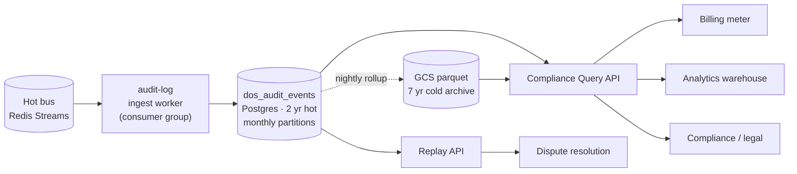
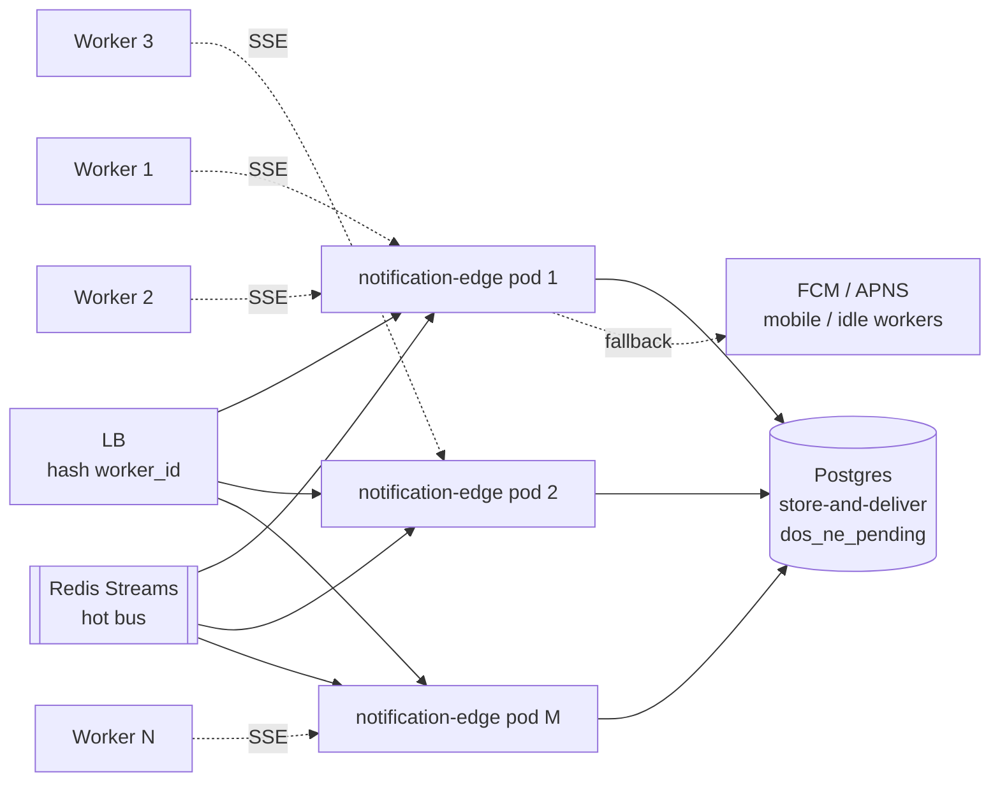
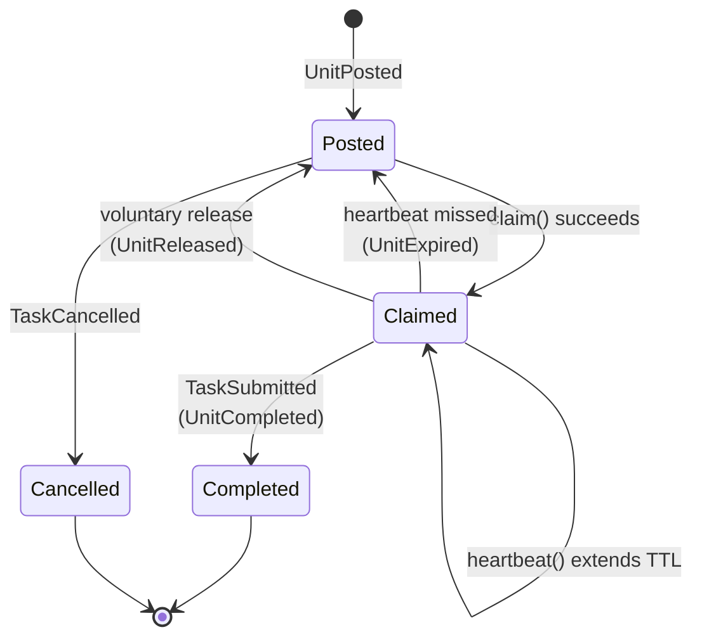
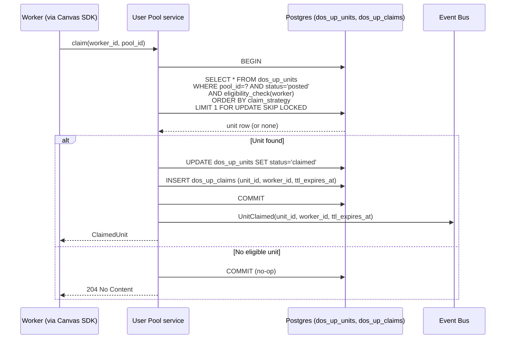

# AGI-OS Component Architecture

> Per-component specification for every Zone A and Zone B component. Purpose, contract, events, SDK, storage, diagrams, tech choices. Reference doc — jump to the component you need.

## Status

**Draft v0.3.** §0 Shell Offerings landing page + [§4.3 Integration Hub reframed as the Integration Plane](#43-integration-hub-integration-plane-zone-a) (three shapes: customer, canvas, platform-provider). Previously filled: [§4.1 Event Bus](#41-event-bus--canonical-catalog-zone-a), [§4.5 Audit Log](#45-audit-log-zone-a), [§5.1 User Pool](#51-user-pool-zone-b). Remaining sections are stubs with a current-state line; fill continues in Pass 3.

## 0. Shell Offerings — what a canvas gets from the platform

Before diving into internals, this is the **vendor-facing catalog** — what the platform actually offers a canvas team. Speaking it out loud matters, because otherwise every canvas rebuilds pool, QC, batching, HITL, and notification themselves. That is what we are refusing to let happen again.

### 0.1 The six offerings

| # | Offering | Shape | Who invokes | Why it exists |
|---|---|---|---|---|
| 1 | **Identity + sessions** | Platform-managed | Shell (for workers), Canvas backend (for service creds) | One auth story across all canvases; short-lived canvas-scoped tokens; operator visibility into sessions |
| 2 | **Event bus + canonical catalog** | Platform-managed | Every canvas and service emits/subscribes | The seam between canvases and every cross-cutting concern (billing, audit, analytics, delivery) |
| 3 | **User Pool** | Capability (RPC-shaped) | Canvas backend, canvas frontend (via bridge `capabilities.use`) | Atomic claim/lease/heartbeat; 80% of canvases don't need their own |
| 4 | **QC / Prism** | Capability (RPC-shaped) | Canvas backend | Rubric execution, agent panels, scoring, redispatch — uniform across canvases |
| 5 | **Integration Hub (Integration Plane)** | Capability (RPC + event pipeline) | Canvas backend (emit `TaskDelivered`), operators (register) | Single channel for customer delivery; single registration plane for canvases and platform integrations; no canvas does outbound itself |
| 6 | **Worker-facing pipelines** — Batching, HITL, Notification | Capability (event pipeline-shaped) | Canvas backend (emit into), worker shell chrome (render) | Pipelines workers feel directly: batch packaging, reviewer flow, in-app / email / Slack notifications. Canvas does not build these. |

Three supporting offerings (Zone A, non-optional, the canvas gets them whether it asks or not):

| Offering | What it guarantees |
|---|---|
| **Audit Log** | Every event persisted 2y hot + 7y cold; compliance-queryable; replayable |
| **Secrets & Key Management** | No secrets in canvas configs or DB rows; all via Secrets Service references |
| **Artifact / Data Plane** | Uniform `ArtifactRef` for files; signed URLs on demand |

### 0.2 How canvases consume them

Two invocation shapes, depending on offering:



- **RPC-shaped** — canvas asks, platform responds. Method + args. Examples: `user_pool.claim`, `qc.evaluate`, `ih_outbound.register_endpoint`. Discovered via `capabilities.list` (§4.5 in `CANVAS_SDK.md`).
- **Event-pipeline-shaped** — canvas emits into, pipeline produces output events. Examples: canvas emits `TaskSubmitted` → batching service produces `BatchSealed`; canvas emits `TaskNeedsReview` → HITL service produces `ReviewCompleted`.

Why split? RPC is for synchronous "give me an answer now" — claim a unit, submit a rubric. Event pipelines are for "run this through a process and tell me when done" — batch, review, notify. Forcing either shape onto the other makes the API awkward.

### 0.3 What the platform deliberately does NOT offer

Saying this explicitly saves every canvas from asking:

- **Task workflow orchestration.** Canvases own their task lifecycle. Temporal, Cloud Tasks, Celery, cron — your choice.
- **Task UI components.** No shared design system imposed. Shell chrome is shell-owned; the iframe interior is yours.
- **Customer contracts.** Platform ships canonical events; pay model + billing event shaping is a separate contract (see `PLATFORM_DESIGN §8`).
- **Worker recruitment / payouts.** Talent and flex platforms own those. Platform emits the events that let them bill.

### 0.4 Offering ↔ component map

| Offering | Section | Zone | Status |
|---|---|---|---|
| Identity + sessions | §4.2 | A | partial |
| Event bus + catalog | §4.1 | A | in-development |
| Integration Hub (registration + outbound + inbound) | §4.3, §5.8 | A + B | in-development / not-implemented |
| User Pool | §5.1 | B | planned |
| QC / Prism | §5.3 | B | partial |
| Batching | §5.4 | B | not-implemented |
| HITL | §5.5 | B | not-implemented |
| Notification (internal) | §5.6 | B | partial |
| Audit Log | §4.5 | A | not-implemented |
| Secrets | §4.6 | A | partial |
| Artifact | §4.7 | A | partial |

---

## How to read this document

- Every filled component follows the same 11-field template. Skim the headings first to build intuition for the template.
- Mermaid diagrams are inlined. They render in GitHub / GitLab / most Markdown viewers.
- Tables that reference code paths point at the real files in the AGI-OS repo. Grep with confidence.
- Everything is **target state** except Integration Hub, which has an accompanying current-state `IH_GAP_ANALYSIS.md`.

## Component template

Every component page fills these 11 fields, in this order:

1. **Purpose** — why this component exists; one paragraph.
2. **Zone + status** — A / B / C + `not-implemented | planned | in-development | live`.
3. **Contract** — numbered invariants the component guarantees.
4. **Events emitted** — table keyed by event type.
5. **Events consumed** — table keyed by event type.
6. **SDK surface** — Python signatures canvas engineers call.
7. **Storage ownership** — tables this component owns; nothing else.
8. **Extension points** — named strategy interfaces with stock implementations.
9. **Adoption levels** — what Level 0, 1, 2 look like for this component.
10. **Failure modes** — known-bad states and how the component responds.
11. **Owner + open decisions** — team that owns it; ADR-worthy questions still open.

For Integration Hub components only, an additional field — **Current state vs target** — cross-references `IH_GAP_ANALYSIS.md`.

## Component index

| § | Component | Zone | Status |
|---|---|---|---|
| 4.1 | Event Bus + canonical catalog | A | in-development |
| 4.2 | Identity, Tenancy & Access | A | partial |
| 4.3 | Integration Hub (Integration Plane) — registration + outbound delivery | A | in-development |
| 4.4 | Billing metering contract | A | not-implemented |
| 4.5 | Audit Log | A | not-implemented |
| 4.6 | Secrets & Key Management | A | partial |
| 4.7 | Artifact / Data Plane | A | partial |
| 4.8 | Gateway / API Edge | A | partial |
| 4.9 | Notification Edge | A | not-implemented |
| 5.1 | User Pool | B | planned |
| 5.2 | Task Execution + State Machine | B | partial |
| 5.3 | QC / Prism | B | partial |
| 5.4 | Batching | B | not-implemented |
| 5.5 | Human-in-the-Loop | B | not-implemented |
| 5.6 | Notification (internal) | B | partial |
| 5.7 | Config Service | B | not-implemented |
| 5.8 | Integration Hub — Inbound | B | in-development |
| 5.9 | Fraud / Trust & Safety | B | not-implemented |
| 5.10 | Dispute / Appeal | B | not-implemented |
| 5.11 | Admin / Operator Console | B | partial |
| 5.12 | Observability & SLOs | B | partial |

---

## 4. Zone A components

### 4.1 Event Bus + canonical catalog (Zone A)

**Purpose.** The event bus is the **seam** between canvases and every cross-cutting platform concern: billing, audit, analytics, customer delivery, observability. Canvases emit canonical events at lifecycle transitions; platform consumers subscribe independently. No consumer ever calls a canvas; no canvas ever calls a consumer. The bus is the only introduction.

"The event bus" is actually **three distinct layers**, each solving a different failure mode. Do not conflate them; the rest of this section assumes the distinction.

**Zone + status.** Zone A. `in-development` — see [current state](#41-current-state).

#### 4.1.1 The three layers

| # | Layer | Substrate | Solves | Retention |
|---|---|---|---|---|
| **1** | **Outbox** (per service) | Postgres `dos_*_outbox` table, written in same DB tx as business row | Atomic publish at source — "did my DB write and event emission stay consistent?" No transport can substitute. | Forever (or until archived) |
| **2** | **Hot bus** (platform-wide) | Redis Streams, consumer groups, per-stream ordering | Low-latency online fan-out to live consumers (IH outbound, observability, notifications) | 7–14 days |
| **3** | **Durable log** (platform-wide) | `audit-log` service — Postgres hot (2 yrs) + GCS parquet cold (7 yrs) | Long-retention replayable history for billing reconciliation, compliance, analytics backfill, dispute forensics. Spec in §4.5. | 2 yr hot, 7 yr cold |

#### 4.1.2 Layered topology



Key property: **Layer 3 is a consumer of Layer 2, not a sibling.** The hot bus fans out to hot consumers and to the audit-log ingest worker; downstream cold consumers (billing, analytics, compliance) query the audit log, not the bus.

#### 4.1.3 Layer 2 swap triggers (Redis → Kafka)

Redis Streams is the Layer 2 pick until any of these hit. At that point, evaluate Kafka (or GCP Pub/Sub) as the replacement. Layer 1 (outbox) and Layer 3 (audit log) are unchanged — only the relay's publish target changes.

| Trigger | Why it flips the call |
|---|---|
| Sustained throughput >10k events/sec | Redis Streams single-node ceiling approaches; Kafka partition-per-topic scales cleanly |
| Steady-state rewindable consumption >14 days | Redis memory-backed retention gets expensive fast; Kafka long retention is native |
| Canvas teams request direct bus consumption (multi-tenant access) | Kafka ACLs + multi-tenant patterns are mature; Redis Streams multi-tenant isolation is manual |
| Regulatory: preserve event stream verbatim beyond audit log | Audit log materialization is lossy for low-level fields; Kafka retains original byte stream |

Ops signals that approaching a trigger:

- Redis Streams **memory utilization >70%** sustained for 7 days → retention trim is fighting workload.
- **Consumer-group lag p95 >1 hour** for any group → fan-out throughput not keeping up.
- **Stream-length p95 growth rate** exceeds trim rate week-over-week.

Alarm thresholds land here; observability dashboards track them.

#### 4.1.4 Contract (applies to all three layers jointly)

1. Delivery is **at-least-once**. Consumers must be idempotent, keyed on `idempotency_key`.
2. Ordering is **per-aggregate**, not global. Events sharing `project_id` + an aggregate key (e.g. `task_id`) arrive in emission order. Across aggregates, no guarantee.
3. Every event is **durably persisted** at Layer 1 before publish to Layer 2, and ingested into Layer 3 before any downstream consumer is considered to have "seen" it. The audit log is the source of truth for "did this event happen."
4. Consumers subscribe by `event_type` + optional filter (e.g. `project_id IN (...)`). Neither the bus nor the audit log transforms or enriches.
5. Failed Layer 2 handlers go to a per-consumer DLQ after N retries. DLQ entries are replayable via the Admin Console (§5.11).
6. The envelope is **immutable within a major version**. See `EVENT_CATALOG.md §2` for the frozen envelope.

#### 4.1.5 Outbox pattern — reliable publish (Layer 1 detail)

Canvases and platform services write events inside the same DB transaction as their business data, using the **outbox pattern**. This guarantees at-least-once publish without a distributed transaction, and crucially, it is independent of the Layer 2 choice — Redis today, Kafka tomorrow, same outbox code.



Every service that emits events has a `dos_{service}_outbox` table with a shared schema. A shared relay binary (or sidecar) tails each outbox and publishes to Layer 2. **The relay is the only process that writes to Layer 2 in normal operation** — services never publish directly.

Layer 3 (audit-log) subscribes to Layer 2 as a regular consumer group; its ingest guarantees are discussed in §4.5.

#### Events emitted

The bus emits nothing itself. It is transport.

#### Events consumed

All canonical events flow through it. See `EVENT_CATALOG.md §3` for the v1 catalog.

#### SDK surface

```python
from agi_os.events import publish, subscribe, DomainEvent, EventFilter

async def publish(event: DomainEvent) -> None: ...

def subscribe(
    event_type: type[DomainEvent],
    handler: Callable[[DomainEvent], Awaitable[None]],
    *,
    filter: EventFilter | None = None,
    consumer_group: str | None = None,
) -> Subscription: ...
```

Canvases and services use the outbox helper, not `publish` directly:

```python
async with outbox(session) as ob:
    session.add(business_row)
    ob.emit(TaskCreated(project_id=..., task_id=..., ...))
```

#### Storage ownership

The bus owns no durable state.

- **Audit Log** (§4.5) owns the append-only record.
- **Outbox tables** are owned per-service, e.g. `dos_tm_outbox`, `dos_ih_outbox`. Schema is platform-owned.
- **DLQ** owns one table per consumer group: `dos_bus_dlq_{consumer_group}`.

#### Extension points

Canvases do not extend the bus. The transport is a platform-internal concern (in-process → Redis Streams → NATS → Kafka), invisible to canvases. Platform-internal pluggability exists between transport adapters.

#### Adoption levels

Not applicable. The bus is Zone A and non-optional. Every canvas uses it.

#### Failure modes

| Failure | Symptom | Platform response |
|---|---|---|
| Transport outage (Redis down) | `XADD` fails | Outbox relay stops advancing; outbox rows accumulate. On recovery, relay drains. Business transactions are not blocked. |
| Handler slow | Consumer group lag grows | Bus back-pressure into that consumer group; publisher unaffected. Observability alarm on lag. |
| Handler failing (e.g. bug, bad deploy) | Retry with exponential backoff; DLQ after N attempts | Per-consumer DLQ; ops alert; replay via Admin Console. |
| Audit log write fails | Outbox relay retries | Publish to bus is gated on audit log success. No event on bus without an audit log row. |
| Outbox relay crash | Stops publishing | Another relay instance picks up (leader election via Redis lock). At-least-once preserved. |

<a id="41-current-state"></a>
#### Current state vs target

| Aspect | Today | Target |
|---|---|---|
| Transport | In-process `asyncio` fan-out (`services/shared/shared/events/bus.py`) | Redis Streams with consumer groups |
| Envelope fields | `event_id`, `event_type`, `occurred_at`, `payload`, `source_service` (`services/shared/shared/events/types.py`) | Plus `project_id`, `idempotency_key`, `schema_version`, `correlation_id`, `causation_id`, `canvas_id` |
| Durability | None (in-memory) | Audit log co-write; outbox on publisher side |
| DLQ | None | Per-consumer group Postgres table |
| Cross-process | No | Yes (Redis Streams) |
| Idempotency | Consumer-responsibility, no contract | `idempotency_key` is envelope-required |

#### Owner + open decisions

- **Owner.** AGI-OS platform team.
- **Open decision.** Transport confirmation: Redis Streams (recommended) vs NATS vs Kafka. Redis leans on existing infra; NATS has better semantics; Kafka is overkill at today's volume. **Ship an ADR before implementing.**

---

### 4.2 Identity, Tenancy & Access (Zone A)

> **Stub.**
>
> **Current state (grounded).** Human identity is mature: JWT via HTTP-only cookies + `Authorization` header (`services/shared/shared/auth/token_service.py`, `cookie_service.py`, `dependencies.py`); 14-role hierarchy in `UserRole`; internal s2s via gateway-injected `X-Internal-*` headers (`shared/auth/internal.py`). Users live in `dos_auth_users`.
>
> **Gap.** No canvas identity — every request today is a Turing employee. Workers are modeled as users with roles, not a distinct principal type. Customers have no identity at all; they are an opaque endpoint plus a shared HMAC secret.
>
> **Target.** Three principal types — `Canvas`, `Worker`, `Customer` — each with its own credential flow, scope, and audit trail. The existing human-user model remains for operators.

---

### 4.3 Integration Hub (Integration Plane) (Zone A)

**Purpose.** Integration Hub is the **single registration + operation plane** for every external system the platform talks to. One service, one data model, one audit surface, one RBAC model, three integration shapes.

Without this consolidation, every new integration type grows its own config table, its own admin CRUD, its own secrets handling, its own audit log. That was the trap we were walking into with a separate `canvas-manifest.yaml` + a separate `ConnectorConfigModel` + a planned separate `platform_providers` table. All three are the same shape with different payloads.

**Zone + status.** Zone A. `in-development` for customer integrations (inbound + outbound). `not-implemented` for canvas registration. `not-implemented` for platform-provider registration.

#### 4.3.0 The three integration shapes

Every row in IH is one of these:

| Shape | Purpose | Examples | Direction |
|---|---|---|---|
| **Customer integration** | Customer systems that send us work or receive our results | Salesforce (inbound opp data), Google Sheets (ingest), Jira (ticket fulfillment), Anthropic webhook (delivery) | Inbound + outbound |
| **Canvas integration** | Task Execution Canvases mounted in the worker shell | TB, GDPVal, OpenClaw | Canvas → platform (API calls + events), platform → canvas (bridge messages) |
| **Platform-provider integration** | External services the platform itself uses | GCS (artifact store), Keyhive (LLM keys), Secrets Manager (credentials), Jibble (time tracking for `hourly` pay) | Platform → provider |

All three share:

- **Data model** — `dos_ih_integrations` parent table, per-shape subtype tables, shared audit log, shared RBAC.
- **Admin UI** — same list/detail/credentials/audit views; shape-specific fields are rendered from the subtype table.
- **Credential flow** — issued on approval, stored in Secrets Service, delivered once, rotatable.
- **Lifecycle** — `pending → staging → prod → deprecated → archived`, audited.
- **Event emission** — every state transition produces a canonical event (`CustomerIntegrationRegistered`, `CanvasRegistered`, `CanvasPromoted`, `ProviderIntegrationRotated`, ...).

#### 4.3.1 Why one service, not three

The temptation is "customer integrations feel different from canvases, split them." We don't, because:

1. **The operational surface is identical.** Register → approve → credentials → staging → prod → deprecate. Every shape walks this loop.
2. **Credentials management is the hardest part.** Splitting three ways means three Secrets Service integrations, three rotation policies, three audit paths. One is enough pain.
3. **Cross-shape queries matter.** "Which canvases deliver to which customers?" and "Which platform providers does each canvas depend on?" are real operator questions. Three services, three joins.
4. **The outbound dispatcher doesn't care what's on the other end.** It takes `endpoint_id`, resolves config, signs, delivers. Whether that endpoint is a customer or a canvas's own webhook doesn't matter — same code path.

#### 4.3.2 Outbound delivery (customer integrations)

This is the most-discussed responsibility of IH, and the one already fleshed out in §8.3 of `PLATFORM_DESIGN.md`. The **single channel** through which a canvas's task results reach a customer. The dispatcher subscribes to canonical `TaskDelivered` events, signs an outbound request, delivers to the customer's endpoint with retries and DLQ, and emits `TaskDeliveryAcked` on success (or `WebhookDeliveryFailed` on exhaustion).

The restriction is absolute: **no canvas delivers to a customer except through this dispatcher.**

##### Dispatcher flow



#### Data model



#### Contract

1. For every `(project_id, purpose)` there is **at most one active** outbound endpoint. Endpoints are provisioned via the project-creation wizard and the Admin Console (§5.11), never by a canvas directly.
2. Every outbound request is HMAC-signed (default: SHA-256 over canonical JSON + timestamp header) with a secret retrieved from the Secrets Service (§4.6). Customers verify using the canonical-JSON algorithm documented in the public SDK.
3. Delivery is **idempotent from the customer's side**: the customer sees the same `event_id` on every retry; dedupe is the customer's responsibility using the platform-documented idempotency header.
4. Retries follow the policy declared on the endpoint: exponential backoff (default: 1 min, 5 min, 15 min, 1 h, 4 h, 12 h, 24 h). After exhaustion the attempt lands in DLQ; a `WebhookDeliveryFailed` event is emitted so canvases and ops can react.
5. A successful 2xx response emits `TaskDeliveryAcked`. The event stream is the contract; no canvas code handles acks directly.

#### Events emitted

| Event | When | Key payload |
|---|---|---|
| `OutboundDeliveryAttempted` | Every attempt (incl. retries) | `endpoint_id`, `attempt_number`, `http_status`, `error_reason` |
| `TaskDeliveryAcked` | On 2xx | `task_id`, `endpoint_id`, `response_body_hash`, `total_attempts` |
| `WebhookDeliveryFailed` | Terminal (DLQ) | `task_id`, `endpoint_id`, `final_error_reason`, `total_attempts` |

#### Events consumed

| Event | Purpose |
|---|---|
| `TaskDelivered` | Trigger. Dispatcher resolves endpoint by `(project_id, purpose='task_delivery')` and schedules delivery. |

#### SDK surface

The dispatcher is event-driven; canvases do not call it. The canvas's only interaction is **emitting a canonical `TaskDelivered` event**. Operator-facing surface is project creation plus admin:

```python
from agi_os.integration_hub import register_outbound_endpoint, RetryPolicy

async def register_outbound_endpoint(
    *,
    project_id: str,
    purpose: Literal["task_delivery", "status_update", "custom"],
    url: str,
    signing_algorithm: Literal["hmac_sha256", "ed25519"] = "hmac_sha256",
    retry_policy: RetryPolicy | None = None,
    payload_shape: Literal["canonical", "custom"] = "canonical",
) -> OutboundEndpoint: ...
```

#### Storage ownership

- `dos_ih_outbound_endpoints` — endpoint config.
- `dos_ih_outbound_attempts` — append-only attempt log.
- `dos_ih_outbound_dlq` — DLQ entries awaiting replay or acknowledgment.

#### Extension points

| Interface | Purpose | Stock implementations |
|---|---|---|
| `Signer` | Sign outbound request | `HmacSha256` (default), `Ed25519`, `CustomHeader` |
| `PayloadShaper` | Transform canonical event → customer-specific shape | `Canonical` (default), `SalesforceComposite`, `JiraIssueCreate` |
| `RetryPolicy` | Declarative retry schedule | `ExponentialBackoff` (default), `Linear`, `CustomSchedule` |

#### Adoption levels

- **Level 0 (default).** Canvas emits `TaskDelivered`. Platform signs, delivers, retries, DLQs, emits ack events. No canvas code.
- **Level 1.** Canvas emits `TaskDelivered`; operator configures a custom `Signer` or `PayloadShaper` on the endpoint for a specific customer. Still zero canvas code.
- **Level 2.** Canvas delivers to customer directly, bypassing the dispatcher. **Strongly discouraged.** Requires an explicit manifest flag and loses platform DLQ, retry, signing, audit, and `TaskDeliveryAcked`. Reserved for customers requiring a transport the platform cannot provide (e.g. on-prem SFTP).

#### Failure modes

| Failure | Platform response |
|---|---|
| Customer 5xx | Retry per policy; DLQ on exhaustion; emit `WebhookDeliveryFailed` |
| Customer 4xx | Immediate DLQ (no retry); emit `WebhookDeliveryFailed` with reason |
| Invalid signature at customer | Surfaced as non-2xx; same path |
| Secret rotation mid-flight | In-flight attempts complete with old secret; new attempts use new secret |
| Platform DLQ full | Rate-limit `TaskDelivered` subscription; ops alert |

#### 4.3.3 Customer integrations — relationship to project creation

The project-creation wizard is the **control-plane surface** that materializes outbound endpoints. Understanding this matters because the wizard is the only user-facing surface that configures IH today.

The wizard's "Integrations" sidebar wires into IH like this:

1. **Client + Salesforce Opp ID resolve the customer endpoint.** The operator selects `Client` (e.g. Anthropic) and a Salesforce Opportunity ID. These resolve a default customer delivery URL via the Salesforce connector (§5.8) — or the operator provides one manually if no default is registered for that client.
2. **Pay Model drives billing event shape.** Pay model is persisted on the project record (`dos_pm_projects.pay_model`, live today: `pay_per_task | fixed_aht | capped_aht | hourly`) and becomes a field on every emitted billing event (§4.4). The outbound `PayloadShaper` can reference it to include payment context in the delivered artifact if the customer contract requires it.
3. **Task Type and Engagement Category filter visible integrations.** The Config Service (§5.7) uses these fields to mark integrations as "recommended," "required," or "hidden" for a given project shape. Example rules: `pay_model=hourly` marks Jibble as required (time-tracking for payroll); `engagement_category=code` marks GitHub as recommended.
4. **The "Connect" action materializes a binding.** For inbound connectors (Jibble, Jira, Salesforce) it creates a `ConnectorConfigModel` (§5.8). For outbound (customer webhook) it creates an `OutboundEndpointModel` (this section). These are the per-project runtime rows the dispatcher and connector framework consume.

The outbound dispatcher is entirely reactive: it reads `dos_ih_outbound_endpoints` and acts on `TaskDelivered` events.

#### 4.3.4 Canvas integrations

A canvas registration is an IH integration with shape `canvas`. See `CANVAS_SDK.md §3` for the canvas-team-facing summary; this section is the component-architecture view.

##### Data model

```mermaid
erDiagram
    dos_ih_integrations ||--|| dos_ih_canvas_integrations : "subtype"
    dos_ih_integrations ||--o{ dos_ih_integration_audit : "audited by"
    dos_ih_canvas_integrations ||--o{ dos_ih_canvas_capability_grants : "granted"

    dos_ih_integrations {
        uuid id PK
        enum shape "customer | canvas | platform_provider"
        enum lifecycle "pending | staging | prod | deprecated | archived"
        string display_name
        jsonb owners
        timestamp created_at
        timestamp updated_at
    }

    dos_ih_canvas_integrations {
        uuid integration_id PK_FK
        string canvas_id "cvs_* nonce, immutable"
        string slug "URL segment, unique"
        string version
        string entry_url
        string backend_url
        string health_path
        string client_id
        string client_secret_ref "Secrets Service ref"
    }

    dos_ih_canvas_capability_grants {
        uuid id PK
        uuid integration_id FK
        string capability "user_pool | qc | ih_outbound | ..."
        jsonb scope_list "[user_pool:claim, user_pool:heartbeat, ...]"
        timestamp granted_at
        string granted_by
    }

    dos_ih_integration_audit {
        uuid id PK
        uuid integration_id FK
        string actor
        enum action "created | approved | promoted | deprecated | credential_rotated | scope_granted | scope_revoked"
        jsonb before
        jsonb after
        timestamp at
    }
```

##### Contract

1. `canvas_id` is platform-assigned on approval (`cvs_<nonce>`), immutable, never reused. The canvas team does not choose it.
2. `slug` is unique within the environment. Changing a slug is a lifecycle event, audited, triggers worker-shell route map reload.
3. `client_secret` is stored in the Secrets Service; only a reference lives in the DB row.
4. Capability grants are the authoritative source for what the canvas's session JWT `scope` claim carries. A grant revoke takes effect on next token mint (15 min max lag).
5. Every lifecycle transition emits a canonical event (`CanvasRegistered`, `CanvasPromoted`, `CanvasDeprecated`, `CanvasArchived`, `CanvasCredentialRotated`, `CanvasScopeChanged`).

##### Events emitted

| Event | When |
|---|---|
| `CanvasRegistered` | Operator approved a new canvas; lifecycle `pending → staging` |
| `CanvasPromoted` | `staging → prod` |
| `CanvasDeprecated` | `prod → deprecated` |
| `CanvasArchived` | Any → `archived` |
| `CanvasCredentialRotated` | Secret rotated (planned or on demand) |
| `CanvasScopeChanged` | Capability grant added / revoked |

Consumers: audit log (always), worker shell (to refresh its canvas directory), observability (dashboards).

##### Admin operations

Operator actions (all audited):

- Approve / reject registration requests
- Promote / deprecate / archive
- Rotate credentials (on schedule or on demand)
- Grant / revoke capability scopes
- Update `entry_url` or `backend_url` (requires re-approval)

##### Performance at scale

The canvas directory is on the worker-shell hot path: every iframe load resolves `slug → canvas_id + entry_url + capability grants`. At 200K concurrent workers with one navigation per minute this is ~3.3K QPS. IH's Postgres read path is not the right tier for this.

**Caching rules:**

1. **Shell pod LRU** — in-memory cache keyed by `slug`, holds ~500 canvases, TTL 5 min. Sub-millisecond on hit.
2. **Redis cache** — second level keyed by `slug`, TTL 5 min, shared across shell pods.
3. **Invalidation via the bus** — IH emits `CanvasRegistered`, `CanvasPromoted`, `CanvasDeprecated`, `CanvasArchived`, `CanvasCredentialRotated`, `CanvasScopeChanged`. The worker shell subscribes and invalidates the matching `slug` entries on both tiers.
4. **Capability grants** are cached on the same key. A `CanvasScopeChanged` event triggers re-fetch on next miss; existing session JWTs continue until expiry (max 15 min lag) because scope lives in the token claim.

At this point IH's own Postgres sees only cache misses and invalidation-triggered refetches — bounded at tens of QPS regardless of worker count.

#### 4.3.5 Platform-provider integrations

External services the platform depends on. Examples: GCS (artifact storage), Keyhive (LLM key management, GDPVal-specific today), GCP Secret Manager, Salesforce (inbound data source for customer integrations), Jibble (time tracking for `hourly` pay).

##### Why they live in IH

Every platform-provider integration has the same operational needs as customer and canvas integrations: registration, credentials in Secrets Service, rotation, audit, lifecycle. Keeping a separate `platform_providers` table means duplicating all of that. Subtype table on the same parent pays once.

##### Data model

```
dos_ih_platform_provider_integrations (
  integration_id PK_FK,
  provider_type   enum(gcs | keyhive | secret_manager | salesforce | jibble | ...),
  connection_config jsonb,          -- provider-specific non-secret config
  credential_ref   string           -- Secrets Service reference
)
```

##### Contract

1. Platform-provider integrations are **operator-managed**, not canvas-requested. No canvas PR flow, no canvas approval loop.
2. A canvas cannot directly address a platform-provider integration — it asks a capability (e.g. `artifact.sign_url`), and the capability routes to the configured provider. Swapping providers is a capability-config change, not a canvas change.
3. Rotation is the default path; manual rotation is always available.

<a id="43-current-state"></a>
#### Current state vs target

See `IH_GAP_ANALYSIS.md` for the full gap table. Summary:

- IH today handles **customer inbound only**. No outbound path. No canvas shape. No platform-provider shape.
- `TaskDelivered` event type does not yet exist in `shared/events/types.py`.
- `ProjectIntegration` (in `project-management`) duplicates `ConnectorConfigModel` (in `integration-hub`) — real design bug; resolution: IH's subtype tables are the source of truth, PM reads via IH SDK.
- Canvas registration currently has no home. Proposed resolution: IH canvas shape (§4.3.4).
- Platform-provider credentials are scattered (`webhook_secret` plaintext in DB rows, LLM keys in Keyhive only for GDPVal). Proposed: IH platform-provider shape with Secrets Service integration (§4.3.5).

#### Owner + open decisions

- **Owner.** Integration Hub team.
- **Open decision.** Subtype-table vs single-table-inheritance for the three shapes. Leaning subtype (cleaner shape-specific indexes, harder to accidentally leak canvas data onto a customer view). ADR before implementing §4.3.4.
- **Open decision.** Canvas registration request UX — self-serve form vs ticket + manual entry for first 3 canvases, then open up. Leaning manual for the first 3 (TB, GDPVal, OpenClaw), self-serve after.

---

### 4.4 Billing metering contract (Zone A)

> **Stub.** Contract only; consuming service out of scope.
>
> **Current state.** No canonical billing events exist; each canvas emits its own shape today.
>
> **Target.** Four event families keyed by `pay_model`:
> - `TaskAccepted` for `pay_per_task`
> - `TaskAcceptedAhtPaid` for `fixed_aht` / `capped_aht`
> - `WorkSessionLogged` for `hourly`
> - `PayableEventVoided` for reversals (cross-cutting)
>
> All carry `project_id`, `pay_model`, `amount_currency`, `amount_value`, `idempotency_key`.

---

### 4.5 Audit Log (Zone A)

**Purpose.** The Audit Log is the **Layer 3 durable event store** for the platform. It ingests every event from the hot bus (Layer 2), persists it to a long-retention Postgres store, rolls cold partitions to GCS parquet, and exposes compliance-query + replay APIs to downstream consumers (billing, analytics, compliance, dispute resolution).

Audit Log is **not** a passive sink. It is the source of truth for "did event X happen on date Y for project Z" across all canvases and services. Every Zone A guarantee about replayability, compliance, and cross-canvas consolidation leans on this service.

**Zone + status.** Zone A. `not-implemented`. Current audit data today lives inside each service's own tables via `AuditMixin` on individual models — a scatter, not a log.

#### Topology



#### Contract

1. **Complete capture.** Every event published to Layer 2 is persisted to Audit Log before any downstream cold consumer is considered to have "seen" it. Ingest worker is the single source of truth for long retention.
2. **Append-only.** Rows are never updated or deleted within the retention window. Corrections are **new** events (`PayableEventVoided`, etc.), never mutations of existing rows.
3. **Cross-canvas uniform schema.** Every row has the same columns regardless of emitting service or canvas. Payload stored as JSONB + SHA-256 hash for integrity verification.
4. **Partitioned by `occurred_at`.** Monthly Postgres partitions. Partitions older than 24 months roll to GCS parquet; Postgres rows are dropped after successful cold-archive verification.
5. **Replay is first-class.** Any subscriber can request a time-range replay to a new consumer group; the replay backend stitches hot Postgres + cold GCS transparently when the window spans both.
6. **Query SLO.** Single-project range query p95 <2 s within hot partition, <30 s crossing into cold. Full-text or cross-project queries are explicitly out of SLO.

#### Events emitted

Audit Log is primarily a sink. Emits only operational events to observability:

| Event | When | Purpose |
|---|---|---|
| `AuditIngestLagged` | Consumer group lag exceeds threshold | Ops alert |
| `AuditArchiveCompleted` | Nightly GCS rollup finished | Dashboards |
| `AuditIngestDLQ` | Event could not be persisted after retries (rare; indicates schema violation) | Critical alert |

#### Events consumed

All canonical events. Subscribes as a dedicated consumer group `audit-log-ingest` with durable offsets. Never filters — captures everything.

#### SDK surface

Canvases and services do **not** call Audit Log directly. They emit events to Layer 2; Audit Log captures automatically. Operators and billing/analytics/compliance consumers query via:

```python
from agi_os.audit import query, replay, verify_integrity

# Compliance-style query
events = await query(
    event_types=["TaskAccepted", "TaskDelivered"],
    project_id="p-abc-123",
    occurred_at_range=(start, end),
    limit=10_000,
)

# Replay to a new consumer group (for billing backfill, etc.)
await replay(
    consumer_group="billing-backfill-2026-q1",
    event_types=["TaskAccepted"],
    occurred_at_range=(quarter_start, quarter_end),
)

# Integrity verification (compliance use)
ok = await verify_integrity(event_id=uuid)
```

#### Storage ownership

- `dos_audit_events` — Postgres, partitioned monthly on `occurred_at`; indexed on `(project_id, occurred_at)` and `(event_type, occurred_at)`; JSONB GIN index on `payload` for ad-hoc queries (optional, expensive).
- `gs://turing-agi-os-audit-archive/{env}/YYYY/MM/*.parquet` — cold archive; queryable via BigQuery external tables for analytics.
- `dos_audit_replay_requests` — operator-facing tracker for in-flight replays.

#### Extension points

None exposed to canvases. Internal pluggability:

| Interface | Purpose | Default |
|---|---|---|
| `ArchiveScheduler` | When to roll partitions to GCS | Monthly, partition-age >24 months |
| `ReplayBackend` | Replay source selection | Hot if window overlaps hot retention; cold otherwise; stitched if spans |
| `IntegrityVerifier` | Hash-chain or standalone SHA-256 verification | Standalone per-event SHA-256 |

#### Adoption levels

Not applicable. Zone A, non-optional. Every event from every canvas lands here.

#### Failure modes

| Failure | Platform response |
|---|---|
| Ingest worker slow / stuck | Consumer group lag alarm; `AuditIngestLagged` emitted. Back-pressure does **not** propagate to hot consumers (ingest is an independent consumer group). Other hot consumers continue. |
| Postgres hot store disk >75% | Alarm; early partition archive triggered; ops reviews retention policy. If catastrophic, ingest pauses and Layer 2 buffers until recovery — bounded by Redis retention (7–14 days). |
| GCS archive upload fails | Rollup retries with exponential backoff; partition remains in Postgres until success. No data loss. Alert on sustained failures. |
| Schema violation (malformed event) | Event sent to `dos_audit_ingest_dlq`; `AuditIngestDLQ` emitted; requires human triage (this should never happen given envelope validation upstream — if it does, it's a platform bug). |
| Query API slow | Read replicas for query tier; time-range index coverage. Billing backfill queries are expected to take minutes, not seconds; query API is not on any user path. |
| Replay spans hot + cold | Replay backend stitches both; consumer sees a unified stream. Requires cold-read capacity — throttled. |
| Cold archive file corruption | Integrity verifier detects on read; alert; operator escalation. Redundant GCS replication covers media-level failures. |

#### Owner + open decisions

- **Owner.** AGI-OS platform team.
- **Open decision — cold archive format.** Parquet (analytics-friendly, BigQuery-native, recommended) vs JSONL (simpler, preserves exact raw bytes for regulated use). Leaning **parquet primary + JSONL side-channel for specifically-regulated projects** (compliance flag on project). ADR deferred to P2 since rollup is a P2 deliverable.
- **Open decision — hash chaining.** Per-event SHA-256 (simple, recommended default) vs Merkle-chained (tamper-evident across the whole log). Chain is useful only if the threat model includes insider tampering, which today's model does not. Revisit only if a specific customer contract requires attestation.

---

### 4.6 Secrets & Key Management (Zone A)

> **Stub.**
>
> **Current state.** `webhook_secret` stored plaintext in `ConnectorConfigModel`.
>
> **Target.** GCP Secret Manager for storage. DB rows hold only references (e.g. `projects/.../secrets/ih-outbound-TB-anthropic/versions/latest`). Rotation, scoped access, per-canvas namespaces.

---

### 4.7 Artifact / Data Plane (Zone A)

> **Stub.**
>
> **Current state.** GCS connector exists; no canonical artifact manifest.
>
> **Target.** Uniform `ArtifactRef(uri, sha256, size, content_type, retention_policy)`. Signed URLs on demand via a thin `artifact-service`. Retention policy enforced by service, not by GCS bucket config.

---

### 4.8 Gateway / API Edge (Zone A)

**Purpose.** The single HTTP entry point for every canvas call into the platform — capability RPCs (`capabilities.use`), auth handoff, event emit endpoints, admin APIs. Today's `delivery-orchestration` service. At 1M workers the gateway is a shared resource for tens of thousands of QPS; its hot-path discipline is the difference between linear-scale and a cliff.

**Zone + status.** Zone A. `partial`. Gateway exists today; hot-path discipline needs to be explicit.

#### Hot-path discipline (non-negotiable)

1. **Strictly stateless.** No per-request DB reads. Project lookups, canvas lookups, and tenancy checks resolve through the token claim or through cached reference data (see §4.3.4 Performance at scale).
2. **Auth is token-native.** The session JWT (§5.2 of `CANVAS_SDK.md`) carries `scope`, `canvas_id`, `project_id`, `worker_id`. Gateway trusts the token signature (JWKS cache) and never re-derives authorization from the DB on a hot-path call.
3. **Audit writes are async.** Every capability invocation emits `CapabilityInvoked` to the outbox; the gateway returns without waiting for audit-log persistence. Audit Log service (§4.5) drains the outbox.
4. **Connection pooling + circuit breakers.** One pool per downstream capability service, with a per-service circuit breaker. A slow capability does not take down the gateway.
5. **Per-worker rate limiting.** Redis token bucket keyed by `worker_id`, enforced at the edge. Caps a runaway canvas at (e.g.) 50 req/s per worker. Rejection returns `429` with `Retry-After` and emits `RateLimitExceeded`.
6. **No business logic.** The gateway routes, authenticates, and meters. Every other concern lives in a downstream service.

#### Contract

- Routing is by `capability` string and `method` name (for `capabilities.use`), or by explicit path (for event emit, admin).
- Every request carries a `correlation_id` header; if absent, gateway generates one. All downstream services propagate it.
- 4xx vs 5xx is strict: 4xx means canvas did something wrong (fix the caller), 5xx means platform did something wrong (page the platform oncall).

#### Events emitted

| Event | When |
|---|---|
| `CapabilityInvoked` | Every `capabilities.use` call (async, via outbox) |
| `RateLimitExceeded` | Per-worker rate limit tripped |
| `GatewayCircuitOpen` | A downstream capability circuit opened |

#### Storage ownership

None direct. Gateway reads the JWKS cache (populated from Identity) and the capability routing table (populated from IH + service registry).

#### Failure modes

| Failure | Response |
|---|---|
| Downstream capability slow | Circuit breaker opens; gateway returns `503` with `Retry-After`; `GatewayCircuitOpen` emitted |
| Downstream capability down | Same as above plus alert; canvas handles per its own retry policy |
| JWKS fetch fails | Gateway falls back to last-known good JWKS (TTL 1 h); new tokens rejected with `unauthorized` if JWKS is stale beyond TTL |
| Per-worker flood | 429 + event; operator console surfaces flooding canvases |

#### Owner + open decisions

- **Owner.** AGI-OS platform team.
- **Open decision.** Whether to keep `delivery-orchestration` as the single gateway or split admin/operator APIs onto a separate edge. Leaning single gateway with a path prefix (`/admin/*` vs `/canvas/*`) to keep ops simple.

---

### 4.9 Notification Edge (Zone A)

**Purpose.** Terminate worker-facing real-time connections (SSE today, WebSocket or FCM/APNS tomorrow), subscribe to the canonical event bus, fan out relevant events to connected workers, and provide a store-and-deliver buffer for disconnected workers. This is the tier that turns canonical events into "the annotator sees a new task appear without refreshing."

**Zone + status.** Zone A. `not-implemented`. The Zone B §5.6 (Notification — internal) is the capability API canvases emit into; §4.9 is the tier that delivers to the worker. Two different concerns.

#### Why this is its own tier

At 200K concurrent workers a single pod holds ~25K SSE connections before GC pressure kicks in. Notification edge is fundamentally stateful (one long-lived socket per worker) and must be deployed separately from the stateless `worker-experience-service`. Co-locating them means the stateless chrome API tier inherits the stateful pod lifecycle (sticky routing, drain-on-deploy) for no reason.

#### Topology



- Sticky routing via LB hash on `worker_id` so reconnects land on the pod that already holds the subscription state.
- Each pod subscribes to the hot bus with a consumer-group filter; in-memory map `worker_id → [topic filters]` decides which events forward to which socket.
- Pods are stateless with respect to storage — presence is derived from the socket list; disconnection triggers a store-to-Postgres write (unread queue, bounded).
- Mobile / idle workers (no open socket for > 5 min) fall back to FCM/APNS push.

#### Contract

1. Once a canvas emits into the Notification (Zone B) capability, delivery to online workers is **at-least-once within 2 s p99**.
2. Offline delivery is **at-least-once within 24 h**; unread queue is bounded at 1000 entries per worker (oldest dropped with `NotificationQueueOverflow` event).
3. Reconnection drains the unread queue before resuming live stream. Client acks each delivery.
4. Multi-device: one worker can have multiple active sockets (e.g. two browser tabs); fan-out to all.

#### Events emitted

| Event | When |
|---|---|
| `NotificationDelivered` | Push acked by client |
| `NotificationQueuedForOffline` | Worker disconnected; message went to the unread queue |
| `NotificationQueueOverflow` | Unread queue for a worker exceeded 1000; oldest dropped |

#### Events consumed

Anything the notification-emitting capability (§5.6) routes to it. Routing rules are per-topic and per-subscription; canvases subscribe workers to topics at task-claim time.

#### Storage ownership

- `dos_ne_pending (worker_id, notification_id, payload, enqueued_at, expires_at)` — unread queue. TTL-based cleanup.
- `dos_ne_subscriptions (worker_id, canvas_id, topic, expires_at)` — per-worker topic filters. Populated by capability calls.

Redis for presence (`ne:presence:<worker_id>` with socket-pod mapping); Postgres for the durable queue.

#### Scale envelope

| Metric | Target |
|---|---|
| Concurrent sockets per pod | 25K (measured ceiling; revisit if frameworks change) |
| End-to-end latency bus → client p99 | 2 s |
| Fan-out throughput per pod | 5K msgs/s |
| Unread queue write rate | 10K/s sustained |

200K concurrent → 8 pods steady-state, provision 12 for headroom. 1M concurrent → 40 pods, provision 60.

#### Failure modes

| Failure | Response |
|---|---|
| Pod crash | Clients reconnect; LB hashes to the same pod type; unread queue in Postgres catches anything missed |
| Hot bus lag | Notification delivery lags proportionally; surfaced via dashboard; no data loss |
| Client flapping (reconnect storm) | Exponential backoff client-side + per-worker connection-rate cap at the LB |
| Worker muted (> 24 h) | Queue TTL expires; older notifications dropped; emitter can query unread count via API |

#### Owner + open decisions

- **Owner.** AGI-OS platform team (new service).
- **Open decision.** SSE vs WebSocket for v1. Leaning SSE — one-way, simpler, works with HTTP/2 multiplexing, no framing overhead for our use case. WebSocket opens up bi-directional but we don't need it in v1.
- **Open decision.** Whether to build our own edge or put Cloud Pub/Sub + an off-the-shelf push service in front. Leaning build-our-own because the subscription-filter logic is canvas-specific and wedding it to a generic push provider adds indirection with no benefit. Revisit if ops load shows otherwise.

---

## 5. Zone B components

### 5.1 User Pool (Zone B)

**Purpose.** A pool/claim primitive for worker-task assignment. Canvases post units (tasks or sub-tasks) into a pool; workers claim units atomically with TTL-bounded leases; expiry returns the unit to the pool for another worker. The reference implementation covers ~80% of canvases; extension points let the remaining 20% adapt without replacing the implementation.

**Zone + status.** Zone B. `planned`. TB and GDPVal each have their own pool implementations in their respective codebases; both would adopt this at Level 1 (custom strategies) per early conversations.

#### Claim state machine



#### Atomic claim with `SKIP LOCKED`



The `SKIP LOCKED` clause guarantees two concurrent workers never see the same row; the second worker's query skips past the first's lock and picks the next eligible unit.

#### Contract

1. **Atomic claim.** At most one worker holds a unit at a time (exclusive mode); shared-quota mode honors a declared max-concurrent count.
2. **TTL-bounded leases.** Every claim has an expiry. On expiry the unit returns to the pool; the original worker receives `UnitExpired`.
3. **Eligibility check before claim.** A declarative `EligibilityPolicy` decides whether a worker may claim a given unit (skills, client restrictions, training level, watched-user throttle).
4. **Ordering policy.** A declarative `ClaimStrategy` decides which unit a worker receives next (FIFO / skill-match / tiered-TTL / weighted-random).
5. **Heartbeat or sliding TTL.** Workers that check in extend their lease; workers that stop extending lose the unit on expiry.

#### Events emitted

| Event | When | Key payload |
|---|---|---|
| `UnitPosted` | Unit enters pool | `unit_id`, `pool_id`, `metadata`, `eligibility_tags` |
| `UnitClaimed` | Worker claims | `unit_id`, `worker_id`, `claim_id`, `ttl_expires_at` |
| `UnitReleased` | Voluntary release before completion | `unit_id`, `worker_id`, `reason` |
| `UnitExpired` | Lease expired without completion | `unit_id`, `worker_id`, `expired_at` |
| `UnitCompleted` | Claim resolved via submission | `unit_id`, `worker_id`, `claim_id` |

#### Events consumed

| Event | Purpose |
|---|---|
| `TaskCreated` | Reference implementation auto-posts units (Level 0 default). |
| `TaskSubmitted` | Reference implementation closes the unit lease. |

#### SDK surface

```python
from agi_os.user_pool import post, claim, heartbeat, release, ClaimStrategy

async def post(*, pool_id: str, unit_ref: str, metadata: dict) -> PooledUnit: ...

async def claim(
    *,
    worker_id: str,
    pool_id: str,
    strategy: ClaimStrategy | None = None,
) -> ClaimedUnit | None: ...

async def heartbeat(*, claim_id: str) -> ClaimedUnit: ...
async def release(*, claim_id: str, reason: str) -> None: ...
```

#### Storage ownership

Reference implementation:

- `dos_up_pools` — pool definitions (one per project+purpose)
- `dos_up_units` — posted units awaiting claim
- `dos_up_claims` — active and historical claims (append-only with status)

Postgres chosen for `SELECT FOR UPDATE SKIP LOCKED` semantics and strong consistency on claim atomicity.

#### Extension points

| Interface | Purpose | Stock implementations |
|---|---|---|
| `ClaimStrategy` | Decide which unit a claiming worker gets next | `FIFO`, `SkillMatch`, `TieredTTL`, `WeightedRandom` |
| `EligibilityPolicy` | Decide whether a worker may claim a given unit | `PermissiveDefault`, `SkillFloor`, `ClientWhitelist`, `WatchedUserThrottle` |
| `TTLPolicy` | Compute initial and extended TTL | `Static`, `Sliding`, `DifficultyScaled` |
| `ClaimMode` | Exclusive or shared-quota claim | `Exclusive`, `SharedQuota` |

Canvases at Level 1 declare one or more of these overrides in their manifest. Stock strategies ship in `agi_os.user_pool.strategies`; custom implementations live in the canvas's codebase and register by name.

#### Adoption levels

- **Level 0.** Canvas emits `TaskCreated`; reference pool auto-posts the unit; workers claim via the SDK; canvas receives `UnitClaimed` and proceeds. No canvas code beyond event emission.
- **Level 1.** Canvas declares custom strategies in manifest (e.g. OpenClaw chooses `SkillMatch` + `Sliding(4h)` + `WatchedUserThrottle`). Still uses the Postgres reference pool; strategies are injected at manifest registration.
- **Level 2.** Canvas runs its own pool (e.g. Redis-backed with per-skill queues) and implements the `Pool` contract directly. Still emits the canonical `UnitClaimed` / `UnitExpired` / `UnitReleased` events so platform observability and audit remain uniform.

#### Failure modes

| Failure | Platform response |
|---|---|
| Claim conflict (two workers race) | Postgres `SKIP LOCKED` resolves atomically; loser gets 204 and retries with jitter via SDK helper |
| Lease expired mid-work | Unit re-enters pool; original worker's submission is rejected on attempted close (race protection via `claim_id` check) |
| Pool exhaustion | Canvas's `TaskCreated` rate exceeds pool throughput; SDK surfaces a queue-depth warning via metrics; ops dashboards red on sustained depth |
| Worker fraud (claim-and-drop cycle) | `WatchedUserThrottle` caps rapid release cycles per worker; audit events emitted; ops alert |

#### Scale / hot-path discipline

The reference implementation is the one every Level-0 canvas inherits. It must hold at 1M registered workers / 200K concurrent without forcing canvases up to Level 2. Two call volumes dominate:

- **Claim.** ~330 QPS sustained, ~2.5K QPS at shift start.
- **Heartbeat.** ~6.7K QPS steady (30 s cadence × 200K concurrent).

Postgres `SKIP LOCKED` handles the claim rate comfortably when `dos_up_units` is partitioned by `pool_id` and indexed on `(status, eligibility_hash, claim_strategy_key)`. Heartbeats, however, would saturate Postgres — they must not touch it.

**Hot-path rules:**

1. **Claim path** — Postgres `SELECT … FOR UPDATE SKIP LOCKED` on a pool-sharded table. Write-through to a Redis claim record (`claim:<claim_id>` with TTL = lease duration) for the heartbeat path to refresh.
2. **Heartbeat path** — Redis `EXPIRE claim:<claim_id> <new_ttl>`. Zero Postgres touch. A background reconciler drains expired Redis keys into `UnitExpired` events and flushes lease state back to Postgres.
3. **Release / complete** — Dual-write: Redis delete + Postgres state update in the same service call, Redis first. A lost Postgres write is recovered by the reconciler using the Redis-absence signal.
4. **Pool shard fan-out** — Large pools (> 100K posted units) shard by a configurable bucket key: `pool:<pool_id>:shard:{0..31}`. Dispatcher rotates workers across shards to avoid hot-key contention. Default bucket count is 16; tune per-pool.
5. **Eligibility check** — Evaluated inside the claim query via a materialized `eligibility_hash` column; complex policies are resolved async on unit post, not on claim. Claim-time eligibility is always a hash comparison.

**Committed SLOs (reference implementation, Level 0):**

| Operation | p50 | p99 | Sustained throughput |
|---|---|---|---|
| `claim` | 20 ms | 100 ms | 10K QPS |
| `heartbeat` | 2 ms | 10 ms | 50K QPS |
| `release` / `complete` | 15 ms | 80 ms | 5K QPS |

These are the numbers Level-0 canvases can plan around. A canvas that needs more throughput than this for a single pool should shard its pool; a canvas that needs different claim semantics moves to Level 2.

#### Owner + open decisions

- **Owner.** AGI-OS platform team.
- **Open decision.** Default `ClaimMode` is `Exclusive`. Shared-quota is opt-in per pool. Confirm with first two canvases (TB, GDPVal) that this matches their expectation before locking the default.
- **Open decision.** Pool-shard default bucket count. 16 feels right for pools up to ~500K units; revisit if OpenClaw or xAI routing pushes higher.

---

### 5.2 Task Execution / State Machine (Zone B)

> **Stub.**
>
> **Current state.** `services/task-management` has an `ExecutionSurface` model and connector interface (`base_task_platform.py`). Canonical state machine not yet defined.
>
> **Target.** Canonical states `created → claimed → submitted → validated → accepted | reworked | rejected → delivered → delivery_acked` with canvas-side mapping. State machine defined in `PLATFORM_DESIGN.md §11`.

---

### 5.3 QC / Prism (Zone B)

> **Stub.**
>
> **Current state.** `services/quality-control` exists with `QualityGateCriteria` (per-project thresholds), `QualityGateDecision` (per-batch approval), `QAEntry`, and an `evaluation_platform` connector. These are the substrate.
>
> **Target.** Prism is a planned managed QC service layered on top of `quality-control` primitives — rubric execution, agent-panel orchestration, scoring, auto-redispatch.
>
> **Open decision.** Is "Prism" a rename of `quality-control` or a new service composed of it? Naming decision, contract unchanged either way. ADR needed.

---

### 5.4 Batching (Zone B)

> **Stub.**
>
> **Current state.** Batching primitives exist per-canvas; nothing at platform layer.
>
> **Target.** Reference implementation for packaging units into customer-consumable batches; canvases can override at Level 2 for custom packaging shapes.

---

### 5.5 Human-in-the-Loop (Zone B)

> **Stub.**
>
> **Current state.** Reviewer flows exist per-canvas; nothing at platform layer.
>
> **Target.** Reviewer pool + review UI + SLA tracking as a managed Zone B service. Reviewer pool reuses §5.1 primitive.

---

### 5.6 Notification (internal) (Zone B)

> **Stub.**
>
> **Current state.** `apac-atlas-notification-svc` exists (see `Notification Service/PLATFORM_DESIGN.md` sibling doc).
>
> **Target.** Platform-managed service for worker + operator notifications (email / Slack / in-app). **Distinct from customer webhook delivery (§4.3).** Customer = Zone A; internal/worker/operator = Zone B.

---

### 5.7 Config Service (Zone B)

> **Stub.**
>
> **Current state.** No dedicated service. GDPVal's `app_configs` pattern is the closest reference.
>
> **Target.** Hot-tunable config surface — rubrics, rates, thresholds, integration recommendations. Drives §4.3.1 point 3 (Task Type / Engagement Category filter integrations).

---

### 5.8 Integration Hub — Inbound (Zone B)

> **Stub.**
>
> **Current state.** `BaseIntegrationConnector` with 5 registered connectors (Google Sheets, BigQuery, Jibble, GCS, TMS Sync). `POST /webhooks/{connector_type}` endpoint with HMAC + 5-minute timestamp replay protection. Idempotent persistence via `WebhookEventModel`. `WebhookService.process_event` is a Phase 2 stub that does nothing (`services/integration-hub/src/integration_hub/services/webhook_service.py:78-100`).
>
> **Target.** Full Phase 2 dispatch — `process_event` routes persisted webhooks to a `ConnectorEventHandler` per connector type; handler publishes canonical events on the bus. Webhook config lookup scoped by `(project_id, connector_type)` instead of `connector_type` alone. `agent_panel` added as first-class connector type. Full gap table in `IH_GAP_ANALYSIS.md`.

---

### 5.9 Fraud / Trust & Safety (Zone B)

> **Stub.** Cross-project pattern library for detecting worker fraud, customer abuse, stuffing attacks.

---

### 5.10 Dispute / Appeal (Zone B)

> **Stub.** State machine + SLA for worker appeals and customer disputes.

---

### 5.11 Admin / Operator Console (Zone B)

> **Stub.**
>
> **Current state.** SQLAdmin-based views in `services/integration-hub/src/integration_hub/admin/` for connector config + webhook events.
>
> **Target.** First-class operator console: project creation (already live in frontend), IH integration registry (customer + canvas + platform-provider), outbound endpoint management, DLQ replay UI, payouts view, dispute workflow.

---

### 5.12 Observability & SLOs (Zone B)

> **Stub.** Dashboards, metrics, alerting. Canonical events → warehouse → SLO definitions per component.

---

## 6. Cross-cutting rails

> **Pass 2 — pending.** These are not "components" in the Zone A/B sense; they cut across everything.

### 6.1 Canvas SDK + CLI
> See `CANVAS_SDK.md`.

### 6.2 Canvas Registration
> Owned by Integration Hub. See §4.3.4 for the data model and lifecycle, and `CANVAS_SDK.md §3` for the canvas-team-facing view. Not a separate service, not a YAML manifest.

### 6.3 Sandbox / Staging
> Stub. Canvas-facing staging environment for integration testing before prod rollout.
