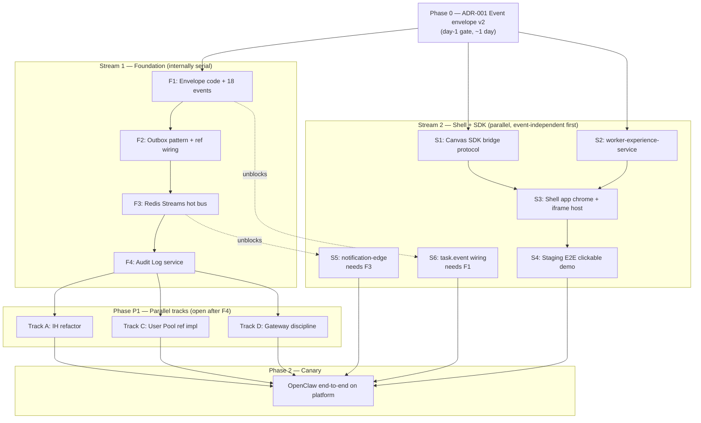

# AGI-OS Platform — Implementation Kickoff

> **Purpose.** Translate the design into concrete first moves inside the `agi-os` repo: what changes, in what order, what's sequential vs parallel, and rough size per item. **No calendar dates, no week assignments** — that's the EM's call once team and priorities are set.
>
> **Sizing convention (BOE + vibe coding).** Assumes AI-assisted coding, one engineer, focused work. Calendar time = ceiling(size / engineers × focus factor). Team leads convert to dates.
>
> - **S** = 1–3 engineer-days. Small, isolated, known pattern.
> - **M** = 3–10 engineer-days. Multi-file, new module, well-understood.
> - **L** = 10–20 engineer-days. New service or complex refactor.
> - **XL** = 20–60 engineer-days. Multi-service or high-ambiguity area.

---

## 1. TL;DR

| | |
|---|---|
| **What we're building** | Platform seams: canonical events + 3-layer plumbing, Integration Hub as integration plane, worker-shell tier, and capability-grade User Pool. Everything else stays where it is. |
| **First canvas on the platform** | OpenClaw (Level-0, accept all defaults). TB and GDPVal migrate later. |
| **Day-1 gate (blocks event-emitting work everywhere)** | `ADR-001 Event envelope v2` — ~1 day. Nothing else blocks. |
| **Two streams run in parallel from day 1** | **Stream 1 (Foundation)** — envelope code → outbox → Redis Streams → Audit Log. **Stream 2 (Shell + SDK)** — canvas SDK bridge + worker-experience-service + shell app + staging E2E demo. They converge when Stream 1 exits F3. |
| **Why two streams, not one** | ~70% of the worker-shell tier is event-independent (bridge is postMessage, bootstrap is REST, session mint is JWT). Serializing it behind the event bus was overcautious. |
| **First PR target** | `/docs/platform-adr/001-event-envelope-v2.md` — the gate. Land it on day 1 regardless of team size. |
| **Total BOE** | ~189–301 engineer-days across all streams and phases. EM-adjustable by parallelism. |

---

## 2. Dependency graph — what blocks what

**Rules:**
1. Phase 0 (ADR-001) is the only hard day-1 gate. Land it first.
2. Stream 1 is internally serial — F1 → F2 → F3 → F4. Don't split it across engineers trying to overlap.
3. Stream 2 is mostly parallel internally, and fully parallel with Stream 1 until it needs the bus or the envelope.
4. Phase P1 tracks A, C, D open when F4 is green.
5. Stream 2's S5 (notification-edge) and S6 (`task.event` wiring) are event-coupled; they complete when Stream 1 reaches F3 and F1 respectively. They're shown inside Stream 2 because the same engineer owns all of Stream 2's surface.

---

## 3. Current-state reality check

Honest before-picture of `agi-os` today, grounded in real file paths:

| Design element | Today in `agi-os` | Gap |
|---|---|---|
| Canonical events | `services/shared/shared/events/types.py` — ~10 domain events with thin `DomainEvent` base. | No task-lifecycle events (`TaskCreated`, `TaskAccepted`, `TaskSubmitted`, `TaskDelivered`, `TaskDeliveryAcked`). No unit-lifecycle events for the pay-per-task pool (`UnitPosted`, `UnitClaimed`, `UnitExpired`, `UnitReleased`, `UnitCompleted`). No canvas lifecycle events (`CanvasRegistered`, `CanvasPromoted`, `CanvasDeprecated`). Envelope missing `idempotency_key`, `correlation_id`, `causation_id`, `canvas_id`, `schema_version`. |
| Event bus | `shared/events/bus.py` — **in-process async dispatch only.** Header literally says "Phase 2: swap for Redis Pub/Sub or NATS." | No cross-service delivery. No durability. No replay. |
| Outbox | None. | All emitting services must add `dos_<svc>_outbox` + relay. |
| Audit Log | None. | New service. |
| Integration Hub | `integration-hub/src/integration_hub/models/` — `ConnectorConfigModel`, `WebhookEventModel`, `ConnectionLog`. **Inbound only.** | No outbound, no canvas shape, no platform-provider shape, no capability-grants table, no audit table. |
| `ProjectIntegration` dup | `project-management/src/project_management/models/integration.py`. Duplicates IH's `ConnectorConfigModel`. | Real design bug. PM should read via IH SDK. |
| Task state machine | Spread across `task-management` + `project-management`. | Not aligned to canonical states from `PLATFORM_DESIGN §11`. Per-canvas mapping work. |
| User Pool | Nothing in `agi-os`. TB and GDPVal each have their own. | Build reference implementation from scratch. |
| Gateway | `delivery-orchestration/` with Alembic migrations. | Needs hot-path discipline audit (no sync DB on capability RPC, JWKS cache, async audit, rate limit). |
| Worker shell | Nothing. | New frontend app + backend service. |
| Notification Edge | Nothing. | New service. |
| Canvas SDK | Nothing. | New npm package + Python package. |

---

## 4. Phase 0 — Day-1 gate (before anything else)

### ADR-001 Event envelope v2

**Size:** S (1–2 days)
**Depends on:** nothing
**Where:** new `/docs/platform-adr/001-event-envelope-v2.md` in the `agi-os` repo

**Contents:**
- Frozen envelope fields: `event_id`, `event_type`, `schema_version`, `occurred_at`, `project_id`, `source_service`, `idempotency_key`, `correlation_id`, `causation_id`, `canvas_id`, `payload`.
- Discriminated-union payload pattern (pydantic v2).
- Versioning policy: additive changes are non-breaking within a major version; breaking changes bump major.
- Idempotency rules: `idempotency_key` is the consumer's dedup key; `event_id` is the global unique identity.

**Exit:** ADR merged with sign-off from platform lead + IH owner + (if present) a canvas-team rep. **No code that emits canonical events lands until this is merged.**

This is ~1 day of work. It is the **only** thing that gates everything downstream. Ship it on day 1 regardless of whether the team is 1 person or 5.

---

## 5. Stream 1 — Foundation (internally SEQUENTIAL)

Starts the day ADR-001 merges. F1 → F2 → F3 → F4, strictly ordered. Do not split across engineers trying to overlap; the envelope and outbox shape need a single mind making the calls.

### F1 — Envelope code + 18 events

**Size:** M (5–8 days)
**Depends on:** ADR-001
**Where:** `services/shared/shared/events/`

**Deliverables:**
- `envelope.py` — `DomainEventV2` implementing the ADR. Coexists with existing `DomainEvent` (v1 stays, deprecated).
- `catalog.py` — the 18 canonical v1 events in three groups (see `EVENT_CATALOG.md §3` for the authoritative list):
  - **Task lifecycle** (10): `TaskCreated`, `TaskSubmitted`, `TaskValidated`, `TaskReworked`, `TaskRejected`, `TaskEscalated`, `TaskAccepted`, `TaskPermanentlyRejected`, `TaskDelivered`, `TaskDeliveryAcked` — customer contract; aligned to the canonical state machine in `PLATFORM_DESIGN §11`. `TaskEscalated` + `TaskPermanentlyRejected` cover the Senior QA escalation path (max-rework / integrity / appeal → Senior QA → accept or final reject).
  - **Unit lifecycle** (5, pay-per-task pool): `UnitPosted`, `UnitClaimed`, `UnitExpired`, `UnitReleased`, `UnitCompleted` — the worker claim/release cycle feeding billing.
  - **Canvas lifecycle** (3): `CanvasRegistered`, `CanvasPromoted`, `CanvasDeprecated` — IH registration changes, consumed by the shell's slug cache.
- `EVENT_CATALOG.md` graduates from 0.1 → 1.0 — payload schemas + idempotency formulas (§3 already locks names and groupings).

**Exit:** round-trip serialization tests green for all 18 events; schema locked.

### F2 — Outbox pattern

**Size:** M (6–10 days)
**Depends on:** F1
**Where:** `services/shared/shared/events/outbox.py` + first wiring in `integration-hub`

**Deliverables:**
- `OutboxWriter(db_session).write(event)` — same-transaction insert to `dos_<svc>_outbox`.
- `OutboxRelay(poll_interval, batch_size)` — async drain to bus.
- First reference wiring: `integration-hub` gets `dos_ih_outbox` via Alembic; existing direct `bus.publish` replaced with `outbox.write` (feature-flagged).
- ADR-002 Outbox semantics.

**Exit:** chaos test — kill relay mid-batch during a 10K-event run; zero drops, zero duplicate `event_id`s after restart.

### F3 — Redis Streams hot bus

**Size:** M–L (8–15 days)
**Depends on:** F2
**Where:** new `shared/events/redis_bus.py`, new `shared/events/consumer.py`, updated `docker-compose.dev.yml`

**Deliverables:**
- `RedisStreamBus` implementing the same protocol as the in-process bus; DI picks per environment.
- `ConsumerGroup` with heartbeat, ack, retry, DLQ.
- ADR-003 Event bus sharding (per-project stream vs global — decide before implementation).
- Redis service in `docker-compose.dev.yml`.

**Exit:** two services exchange events via Redis Streams. Load test at 10K events/s sustained, < 500 ms p99 fan-out.

### F4 — Audit Log service

**Size:** L (12–20 days)
**Depends on:** F3
**Where:** new `services/audit-log/`

**Deliverables:**
- FastAPI service, monthly-partitioned Postgres schema, consumer group on the hot bus.
- Query API: `GET /events?canvas_id=...&event_type=...&from=...&to=...`.
- Timeline endpoint: `GET /events/chain?correlation_id=...` — returns the full causation chain. Build this on day one; it's the debugging workhorse.
- GCS parquet archive deferred (Pass 3).

**Exit:** every canonical event lands within 2 s p99. 24-hour query returns in < 1 s. Full chain reconstructible from one `correlation_id`.

**Stream 1 total BOE:** ~31–53 engineer-days.

---

## 6. Stream 2 — Shell + SDK (PARALLEL with Stream 1)

Starts the day ADR-001 merges. Internally parallelizable where shown. Converges with Stream 1 at F1 (for `task.event`) and F3 (for notification-edge).

### S1 — Canvas SDK bridge protocol

**Size:** M (8–12 days)
**Depends on:** ADR-001 (for `task.event` payload shape; rest is event-independent)
**Where:** new `frontend/packages/canvas-sdk/`

**Deliverables:**
- `@agi-os/canvas-sdk` npm package.
- `bridge.connect()`, `bridge.send(type, payload)`, `bridge.on(type, handler)` — flat API per `CANVAS_SDK §4`.
- Handshake, session handling, capability discovery message layer.
- Shell-side entry: `@agi-os/canvas-sdk/shell` — `ShellHost`.
- Examples + README; publishable as internal package first.

**Exit:** two-page test harness (mock shell + mock canvas) passes full handshake + capability discovery + session mint + toast + task.event.

### S2 — `worker-experience-service`

**Size:** M (8–12 days)
**Depends on:** ADR-001 (envelope shape for emitted events)
**Where:** new `services/worker-experience-service/`

**Deliverables:**
- FastAPI service, Postgres-backed.
- `GET /bootstrap` — worker profile + canvas directory + capability grants (read-through IH with pod LRU + Redis cache).
- `GET /canvas/:slug/resolve` — slug → canvas_id + entry_url + scopes.
- `POST /session/mint` — canvas-scoped JWT.
- Bus invalidation wiring for `Canvas*` events (design for it now; actual wiring lands when F3 is green).

**Exit:** endpoints return live data for a manually-seeded OpenClaw canvas row in IH; p99 < 50 ms on slug resolve with a warm cache.

### S3 — Shell app

**Size:** L (12–18 days)
**Depends on:** S1 + S2
**Where:** new `frontend/canvas-agi-os/`

**Deliverables:**
- Vite + React.
- Left-nav chrome, iframe host component, routing on `/<slug>/*`.
- Bridge host via `@agi-os/canvas-sdk/shell`.
- Calls `worker-experience-service` for bootstrap + session mint.
- Placeholder notification panel (real SSE wiring comes in S5).

**Exit:** worker logs in on staging, navigates to a canvas, iframe loads, bridge handshake completes, session JWT arrives, capability-list returns the granted capabilities.

### S4 — Staging end-to-end demo

**Size:** S (3–5 days)
**Depends on:** S1 + S2 + S3
**Where:** `docker-compose` staging + test harness

**Deliverables:**
- Docker-compose wiring that stands up a minimal stack: IH (with seeded OpenClaw row) + worker-experience-service + shell app + a dummy "hello canvas" iframe.
- Worker logs in → bootstrap → iframe → bridge → session.ready → calls capability stub → shell responds.
- A single-page demo script that a leadership reviewer or canvas team can run in 5 minutes.

**Exit:** demo reproducible by anyone who pulls the repo. This is the artifact you show OpenClaw team when you ask them to start wiring.

---

### S5 — `notification-edge` (converges with Stream 1 at F3)

**Size:** L (15–25 days)
**Depends on:** F3 (needs the bus)
**Where:** new `services/notification-edge/`

**Deliverables:**
- SSE termination, hot-bus consumer, Postgres unread queue `dos_ne_pending`, sticky LB hash on `worker_id`.
- Per `COMPONENT_ARCHITECTURE §4.9`: 25K sockets/pod, FCM/APNS fallback hook for idle workers.
- Shell app's notification panel wires to real SSE.

**Exit:** 25K concurrent SSE sockets on one pod in load test; bus → client p99 < 2 s.

### S6 — `task.event` emission (converges with Stream 1 at F1)

**Size:** S (3–5 days)
**Depends on:** F1 (needs the envelope)
**Where:** canvas SDK + shell

**Deliverables:**
- Shell bridges `task.event` messages from canvas to the canonical bus as `DomainEventV2` envelopes (via worker-experience-service's emit endpoint, which uses the outbox).
- Update SDK docs with the shape.

**Exit:** a `task.submitted` message from a canvas iframe appears in Audit Log (once F4 is green) tagged with the correct `canvas_id`, `worker_id`, `correlation_id`.

**Stream 2 total BOE:** ~49–77 engineer-days (S1–S4 pre-convergence ~31–47; S5 + S6 post-convergence ~18–30).

---

## 7. Phase P1 — Parallel tracks (open after F4)

All three tracks start once F4 exits. Zero cross-track dependencies. Each track breaks into sized items.

### Track A — Integration Hub refactor

Goal: bring IH to `COMPONENT_ARCHITECTURE.md §4.3`.

| Item | Size | Depends on | Where |
|---|---|---|---|
| A1: Data-model migration — introduce `dos_ih_integrations` parent; move existing columns into `dos_ih_customer_integrations` subtype | L (10–15d) | F4 | `integration-hub/alembic/` + `integration_hub/models/` |
| A2: Add `dos_ih_canvas_integrations` + `dos_ih_canvas_capability_grants` + `dos_ih_integration_audit`. Seed OpenClaw row | M (5–8d) | A1 | same |
| A3: Add `dos_ih_platform_provider_integrations`. Migrate GCS + Salesforce | M (5–8d) | A1 | same |
| A4: Remove `project_management.models.integration.ProjectIntegration`; PM reads via new `ih_client.py` SDK module | M (5–10d) | A1 + PM owner sign-off | `project-management/` + IH SDK |
| A5: Outbound delivery — `OutboundEndpointModel`, dispatcher, HMAC signing, retry/DLQ. Emits `TaskDelivered` + `TaskDeliveryAcked` | L (12–18d) | A1 | `integration-hub/` |
| A6: Slug resolution cache (pod LRU + Redis, invalidated via `Canvas*` events) | S (3–5d) | A2 | `integration-hub/` + `worker-experience-service` |

**A-total:** L–XL (~40–60d). A1 → (A2 ∥ A3 ∥ A4) → (A5 ∥ A6).

Note: A6 consolidates the slug cache design into one place — the worker-experience-service (S2) had placeholder cache code that gets wired to real invalidation events here.

---

### Track C — User Pool reference implementation

Goal: hybrid Postgres-for-claim + Redis-for-heartbeat per `COMPONENT_ARCHITECTURE.md §5.1`.

| Item | Size | Depends on | Where |
|---|---|---|---|
| C1: Service scaffold + schema (`dos_up_pools`, `dos_up_units`, `dos_up_claims`). Stock `ClaimStrategy` — `FIFO`, `SkillMatch`, `WeightedRandom` | M (8–10d) | F4 | new `services/user-pool/` |
| C2: Claim path — `SELECT FOR UPDATE SKIP LOCKED` on pool-sharded table. Redis write-through (`claim:<id>` TTL). Emit `UnitClaimed` | M (6–10d) | C1 | same |
| C3: Heartbeat path — Redis-only `EXPIRE`. Reconciler drains expired → `UnitExpired` events | M (5–8d) | C2 | same |
| C4: Eligibility + TTL policies. Pool-shard bucket rotation | M (5–8d) | C2 | same |
| C5: Python SDK package `agi_os.user_pool` for canvas backends | S (3–5d) | C2 | `services/shared/` |
| C6: Load test — 10K claim QPS + 50K heartbeat QPS sustained, p99 under SLO | M (5–8d) | C3 + C4 | test rig |

**C-total:** L–XL (~32–49d). C1 → C2 → (C3 ∥ C4) → C6 ∥ C5.

---

### Track D — Gateway hot-path discipline

Goal: harden `delivery-orchestration/` per `COMPONENT_ARCHITECTURE.md §4.8`.

| Item | Size | Depends on | Where |
|---|---|---|---|
| D1: Discovery pass — enumerate every per-request DB read in the gateway | S (2–4d) | nothing (can start during F4) | `delivery-orchestration/` |
| D2: JWKS cache. Drop DB-based project/canvas lookups in favor of token claims | M (5–8d) | D1 + identity JWKS endpoint | same |
| D3: Async audit writes — `CapabilityInvoked` via outbox instead of sync inserts | M (4–7d) | F2 + D1 | same |
| D4: Circuit breakers + downstream pools. Per-worker Redis token bucket (cap 50 req/s) | M (5–8d) | D1 | same |
| D5: Load test — 30K QPS, p99 < 50 ms added overhead; break downstream, verify clean failover | S (3–5d) | D2 + D3 + D4 | test rig |

**D-total:** L (~19–32d). D1 → (D2 ∥ D3 ∥ D4) → D5. D1 can start during F4 (read-only discovery).

---

## 8. Phase 2 — OpenClaw canary

Goal: one real canvas running real tasks end-to-end.

| Item | Size | Depends on |
|---|---|---|
| OC1: OpenClaw backend wires to hot bus, emits `TaskCreated`; Level-0 pool auto-claims; canvas UI loads in worker shell | M (8–12d) | All Stream 2 and all P1 tracks green |
| OC2: QC + Notification integration via `capabilities.use` | M (5–8d) | OC1 |
| OC3: Internal dogfood — 100 tasks run by internal team; fix what breaks | M (5–10d) | OC2 |
| OC4: IH promotes OpenClaw to `prod`; single pilot project; 48-hr dashboard watch | S (2–3d) + observation | OC3 |
| OC5: Open to full OpenClaw production traffic | S (1–2d) | OC4 |

**Phase 2 total:** L (~21–35d + observation).

**Why OpenClaw first, not TB or GDPVal:**
- Greenfield — no legacy system to unwind while the platform is still forming.
- Canonical "accept all defaults" canvas — every Level-0 shell offering exercised.
- TB and GDPVal both have working pool/QC implementations. Migrating them before the platform has seen real traffic for a quarter is fighting the platform during its formative phase.

---

## 9. Out of scope (scope fence)

These are the temptations that will sink the plan if anyone lets them creep in before Phase 2 is green. Say no.

| Deferred | Why it waits |
|---|---|
| QC / Prism Zone B spec | Prism exists as a service; canvases call it. Lift-and-document later. |
| Batching Zone B spec | Understood shape (event-pipeline). Consumer of canonical events. |
| HITL Zone B spec | Same as batching. Reviewer canvas is Zone C for v1. |
| Fraud / Trust & Safety | Not on the OpenClaw canary path. |
| Dispute / Appeal | Works informally today. Formalize later. |
| Admin console UI polish | Track A does minimum viable (manual DB + scripts). Real console later. |
| Config Service | Hardcoded + env vars for v1. Promote when > 5 canvases in prod. |
| Canvas CLI (`@agi-os/canvas-cli`) | Hand-wire for v1. DX polish later. |
| GCS parquet archive (Audit Log Layer 3B) | Postgres hot storage covers compliance window for v1. |
| Kafka migration | Redis Streams holds through design load. Swap only if `§4.1.3` triggers fire. |
| TB / GDPVal migration | They work today. OpenClaw canary first. |

---

## 10. Role recommendations (not staffing math — EM's call)

Who should own what, based on skill fit. Heads count and calendar are the EM's to compute from total BOE + parallelism.

| Stream / Track | Primary skill | Notes |
|---|---|---|
| Phase 0 (ADR-001) | Platform lead | Authoritative envelope design; this is the most leveraged single day in the whole plan |
| Stream 1 (Foundation) | Backend platform lead | Pair heavily on F1/F2 reviews. Single mind, single voice on envelope + outbox. |
| Stream 2 (Shell + SDK) | Full-stack engineer | React + backend service fluency. Owns S1–S4 and picks up S5+S6 when they unblock. |
| Track A (IH refactor) | Backend + data migration | Opens after F4. Highest legacy risk; senior owner essential. |
| Track C (User Pool) | Backend + distributed systems | Hot-path performance work; Redis + Postgres hybrid patterns. |
| Track D (Gateway) | Backend + infra-leaning | Can be an existing `delivery-orchestration` owner. D1 can start during F4. |
| Phase 2 | Platform + OpenClaw embed | OpenClaw team provides one engineer part-time for the canary. |

**Max useful parallelism:**
- **Day 1 onward:** 2 streams (Foundation + Shell/SDK).
- **After F4:** up to 4 streams simultaneously (Shell/SDK finishing S5/S6 + Tracks A, C, D).
- **Phase 2:** 1 stream + OpenClaw embed.

---

## 11. Pre-flight checklist (do before day 1, regardless of calendar)

Ten things that unblock everything else. Not time-bound — but Phase 0 cannot start until these are done.

1. Land `/docs/platform-adr/` directory in `agi-os`. ADR-000 points at this design folder as authoritative.
2. Draft ADR-001 Event envelope v2 in a branch, ready to PR on day 1.
3. Open tracking issues for each of the 18 canonical events (10 task-lifecycle + 5 unit-lifecycle + 3 canvas-lifecycle). Link to `PLATFORM_DESIGN §10` + `EVENT_CATALOG.md §3`.
4. Add Redis to `docker-compose.dev.yml` (unused yet, ready for F3 and cache work in S2).
5. Shape (don't land) the Alembic migration skeleton for `dos_ih_outbox` in `integration-hub/alembic/versions/`.
6. Ping the `project-management` owner about the upcoming `ProjectIntegration` removal in A4. Get verbal alignment.
7. `grep -r ProjectIntegration services/` across the repo. Find every reader. Document.
8. Read the `delivery-orchestration/` codebase and list every synchronous DB call. Becomes D1's input.
9. Design-review session with the OpenClaw team. Walk them through `CANVAS_SDK §6` onboarding playbook. Confirm they can start Phase 2 wiring when the time comes.
10. Stand up a weekly 30-min "platform state of the union" meeting. Status, blockers, scope fence.

---

## 12. Unknowns to resolve early

| Unknown | Resolver | Who | When |
|---|---|---|---|
| Every sync DB call in `delivery-orchestration` | Code read + list | Track D owner | Before D2 starts |
| Does Alembic cleanly handle subtype tables for IH? | Branch prototype | Track A owner | Before A1 merges |
| Outside-PM readers of `ProjectIntegration` | Repo grep | Track A owner | Before A4 starts |
| Current actual event volume through `shared/events/bus.py` | Add a counter, observe | Phase F owner | During F1 |
| Is Docker Compose stack dev-only or prod-ish? | Ask ops | Phase F owner | Before F3 |
| Actual canvas count for next 12 months | Product + leadership | EM | Before C4 |
| Bridge protocol version-negotiation rules across SDK versions | ADR | Stream 2 owner | During S1 |

---

## 13. Risks

| Risk | Likelihood | Mitigation |
|---|---|---|
| Scope creep into Zone B stubs | High | §9 scope fence. Call out every request against it. |
| Event envelope v2 misses a field we regret | Medium | ADR-001 review with every service owner. Envelope is genuinely frozen once ADR lands. |
| Stream 2 builds against an event shape that changes | Low–Medium | ADR-001 is day 1; Stream 2 only uses `task.event` post-F1 via S6. Until then, Stream 2 is event-independent. |
| Outbox relay lag during bursts | Medium | Chaos test is the F2 exit criterion. |
| Redis cluster sizing wrong at 1M workers | Low until we get there | Single node first. `§4.1.3` triggers (Kafka migration) documented. |
| Turnover mid-project | Medium | Pair-program on Phase 0 and F1. Stream 2 engineer reads Stream 1 PRs. |
| OpenClaw not ready when tracks converge | Medium | Pre-flight item 9. Backup: synthetic TB workload as canary. |

---

## 14. How this doc evolves

- **Strike through** items as they land — don't delete (scope history matters).
- Add **actual size** next to the estimate when each item completes. Calibrate BOE from reality.
- **Update dependency graph** if a new blocker appears. The graph is the contract.
- **Retire this doc** when Phase 2 exits green. After that, work is normal project planning.

---

## 15. Appendix — total BOE rollup

| Phase / Stream | BOE | Parallelism |
|---|---|---|
| Phase 0 (ADR-001) | ~1–2 eng-days | Single owner |
| Stream 1 (Foundation: F1 → F4) | ~31–53 eng-days | Strictly serial |
| Stream 2 pre-convergence (S1 → S4) | ~31–47 eng-days | S1 ∥ S2 → S3 → S4 |
| Stream 2 post-convergence (S5, S6) | ~18–30 eng-days | S5 ∥ S6 after F3/F1 |
| Track A (IH refactor) | ~40–60 eng-days | A1 → (A2 ∥ A3 ∥ A4) → (A5 ∥ A6) |
| Track C (User Pool) | ~32–49 eng-days | C1 → C2 → (C3 ∥ C4) → C6 ∥ C5 |
| Track D (Gateway) | ~19–32 eng-days | D1 → (D2 ∥ D3 ∥ D4) → D5 |
| Phase 2 (OpenClaw canary) | ~21–35 eng-days + obs. window | Mostly serial |
| **Total** | **~193–308 eng-days** | — |

**With 2 engineers from day 1:** critical path is Stream 1 (31–53 days) overlapped with Stream 2 pre-convergence (31–47 days), then Phase P1 parallel band (dominated by Track A at 40–60 days), then Phase 2. EM converts to calendar.

---

## 16. Document trail

| If you ask … | Read … |
|---|---|
| Why these decisions? | `PLATFORM_DESIGN.md` |
| What does each component do? | `COMPONENT_ARCHITECTURE.md` |
| How does a canvas integrate? | `CANVAS_SDK.md` |
| What events exist? | `EVENT_CATALOG.md` (in progress) + `PLATFORM_DESIGN §10` |
| What's wrong with IH today? | `IH_GAP_ANALYSIS.md` |
| How do we start? | This file. |
