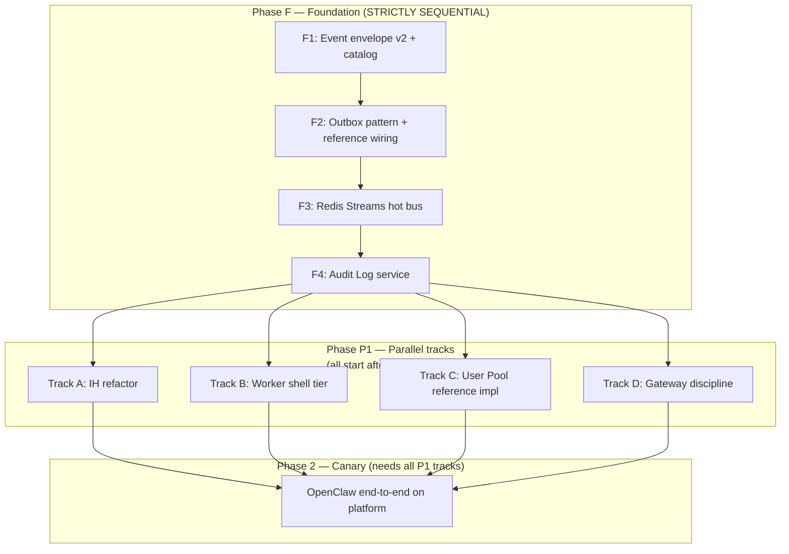

# AGI-OS Platform — Implementation Kickoff

> **Purpose.** Translate the design into concrete first moves inside the `agi-os` repo: what changes, in what order, what's sequential vs parallel, and rough size per item. **No calendar dates, no week assignments** — that's the EM's call once team and priorities are set.
>
> **Sizing convention (BOE + vibe coding).** Assumes AI-assisted coding, one engineer, focused work. Calendar time = ceiling(size / engineers × focus factor). Team leads convert to dates.
>
> - **S** = 1–3 engineer-days. Small, isolated, known pattern.
> - **M** = 3–10 engineer-days. Multi-file, new module, well-understood.
> - **L** = 10–20 engineer-days. New service or complex refactor.
> - **XL** = 20–60 engineer-days. Multi-service or high-ambiguity area.

---

## 1. TL;DR

| | |
|---|---|
| **What we're building** | Platform seams: canonical events + 3-layer plumbing, Integration Hub as integration plane, worker-shell tier, and capability-grade User Pool. Everything else stays where it is. |
| **First canvas on the platform** | OpenClaw (Level-0, accept all defaults). TB and GDPVal migrate later. |
| **What blocks everything** | Canonical event envelope + outbox + Redis Streams. Until those three exist, nothing downstream is real. |
| **First PR target** | `services/shared/shared/events/envelope.py` with `DomainEventV2` + `ADR-001 Event envelope v2`. |
| **Total BOE** | ~180–280 engineer-days across all phases. EM-adjustable by parallelism. |

---

## 2. Dependency graph — what blocks what

**Non-negotiable rule:** Phase F is serial. If three engineers split F1/F2/F3 in parallel, they invent three incompatible event shapes and Phase P1 becomes "unwind the mess."

**Inside Phase P1, the four tracks are fully independent** — no cross-track dependencies. They merge only in Phase 2.

---

## 3. Current-state reality check

Honest before-picture of `agi-os` today, grounded in real file paths:

| Design element | Today in `agi-os` | Gap |
|---|---|---|
| Canonical events | `services/shared/shared/events/types.py` — ~10 domain events with thin `DomainEvent` base. | No PPT events. Envelope missing `idempotency_key`, `correlation_id`, `causation_id`, `canvas_id`, `schema_version`. |
| Event bus | `shared/events/bus.py` — **in-process async dispatch only.** Header literally says "Phase 2: swap for Redis Pub/Sub or NATS." | No cross-service delivery. No durability. No replay. |
| Outbox | None. | All emitting services must add `dos_<svc>_outbox` + relay. |
| Audit Log | None. | New service. |
| Integration Hub | `integration-hub/src/integration_hub/models/` — `ConnectorConfigModel`, `WebhookEventModel`, `ConnectionLog`. **Inbound only.** | No outbound, no canvas shape, no platform-provider shape, no capability-grants table, no audit table. |
| `ProjectIntegration` dup | `project-management/src/project_management/models/integration.py`. Duplicates IH's `ConnectorConfigModel`. | Real design bug. PM should read via IH SDK. |
| Task state machine | Spread across `task-management` + `project-management`. | Not aligned to canonical states from `PLATFORM_DESIGN §11`. Per-canvas mapping work. |
| User Pool | Nothing in `agi-os`. TB and GDPVal each have their own. | Build reference implementation from scratch. |
| Gateway | `delivery-orchestration/` with Alembic migrations. | Needs hot-path discipline audit (no sync DB on capability RPC, JWKS cache, async audit, rate limit). |
| Worker shell | Nothing. | New frontend app + backend service. |
| Notification Edge | Nothing. | New service. |
| Canvas SDK | Nothing. | New npm package + Python package. |

---

## 4. Phase F — Foundation (SEQUENTIAL)

Nothing downstream ships until F4 exits. Each item lists dependencies, size, exit criteria, and concrete paths.

### F1 — Canonical event envelope + catalog v1

**Size:** M (5–8 days)
**Depends on:** nothing
**Where:** `services/shared/shared/events/`

**Deliverables:**
- `envelope.py` — `DomainEventV2(event_id, event_type, schema_version, occurred_at, project_id, source_service, idempotency_key, correlation_id, causation_id, canvas_id, payload)`. Coexists with v1 — do not break existing emitters.
- `catalog.py` — the 12 canonical PPT events (`TaskCreated`, `TaskAccepted`, `UnitPosted`, `UnitClaimed`, `UnitExpired`, `UnitReleased`, `UnitCompleted`, `TaskSubmitted`, `TaskDelivered`, `TaskDeliveryAcked`, plus the `Canvas*` lifecycle events).
- `EVENT_CATALOG.md` graduates from v0.0 → v1.0 with field-level docs.
- **ADR-001 Event envelope v2** in the repo (`/docs/platform-adr/`).

**Exit:** round-trip serialization tests green for all 12 events. Schema locked — no further changes without a new ADR.

---

### F2 — Outbox pattern

**Size:** M (6–10 days)
**Depends on:** F1
**Where:** `services/shared/shared/events/outbox.py` + first wiring in `integration-hub`

**Deliverables:**
- `OutboxWriter(db_session).write(event)` — same-transaction insert to `dos_<svc>_outbox`.
- `OutboxRelay(poll_interval, batch_size)` — async drain to bus.
- First reference wiring: `integration-hub` gets `dos_ih_outbox` via Alembic migration; `WebhookReceived` and `ConnectorInvoked` now emit through the outbox, not directly.
- **ADR-002 Outbox semantics** — at-least-once delivery, idempotency-key dedup rules.

**Exit:** chaos test — kill relay mid-batch during a 10K-event run; zero drops, zero duplicate `event_id`s after restart.

---

### F3 — Redis Streams hot bus

**Size:** M–L (8–15 days)
**Depends on:** F2
**Where:** new `shared/events/redis_bus.py`, new `shared/events/consumer.py`, updated `docker-compose.dev.yml`

**Deliverables:**
- `RedisStreamBus` implementing the same `EventBus` protocol as the existing in-process bus. DI picks per environment.
- `ConsumerGroup(service_name, event_types)` with heartbeat, ack, retry, DLQ.
- Sharding: one stream per `project_id` prefix vs global — **decide in ADR-003** before implementation.
- Redis added to `docker-compose.dev.yml`.

**Exit:** two services in `docker-compose up` exchange events via Redis Streams. Load test at 10K events/s sustained, < 500 ms p99 fan-out.

---

### F4 — Audit Log service

**Size:** L (12–20 days)
**Depends on:** F3
**Where:** new `services/audit-log/`

**Deliverables:**
- FastAPI service, monthly-partitioned Postgres schema, consumer group on the hot bus.
- Query API: `GET /events?canvas_id=...&event_type=...&from=...&to=...`.
- Timeline endpoint: `GET /events/chain?correlation_id=...` — returns the full causation chain. This one endpoint unlocks massive debugging value; build it on day one.
- GCS parquet archive explicitly **deferred** (Pass 3).

**Exit:** every canonical event from every emitting service lands within 2 s p99. 24-hour window query returns in < 1 s. Full chain for a task reconstructible from one `correlation_id`.

---

**Phase F total BOE:** ~31–53 engineer-days (1 engineer sequential, or 1 lead + pair partner faster).

---

## 5. Phase P1 — Parallel tracks

All four tracks start after F4 exits. Zero cross-track dependencies inside P1. Each track breaks into sized items.

### Track A — Integration Hub refactor

Goal: bring IH to `COMPONENT_ARCHITECTURE.md §4.3`.

| Item | Size | Depends on | Where |
|---|---|---|---|
| A1: Data-model migration — introduce `dos_ih_integrations` parent; move existing columns into `dos_ih_customer_integrations` subtype | L (10–15d) | F4 | `integration-hub/alembic/` + `integration_hub/models/` |
| A2: Add `dos_ih_canvas_integrations` + `dos_ih_canvas_capability_grants` + `dos_ih_integration_audit`. Seed OpenClaw row manually | M (5–8d) | A1 | same |
| A3: Add `dos_ih_platform_provider_integrations`. Migrate GCS + Salesforce into this shape with Secrets Service refs | M (5–8d) | A1 | same |
| A4: Remove `project_management.models.integration.ProjectIntegration`; PM reads via new `ih_client.py` SDK module. Feature-flagged rollout | M (5–10d) | A1 + PM owner sign-off | `project-management/` + IH SDK |
| A5: Outbound delivery — `OutboundEndpointModel`, dispatcher, HMAC signing, retry/DLQ. Emits `TaskDelivered` + `TaskDeliveryAcked` | L (12–18d) | A1 | `integration-hub/` |
| A6: Slug resolution cache (pod LRU + Redis, invalidated via `Canvas*` events) | S (3–5d) | A2 | `integration-hub/` |

**A-total:** L–XL (~40–60d). A1 → (A2, A3, A4 parallel) → (A5, A6 parallel).

---

### Track B — Worker shell tier

Goal: new stack — `worker-experience-service` + `notification-edge` + `canvas-agi-os` shell app + `@agi-os/canvas-sdk`.

| Item | Size | Depends on | Where |
|---|---|---|---|
| B1: `worker-experience-service` scaffold. Endpoints: `GET /bootstrap`, `GET /canvas/:slug/resolve`, `POST /session/mint` | M (8–12d) | F4 | new `services/worker-experience-service/` |
| B2: `@agi-os/canvas-sdk` npm package — flat `bridge.connect` / `send` / `on`; handshake; session handling; capability discovery stubs | M (8–12d) | F1 (envelope) | new `frontend/packages/canvas-sdk/` |
| B3: Shell app — new Vite + React app. Left-nav chrome, iframe host, routing on `/<slug>/*` | L (12–18d) | B2 | new `frontend/canvas-agi-os/` |
| B4: `notification-edge` service — SSE termination, hot-bus consumer, Postgres unread queue `dos_ne_pending`, sticky LB hash on `worker_id` | L (15–25d) | F3 | new `services/notification-edge/` |
| B5: Staging E2E — bootstrap → mint token → load OpenClaw iframe → bridge handshake → session.ready | S (3–5d) | B1 + B2 + B3 + B4 | integration test |

**B-total:** XL (~46–72d). B1 ∥ B2 ∥ B4 → B3 → B5.

---

### Track C — User Pool reference implementation

Goal: hybrid Postgres-for-claim + Redis-for-heartbeat per `COMPONENT_ARCHITECTURE.md §5.1`.

| Item | Size | Depends on | Where |
|---|---|---|---|
| C1: Service scaffold + schema (`dos_up_pools`, `dos_up_units`, `dos_up_claims`). Stock `ClaimStrategy` — `FIFO`, `SkillMatch`, `WeightedRandom` | M (8–10d) | F4 | new `services/user-pool/` |
| C2: Claim path — `SELECT FOR UPDATE SKIP LOCKED` on pool-sharded table. Redis write-through (`claim:<id>` TTL). Emit `UnitClaimed` | M (6–10d) | C1 | same |
| C3: Heartbeat path — Redis-only `EXPIRE`. Reconciler drains expired → `UnitExpired` events | M (5–8d) | C2 | same |
| C4: Eligibility + TTL policies. Pool-shard bucket rotation | M (5–8d) | C2 | same |
| C5: Python SDK package `agi_os.user_pool` for canvas backends | S (3–5d) | C2 | `services/shared/` |
| C6: Load test — 10K claim QPS + 50K heartbeat QPS sustained, p99 under SLO | M (5–8d) | C3 + C4 | test rig |

**C-total:** L–XL (~32–49d). C1 → C2 → (C3 ∥ C4) → C6 ∥ C5.

---

### Track D — Gateway hot-path discipline

Goal: harden `delivery-orchestration/` per `COMPONENT_ARCHITECTURE.md §4.8`.

| Item | Size | Depends on | Where |
|---|---|---|---|
| D1: Discovery pass — enumerate every per-request DB read in the gateway. Document each | S (2–4d) | nothing (can start during F4) | `delivery-orchestration/` |
| D2: JWKS cache (in-process + Redis fallback). Drop DB-based project/canvas lookups in favor of token claims | M (5–8d) | D1 + identity JWKS endpoint | same |
| D3: Async audit writes — gateway emits `CapabilityInvoked` via outbox instead of synchronous audit-table inserts | M (4–7d) | F2 + D1 | same |
| D4: Circuit breakers + downstream connection pools. Per-worker Redis token bucket (cap 50 req/s) | M (5–8d) | D1 | same |
| D5: Load test — 30K QPS sustained, p99 < 50 ms added overhead. Open a downstream circuit, verify clean failover | S (3–5d) | D2 + D3 + D4 | test rig |

**D-total:** L (~19–32d). D1 → (D2 ∥ D3 ∥ D4) → D5. D1 is the only item that can start before F4 (read-only discovery).

---

## 6. Phase 2 — OpenClaw canary

Goal: one real canvas running real tasks end-to-end.

| Item | Size | Depends on |
|---|---|---|
| OC1: OpenClaw backend wires to hot bus, emits `TaskCreated`; Level-0 pool auto-claims; canvas UI loads in worker shell | M (8–12d) | All P1 tracks green |
| OC2: QC + Notification integration via `capabilities.use` | M (5–8d) | OC1 |
| OC3: Internal dogfood — 100 tasks run by internal team; fix what breaks | M (5–10d) | OC2 |
| OC4: IH promotes OpenClaw to `prod`; single pilot project; 48-hr dashboard watch | S (2–3d) + observation window | OC3 |
| OC5: Open to full OpenClaw production traffic | S (1–2d) | OC4 |

**Phase 2 total:** L (~21–35d + observation).

**Why OpenClaw first, not TB or GDPVal:**
- Greenfield — no legacy system to unwind while the platform is still forming.
- Canonical "accept all defaults" canvas — every Level-0 shell offering exercised.
- TB and GDPVal both have working pool/QC implementations. Migrating them before the platform has seen real traffic for a quarter is fighting the platform during its formative phase.

---

## 7. Out of scope (scope fence)

These are the temptations that will sink the plan if anyone lets them creep in before Phase 2 is green. Say no.

| Deferred | Why it waits |
|---|---|
| QC / Prism Zone B spec | Prism exists as a service; canvases call it. Lift-and-document later. |
| Batching Zone B spec | Understood shape (event-pipeline). Consumer of canonical events. |
| HITL Zone B spec | Same as batching. Reviewer canvas is Zone C for v1. |
| Fraud / Trust & Safety | Not on the OpenClaw canary path. |
| Dispute / Appeal | Works informally today. Formalize later. |
| Admin console UI polish | Track A does minimum viable (manual DB + scripts). Real console later. |
| Config Service | Hardcoded + env vars for v1. Promote when > 5 canvases in prod. |
| Canvas CLI (`@agi-os/canvas-cli`) | Hand-wire for v1. DX polish later. |
| GCS parquet archive (Audit Log Layer 3B) | Postgres hot storage covers compliance window for v1. |
| Kafka migration | Redis Streams holds through design load. Swap only if `§4.1.3` triggers fire. |
| TB / GDPVal migration | They work today. OpenClaw canary first. |

---

## 8. Role recommendations (not staffing math — EM's call)

Who should own what, based on skill fit. Heads count and calendar time are the EM's to compute from total BOE + parallelism.

| Track | Primary skill | Notes |
|---|---|---|
| Phase F | Backend platform lead | Foundational choices; pair heavily in F1/F2 reviews |
| Track A (IH) | Backend + data migration | Track A has the most legacy risk; senior owner essential |
| Track B (worker shell) | Full-stack + frontend | Needs React + backend service fluency; biggest item is B4 (notification edge) which is backend |
| Track C (User Pool) | Backend + distributed systems | Hot-path performance work; owner should be comfortable with Redis + Postgres hybrid patterns |
| Track D (gateway) | Backend + infra-leaning | Small track; can be an existing `delivery-orchestration` owner |
| Phase 2 | Platform + OpenClaw embed | OpenClaw team provides one engineer part-time for the canary |

Parallel capacity (max useful): **4 independent tracks in P1 + discovery-pass parallel in D1 during F4 = effectively 5 streams at peak**. Any headcount beyond that sits idle or creates coordination tax.

---

## 9. Pre-flight checklist (do before Phase F starts, regardless of calendar)

Ten things that unblock everything else. Not time-bound — but F1 cannot start until these are done.

1. Land **`/docs/platform-adr/`** in `agi-os`. ADR-000 points at this design folder as authoritative.
2. Draft **ADR-001 Event envelope v2** — frozen envelope, discriminated-union payloads, versioning policy. Circulate for review.
3. Open tracking issues for each of the 12 canonical PPT events. Link to `PLATFORM_DESIGN §10` + `EVENT_CATALOG.md`.
4. Add Redis to `docker-compose.dev.yml` (unused yet, but ready for F3).
5. Shape (don't land) the Alembic migration skeleton for `dos_ih_outbox` in `integration-hub/alembic/versions/`.
6. Ping the `project-management` owner about the upcoming `ProjectIntegration` removal in A4. Get verbal alignment.
7. `grep -r ProjectIntegration services/` across the repo. Find every reader. Document.
8. Read the `delivery-orchestration/` codebase and list every synchronous DB call. Becomes the D1 discovery-pass input.
9. Design-review session with the OpenClaw team. Walk them through `CANVAS_SDK §6` onboarding playbook. Confirm they can start their end of Phase 2 when the time comes.
10. Stand up a weekly 30-min "platform state of the union" meeting. Status, blockers, scope fence.

---

## 10. Unknowns to resolve early

These are the things we honestly don't know about `agi-os` today. Resolve them before the tracks that depend on them start, not after.

| Unknown | Resolver | Who | When |
|---|---|---|---|
| Every sync DB call in `delivery-orchestration` | Code read + list | Track D owner | Before D2 starts |
| Does Alembic cleanly handle subtype tables for IH? | Branch prototype | Track A owner | Before A1 merges |
| Outside-PM readers of `ProjectIntegration` | Repo grep | Track A owner | Before A4 starts |
| Current actual event volume through `shared/events/bus.py` | Add a counter, observe | Phase F owner | During F1 |
| Is Docker Compose stack dev-only or prod-ish? | Ask ops | Phase F owner | Before F3 |
| Actual canvas count for next 12 months (drives pool-shard defaults) | Product + leadership | EM | Before C4 |

---

## 11. Risks

| Risk | Likelihood | Mitigation |
|---|---|---|
| Scope creep into Zone B stubs | High | §7 scope fence. Call out every request against it. |
| Event envelope v2 misses a field we regret | Medium | ADR-001 review with every service owner. Envelope is genuinely frozen once ADR lands. |
| Outbox relay lag during bursts | Medium | Chaos test is the F2 exit criterion, not an afterthought. |
| Redis cluster sizing wrong at 1M workers | Low until we get there | Single node first. `§4.1.3` triggers (Kafka migration) already documented. |
| Turnover mid-project | Medium | Pair-program on Phase F. Every track has a second engineer who's read the code. |
| OpenClaw not ready when P1 exits | Medium | Pre-flight item 9 (design review). Backup: synthetic TB workload as canary. |

---

## 12. How this doc evolves

- **Strike through** items as they land — don't delete (scope history matters).
- Add **actual size** next to the estimate when each item completes. We calibrate BOE from reality over time.
- **Update dependency graph** if a new blocker appears. The graph is the contract.
- **Retire this doc** when Phase 2 exits green. After that, work is normal project planning.

---

## 13. Appendix — total BOE rollup

**Rough** totals for EM calendar-math:

| Phase | BOE | Parallelism |
|---|---|---|
| Phase F | ~31–53 engineer-days | Strictly serial (1 engineer at a time, or lead + pair) |
| Track A | ~40–60 engineer-days | Mostly serial within the track; some parallel sub-items |
| Track B | ~46–72 engineer-days | B1 ∥ B2 ∥ B4 parallel, then B3 → B5 |
| Track C | ~32–49 engineer-days | C1 → C2 → (C3 ∥ C4) → C6 ∥ C5 |
| Track D | ~19–32 engineer-days | D1 → (D2 ∥ D3 ∥ D4) → D5 |
| Phase 2 | ~21–35 engineer-days + observation | Mostly serial |
| **Total** | **~189–301 engineer-days** | — |

At 4 engineers with 60% focus factor: Phase F sequential ≈ 15–20% of total calendar; Phase P1 parallel band is the long pole (bounded by Track B or Track A, whichever is larger); Phase 2 is ~10% tail. **The EM owns the calendar math.**

---

## 14. Document trail

| If you ask … | Read … |
|---|---|
| Why these decisions? | `PLATFORM_DESIGN.md` |
| What does each component do? | `COMPONENT_ARCHITECTURE.md` |
| How does a canvas integrate? | `CANVAS_SDK.md` |
| What events exist? | `EVENT_CATALOG.md` (in progress) + `PLATFORM_DESIGN §10` |
| What's wrong with IH today? | `IH_GAP_ANALYSIS.md` |
| How do we start? | This file. |
