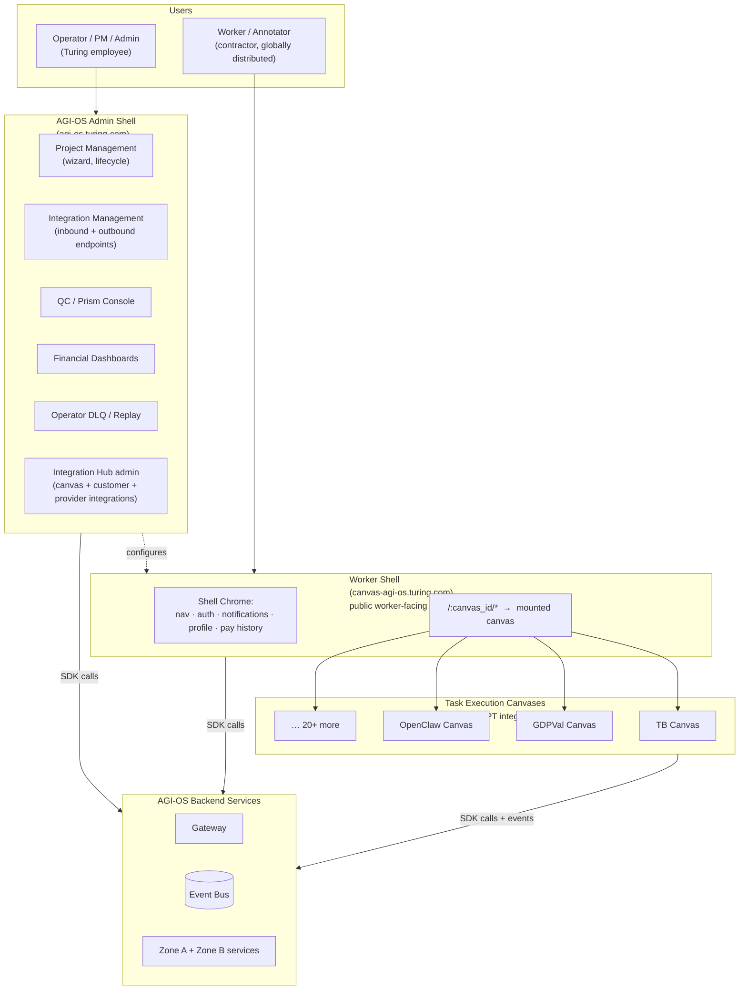
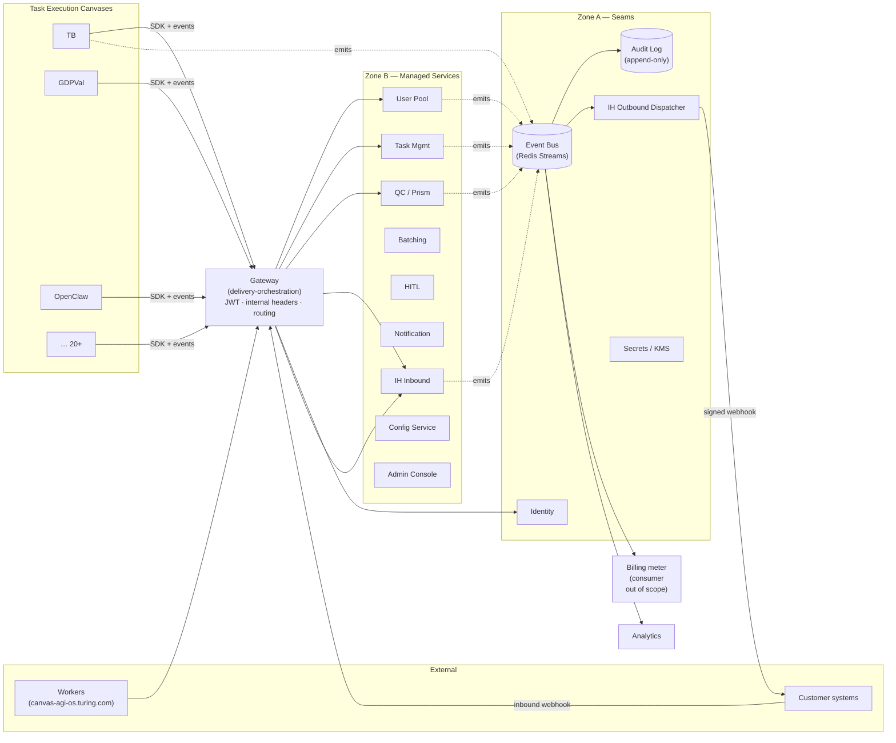
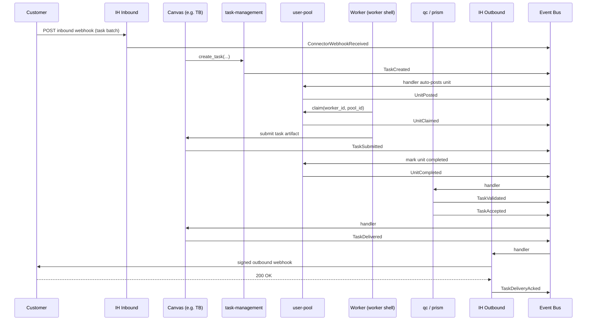
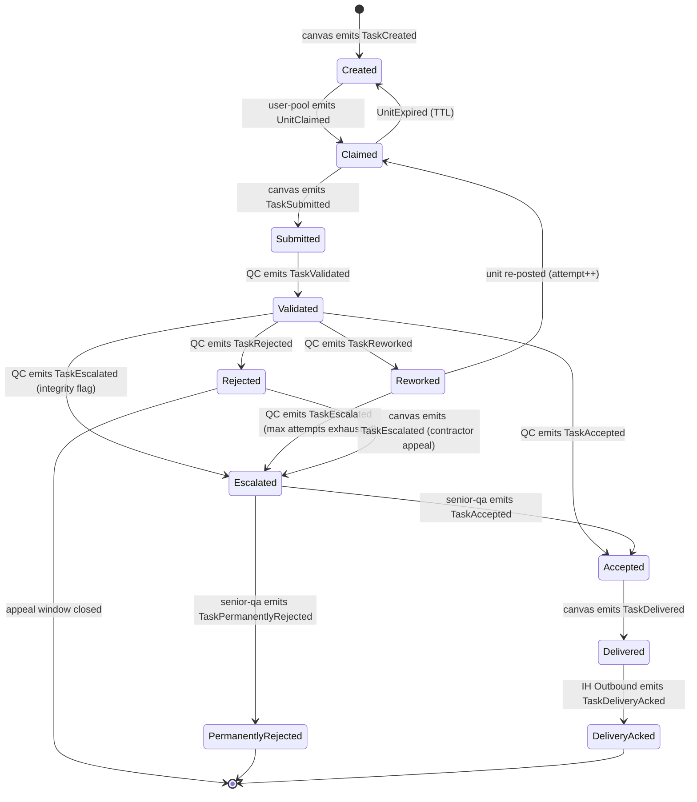

# AGI-OS Platform Design

> Platform vision, operating principles, three-surface model, zones, architecture, tech decisions, rollout, and governance. This is the conceptual document — per-component detail lives in `COMPONENT_ARCHITECTURE.md`.

---

## 1. Document metadata

| Field | Value |
|---|---|
| **Title** | AGI-OS Platform Design |
| **Status** | Draft v0.3 (multi-doc split + Mermaid diagrams + committed tech decisions) |
| **Primary audience** | Platform engineers building AGI-OS |
| **Secondary audience** | Canvas engineers onboarding pay-per-task projects (TB, GDPVal, OpenClaw, 20+ more) |
| **Leadership reads** | §2 only |
| **Authors** | Ashu (Principal Engineer, AGI-OS) |
| **Reviewers** | TBD |
| **Last updated** | 2026-04-21 |
| **Related docs** | `./README.md`, `./COMPONENT_ARCHITECTURE.md`, `./CANVAS_SDK.md`, `./EVENT_CATALOG.md`, `./IH_GAP_ANALYSIS.md` |
| **Change log** | 0.1 — initial draft §1–§7 (2026-04-21). 0.2 — Pass 2 sample: §8.1 Event Bus, §8.3 IH Outbound, §8.8 User Pool (2026-04-21). 0.3 — split into multi-doc; seller → canvas rename; Mermaid diagrams in §4.5 and §7; §7.6 committed tech decisions; §11 canonical state machine; stubs point at sibling docs (2026-04-21). 0.4 — worker-shell architecture decided (iframe + bridge SDK); §7.6 row 11 closed; §17 Q1 resolved; `CANVAS_SDK.md §3–§6` filled (2026-04-21). |

### 1.1 Why this doc is not monolithic

Earlier drafts kept everything in one file. It hit 900 lines and the value-per-line dropped. The split is:

| Doc | Scope |
|---|---|
| `PLATFORM_DESIGN.md` (this doc) | Vision, zones, architecture, decisions, rollout |
| `COMPONENT_ARCHITECTURE.md` | Per-component deep-dive with diagrams |
| `CANVAS_SDK.md` | How canvases integrate — shell, bridge, registration (via IH) |
| `EVENT_CATALOG.md` | Canonical events (reference) |
| `IH_GAP_ANALYSIS.md` | Integration Hub current → target |

See `README.md` for the full index and reading order.

### 1.2 How to read this document

- Leadership reads **§2 TL;DR** and stops.
- Platform engineers read **§3–§7** end-to-end, then use `COMPONENT_ARCHITECTURE.md` as reference.
- Canvas engineers read **§4.5 (three surfaces)**, **§6 (three zones)**, then go directly to `CANVAS_SDK.md`.
- Gap analysis is scoped to **Integration Hub only** by explicit choice. Every other component in `COMPONENT_ARCHITECTURE.md` is target-state; no current-code grounding is attempted or claimed outside of IH.

### 1.3 Non-goals of this document

- Not a requirements doc for an individual canvas. TB, GDPVal, OpenClaw each have their own.
- Not a catalog of ADRs. Referenced ADRs live as separate files.
- Not a specification of billing ledger, invoicing, or payout execution. Those are another team's deliverable; this doc commits only to **emitting the right events** for them to consume. This is a Zone A contract, not a Zone A service.
- Not a specification of Flex or the Talent Onboarding platform. Those are adjacent platforms; this doc defines only the event seam AGI-OS exposes.

### 1.4 Terminology

- **Canvas** — short name for a Task Execution Canvas. Conversational.
- **Task Execution Canvas (TEC)** — formal name.
- **`ExecutionSurface`** — code/technical term (see `services/task-management/src/task_management/models/execution_surface.py`).

The code keeps `ExecutionSurface`; prose uses "canvas." Prior drafts used "seller" — that terminology has been retired because these are Turing-owned integrations, not an AWS Marketplace.

---

## 2. TL;DR for leadership

> One page. If you only read this page, you have enough to decide.

**The situation.** Turing runs 20+ pay-per-task (PPT) projects. TB, GDPVal, OpenClaw, and the rest are each building the same infrastructure — worker pools, QC, batching, customer delivery, billing metering, HITL, notifications — in roughly the same shape, with roughly the same pitfalls, but incompatibly. Finance cannot consolidate. Compliance cannot certify. Customers see inconsistent contracts. Every new project starts from zero.

**The bet.** Instead of building a PPT monolith, AGI-OS becomes a **platform** — like AWS is to ISVs, Stripe to merchants, Shopify to stores. Canvases (TB, GDPVal, OpenClaw, …) bring their own task execution; the platform provides managed services and a stable SDK. Canvases stay independent where it matters (authoring UI, task generator, workflow engine) and adopt standard rails where it matters to the business (identity, event emission, customer delivery, billing metering, audit).

**The operating principle.** Standardize the **seams**, not the **insides**. Restrictions exist only where one canvas's divergence would break another canvas's world — money, compliance, customer trust, interoperability. Everything else is the canvas's call.

**The three zones.**

| Zone | What | Example | Flexibility |
|---|---|---|---|
| **A — Seams** | Platform-dictated contracts | Canonical events, identity, customer delivery, billing metering, audit | None |
| **B — Managed services** | Platform-offered, canvas-consumed | User pool, QC/Prism, batching, HITL, notification, config | Opt in/out per component |
| **C — Canvas-owned** | Out of scope for platform | Authoring UI, task generator, workflow engine | Full |

**The payoff.** OpenClaw onboards in two weeks without writing platform code. TB and GDPVal re-home under the same contract. Finance consolidates on one event schema. Project #21 gets the nine hard-earned lessons from GDPVal and TB for free.

**The ask.** P0 foundations in 6 weeks with 4 engineers delivers the seams (events, customer delivery, agent-panel integration, IH as the integration plane for canvas + customer + platform-provider registration). P1 in another 6 weeks delivers shared PPT primitives (pool, QC router, redispatch, admin, observability). P2 is nice-to-have trust and extensibility work.

**What this document is.** The design contract between AGI-OS platform engineering and every PPT canvas. It locks vision, zones, events, components, rollout, and governance so no new project gets to "just build it our way."

---

## 3. Why this document exists

### 3.1 The 20+ project problem

Turing operates 20+ projects that, from a distance, look remarkably similar: a customer hands over a stream of tasks, a pool of workers executes them, quality control gates production, payment happens on delivery, results are shipped back to the customer. Each project is separately real — the tasks differ, the rubrics differ, the workflows differ — but the **scaffolding** around them is the same nine concerns, repeated.

Today each project builds that scaffolding itself.

- TB uses Temporal and Postgres. GDPVal uses Cloud Tasks and Firestore. OpenClaw will pick yet another combination.
- Each ships its own customer webhook integration — some HMAC, some JWT, most without retries that survive a DNS flap or a restart of the receiving service.
- Each writes its own billing metering, with inconsistent field names, inconsistent idempotency rules, inconsistent semantics around "payment eligible" vs "delivery eligible."
- Each builds an operator console from scratch.
- None of them share a common audit log, a common SLO dashboard, or a common fraud-defense catalog.

The cost is not hypothetical. Finance cannot consolidate revenue across projects without a human reconciling schemas. Compliance cannot attest to data handling without auditing 20 separate implementations. Customer trust varies by which project a given customer happens to be integrated with. Onboarding an engineer to a new project is a three-week rediscovery exercise. Worst of all: every new project starts the cycle again.

### 3.2 Why a middle ground won't work

The instinctive reaction is to build "a PPT module" and ask everyone to adopt it. That fails predictably.

If the module is **too rigid**, canvases discover a case it doesn't cover, they fork it, and we end up with 21 implementations instead of 20.

If the module is **too loose**, it provides nothing new, and canvases build on top of it exactly as before — with the added overhead of pretending to use a platform.

Picking an arbitrary middle doesn't help. The middle is still arbitrary. What resolves the tension is picking the **right axis** to be restrictive on: the cross-cutting concerns that break when canvases diverge — billing, identity, customer delivery, audit, compliance. On those, the platform is absolute. On everything else, the canvas is sovereign.

This is exactly how AWS, Stripe, and Shopify work. The next section makes that model explicit.

### 3.3 What this document must not become

A corollary, since it is tempting. This document must not become:

- **A retrofit.** It does not describe the current AGI-OS codebase with fancier words. Where the current code supports the vision, we say so; where it does not, we say so equally plainly.
- **A catalog of wishes.** Every Zone A commitment has an owner, a contract, and a rollout phase.
- **A negotiation surface.** Zone A is Zone A by design. Canvases that cannot accept it do not ship on AGI-OS. This is not cruel — it is the only way a platform of this kind survives.

---

## 4. Vision — AGI-OS is a platform, not a framework

### 4.1 The platform analogy

AGI-OS is to its canvases what **AWS is to an ISV**, what **Stripe is to a merchant**, what **Shopify is to a store**.

- **AWS** is strict on IAM, billing metering, VPC networking, and service API shapes. It is entirely agnostic about what you run inside an EC2 instance.
- **Stripe** is absolute on payment rails, PCI handling, webhook signatures, idempotency keys, and dispute schemas. It has zero opinion on what your checkout UI looks like.
- **Shopify** dictates the order schema, inventory schema, and payment flow. It is permissive about themes, custom apps, and merchant workflow.

All three feel "free" to their tenants because the restrictions are where restrictions *have* to be — and nowhere else. AGI-OS adopts the same shape.

| | AWS equivalent | AGI-OS equivalent |
|---|---|---|
| The platform | AWS itself | AGI-OS |
| The tenant | ISV on AWS | Task Execution Canvas (TB, GDPVal, OpenClaw) |
| The end customer | ISV's customers | Customer buying tasks |
| Identity service | IAM | AGI-OS Identity & Tenancy |
| Metering | AWS billing | Canonical metering events |
| Persistent storage | S3 / RDS | Artifact data plane / per-service Postgres |
| Eventing | EventBridge | Canonical event bus |
| Workflow engine | Not AWS's problem | Not AGI-OS's problem (canvas chooses) |
| The product sold | Seller's software | Canvas's task execution |

Read the table once more. Note what AWS does **not** provide: the ISV's product. Note what AGI-OS does **not** provide: the canvas's task execution. The platform provides the **shell** and the **managed services**. The canvas provides the task execution.

### 4.2 What AGI-OS *is*

AGI-OS is:

1. A **set of managed platform services** (identity, events, integration hub, user pool, QC, batching, HITL, notification, config, audit, admin, observability).
2. An **SDK + CLI** that canvases use to call those services and emit canonical events.
3. The **Integration Hub as the single integration plane** — canonical home for canvas registration, customer integrations, and platform-provider integrations. Replaces anything that would otherwise live as a YAML manifest in a canvas repo.
4. A **contract catalog** — the set of events, schemas, and invariants every canvas must honor.
5. A **governance process** that evolves contracts without breaking canvases.

That's the whole product.

### 4.3 What AGI-OS *is not*

AGI-OS is **not**:

- A workflow engine. It does not orchestrate the canvas's steps. Canvases use Temporal, Cloud Tasks, Celery, or whatever fits their domain.
- A framework the canvas's code runs "inside." Canvases deploy their own services; they call AGI-OS over HTTP / gRPC / SDK.
- An authoring UI platform. Each canvas builds its own (Coder, Next.js, Label Studio, spreadsheets).
- A generator or LLM-prompt manager. That is canvas-owned.
- A monolith. It is an ensemble of right-sized microservices, each with a clear bounded context.
- A free-for-all. Canvases that opt out of a managed service still must honor the contracts in Zone A.

If you catch yourself designing something that requires the canvas to subclass an AGI-OS class, **you have crossed the line**. The platform is a service, not a framework. Canvases call it; they do not extend it.

### 4.4 The canvas as a black box

From AGI-OS's perspective, a canvas is a black box with four visible surfaces:

1. **Identity** — every request the canvas makes is authenticated to a scoped tenant token; identity is assigned and managed in Integration Hub.
2. **Events emitted** — the canvas publishes canonical events at known lifecycle points.
3. **Events consumed** — the canvas subscribes to canonical events and reacts (customer webhook acks, delivery confirmations).
4. **IH registration record** — the authoritative record of the canvas: `canvas_id`, `slug`, `entry_url`, `backend_url`, owners, lifecycle state, capability grants. No YAML in the canvas's repo; the record lives in IH's database (`COMPONENT_ARCHITECTURE.md §4.3.4`).

Everything else is invisible to the platform. That invisibility is the feature, not a limitation. It is what lets the platform serve 20 canvases without knowing what any of them actually builds.

### 4.5 The three surfaces (UI model)

Previous sections described the service model. Equally important is the **user-interface model**, because humans interact with AGI-OS at three distinct surfaces.

**The three surfaces.**

| Surface | Who | URL | Owns |
|---|---|---|---|
| **Admin Shell** | Operators, PMs, admins (Turing employees) | `agi-os.turing.com` (internal) | Project lifecycle, Integration Hub (customer + canvas + platform-provider), QC config, financials, DLQ replay |
| **Worker Shell** | Workers (Turing contractors) | `canvas-agi-os.turing.com` (public) | Chrome: left nav, auth, notifications, profile, pay history. Hosts canvases in its mount area. |
| **Task Execution Canvas** | Workers (inside the worker shell) | `canvas-agi-os.turing.com/:canvas_id/*` | The actual task UX — authoring, labeling, evaluating, submitting |

**Key properties.**

1. **Operators never see canvases directly.** They configure projects in the admin shell, which configures IH and other services, which in turn render as options to workers.
2. **Workers never see the admin shell.** The worker shell is their world. The canvas fills the content area; the shell provides everything around it.
3. **Each canvas is a swap-in.** Replacing TB tomorrow is an IH lifecycle transition (deprecate TB, approve replacement) + a worker-shell route reload; the worker shell code itself does not change.
4. **Admin and worker are two different products.** They share backend services but not UI code, not session state, not design system (they *may* share components; they need not).

**Why this matters for design.** The admin shell is where `Integration Hub` configuration happens — that is, where an operator says "for project X, customer endpoint is Y, signing key is Z, pay model is `pay_per_task`." The worker shell is where the effect of that configuration is felt — a worker sees the TB canvas because project X was configured to use TB. The admin shell is the control plane; the worker shell (plus canvases) is the data plane made visible.

**How canvases actually load into the worker shell** (iframe / module federation / dynamic bundle / web components / hybrid) is an **open decision** — see `CANVAS_SDK.md §2` for the full brainstorm and recommendation.

---

## 5. Operating principles

Five principles govern every design decision in this document. When a question arises that this document does not directly answer, these principles resolve it.

### 5.1 Standardize seams, not insides

A **seam** is any point where a canvas's choice would affect another canvas, another team, the customer, finance, compliance, or the platform as a whole. Seams are where the platform is restrictive.

An **inside** is any mechanism purely within the canvas's own execution. Insides are where the platform has zero opinion.

| Concern | Seam or inside? | Why |
|---|---|---|
| Event emission shape | Seam | Finance, audit, analytics all depend. |
| Rubric score computation | Inside | Canvas domain logic. |
| Customer webhook signature algorithm | Seam | Customer trust, security. |
| Pool storage (Redis vs Postgres) | Inside | As long as the contract is honored. |
| Worker identity | Seam | Cross-service attribution, payouts, audit. |
| Authoring UI visual design | Inside | Zero cross-canvas impact. |

### 5.2 The triage question

When unsure whether something is platform-owned or canvas-owned, ask exactly one question:

> **"If two canvases do this differently, does it break a cross-canvas invariant — billing, compliance, security, customer trust, finance consolidation, or interoperability?"**

- **Yes** → platform contract. Restrictive. No flexibility. This is a seam.
- **No** → canvas's choice. Offer a default if useful; never mandate.

This single question resolves 95% of scope debates. Adopt it as a team habit.

### 5.3 Contracts hard, implementations soft

Every capability has three layers:

1. **Contract** — interface, event schema, invariants, SLO. Owned by AGI-OS. Immutable within a major version.
2. **Reference implementation** — the default that covers most canvases. Owned by AGI-OS. Evolves freely within the contract.
3. **Extension points** — named strategy interfaces canvases can override. Owned by AGI-OS; implemented by canvases.

A canvas adopts a capability at one of three levels:

| Level | Name | Meaning |
|---|---|---|
| **0** | Accept defaults | Import the SDK, call the service, ship. No code. |
| **1** | Override strategies | Use the reference implementation; inject custom strategies for specific behaviors (e.g. a custom eligibility policy on the pool). |
| **2** | Replace implementation | Implement the contract yourself (e.g. run your own pool on Redis). Still emit canonical events. Still honor invariants. |

Level 2 is allowed. **Forking is not.** The difference: Level 2 is registered in IH with explicit capability grants and remains observable to the platform (it still emits canonical events). A fork disappears into a canvas's private repo and becomes invisible.

### 5.4 Platform ≠ in-process framework

The platform is **a set of services the canvas calls**, not a library the canvas's code runs inside.

- SDKs are thin clients over HTTP / gRPC / event bus — they do not contain business logic.
- Canvases never import platform classes to extend.
- Canvases never ship platform code inside their process.
- Platform upgrades do not require canvas deploys, except when a contract version changes — which is governed (§15).

This is the cardinal difference between a platform and a framework. Frameworks create coupling; platforms create interfaces.

### 5.5 Govern by economics, not by enforcement

The platform never says "you must use us." It says "using us is free, tested, observable, compliant, and audited; not using us means you do all that yourself."

- A canvas that accepts defaults ships faster than one that doesn't.
- A canvas that uses the SDK gets observability for free.
- A canvas that emits canonical events shows up in the central finance dashboard automatically.
- A canvas that opts out of a managed service takes on its operational burden in full.

The right incentive structure produces the right adoption without needing a policeman. Canvases that opt out at Level 2 do so because they genuinely need to — and they still honor the contract, which is what actually matters.

---

## 6. The three zones

The platform model resolves into three zones. Every platform concern lands in exactly one.

### 6.1 Zone A — Seams (platform-dictated, non-negotiable)

Zone A is where a canvas's divergence would break a cross-canvas invariant. The platform mandates the shape; canvases have no flexibility beyond the contract.

| Component | Why it is Zone A |
|---|---|
| Canonical event catalog + envelope | Finance, billing, audit, analytics all depend on one shape. |
| Identity & tenancy model | Every request must be attributable to a known tenant. |
| Integration Hub — Outbound customer delivery | Customer trust, signing, retry, DLQ, audit. One shape only. |
| Billing metering events | Finance consolidates across canvases; schema drift is catastrophic. |
| Audit log schema | Dispute resolution and compliance attestations need uniformity. |
| Secrets & key management | The security model cannot be per-canvas. |
| Artifact data-plane contract | Customer artifacts must have a uniform manifest, retention, and access model. |

If it is in Zone A, there is one acceptable shape. A canvas that cannot accept it does not ship on AGI-OS.

### 6.2 Zone B — Managed services (platform-offered, canvas-consumed)

Zone B is where the platform offers managed services that most canvases will use because building them is expensive and the platform's version is good. Canvases can **opt out per component** if they have a reason, but they still honor Zone A contracts (particularly event emission).

| Component | Why it is Zone B |
|---|---|
| User Pool (pool/claim, eligibility, skills) | Common pattern, but some canvases want custom backends. |
| Task execution service + state machine | Canonical states matter; internal engine does not. |
| QC / Prism | Central QC brain; canvases with fundamentally different scoring may skip. |
| Batching | Packaging shape varies widely; offer a default. |
| Human-in-the-Loop | Reviewer UI varies; offer a default. |
| Notification (internal / worker / operator) | SMTP / Slack / in-app plumbing. |
| Integration Hub — Inbound connectors | Data-source variety; offer a registry-based connector model. |
| Config Service | Rubrics, rates, thresholds — `app_configs`-style. |
| Fraud / Trust & Safety | Cross-project learning; shared patterns. |
| Dispute / Appeal | State machine differs slightly per project. |
| Admin / Operator Console | Operator views; canvases may want custom panels. |
| Observability & SLOs | Platform provides dashboards; canvases emit metrics. |

Capability grants configured in IH (§4.3.4 in `COMPONENT_ARCHITECTURE.md`) tell the platform which Zone B services the canvas uses and with what scope. Defaults are the starting point; the admin console reports on Level 1 / 2 adoption so deviations are visible.

### 6.3 Zone C — Canvas-owned (platform has no opinion)

Zone C is the canvas's product. The platform does not build, offer, or opine on these concerns.

| Component | Why it is Zone C |
|---|---|
| Authoring UI | Coder, Next.js, Label Studio, Sheets — all valid; platform doesn't care. |
| Task generator / LLM prompting | Canvas IP. |
| Internal workflow engine | Temporal, Cloud Tasks, Celery — canvas's choice. |
| Packaging mechanics | xlsx vs Dockerfile+tests vs labels — canvas's format. |
| Rubric content (weights, rules) | Canvas domain; platform provides the framework they plug into, not the weights. |
| Customer pricing and contract negotiation | Canvas owns the commercial relationship. |

Zone C is the largest by line count and the smallest by platform effort. That is correct.

### 6.4 Component placement table

Every known component, classified. (Details in `COMPONENT_ARCHITECTURE.md`.)

| # | Component | Zone | Detail ref |
|---|---|---|---|
| 1 | Canonical event catalog + envelope | A | `EVENT_CATALOG.md`, `COMPONENT_ARCHITECTURE.md §4.1` |
| 2 | Event bus infrastructure | A | `COMPONENT_ARCHITECTURE.md §4.1` |
| 3 | Identity, Tenancy & Access | A | `COMPONENT_ARCHITECTURE.md §4.2` |
| 4 | Integration Hub (Integration Plane) — registration + outbound delivery | A | `COMPONENT_ARCHITECTURE.md §4.3`, `IH_GAP_ANALYSIS.md` |
| 5 | Billing metering events | A | `COMPONENT_ARCHITECTURE.md §4.4` |
| 6 | Audit Log | A | `COMPONENT_ARCHITECTURE.md §4.5` |
| 7 | Secrets & Key Management | A | `COMPONENT_ARCHITECTURE.md §4.6` |
| 8 | Artifact / Data Plane contract | A | `COMPONENT_ARCHITECTURE.md §4.7` |
| 9 | User Pool | B | `COMPONENT_ARCHITECTURE.md §5.1` |
| 10 | Task Execution + State Machine | B | `COMPONENT_ARCHITECTURE.md §5.2` |
| 11 | QC / Prism | B | `COMPONENT_ARCHITECTURE.md §5.3` |
| 12 | Batching | B | `COMPONENT_ARCHITECTURE.md §5.4` |
| 13 | Human-in-the-Loop | B | `COMPONENT_ARCHITECTURE.md §5.5` |
| 14 | Notification (internal) | B | `COMPONENT_ARCHITECTURE.md §5.6` |
| 15 | Integration Hub — Inbound connectors | B | `COMPONENT_ARCHITECTURE.md §5.8`, `IH_GAP_ANALYSIS.md` |
| 16 | Config Service | B | `COMPONENT_ARCHITECTURE.md §5.7` |
| 17 | Fraud / Trust & Safety | B | `COMPONENT_ARCHITECTURE.md §5.9` |
| 18 | Dispute / Appeal | B | `COMPONENT_ARCHITECTURE.md §5.10` |
| 19 | Admin / Operator Console | B | `COMPONENT_ARCHITECTURE.md §5.11` |
| 20 | Observability & SLOs | B | `COMPONENT_ARCHITECTURE.md §5.12` |
| 21 | Canvas SDK + CLI | Rails | `CANVAS_SDK.md` |
| 22 | Canvas Registration (via IH) | Rails | `CANVAS_SDK.md §3`, `COMPONENT_ARCHITECTURE.md §4.3.4` |
| 23 | Sandbox / Staging | Rails | `COMPONENT_ARCHITECTURE.md §6.3` |
| 24 | Authoring UI | C | — canvas-owned |
| 25 | Task generator | C | — canvas-owned |
| 26 | Internal workflow engine | C | — canvas-owned |
| 27 | Packaging mechanics | C | — canvas-owned |
| 28 | Rubric content | C | — canvas-owned |
| 29 | Customer pricing | C | — canvas-owned |

### 6.5 Reasoning for the contested placements

Three placements deserve a justification because they are the ones that come up in design review.

**QC / Prism as Zone B, not Zone A.**
One could argue QC is core enough to be a seam. It is not. Canvases with fundamentally different scoring (e.g. a binary pass/fail vs a weighted rubric) should be allowed to run their own QC. What finance cares about is the *events* — `TaskValidated`, `TaskRejected`, `TaskAccepted` — not the algorithm that produced them. So the *events* are Zone A, the *service* is Zone B.

**Billing metering events as Zone A, but billing service out of scope.**
The events are Zone A because finance depends on their shape. The *consuming* service — the ledger, invoicing, payout — is another team's deliverable and is out of scope for this document. This is the clean seam Turing's organizational structure is asking for.

**User Pool as Zone B, not Zone A.**
The worker identity is Zone A (everyone must use the same worker ID). The pool mechanics (claim strategy, TTL policy, eligibility) are Zone B because projects legitimately diverge here. GDPVal's static TTL vs TB's sliding TTL is not a compliance issue; it is a product choice.

---

## 7. High-level architecture

### 7.1 Canvas ↔ Platform interaction model

A canvas interacts with the platform across four distinct channels. None of them involve running platform code inside the canvas's process.

1. **SDK calls (outbound from canvas).** The canvas's services use the AGI-OS SDK to call platform services: allocate a task, claim a unit from a pool, submit a QC result, package a batch. Authenticated HTTP / gRPC calls scoped to the canvas's tenant.
2. **Event emission (outbound from canvas).** At lifecycle transitions, the canvas publishes canonical events on the AGI-OS event bus. These events are the metering surface — finance, audit, customer delivery, and analytics all consume them.
3. **Event consumption / webhooks (inbound to canvas).** The canvas subscribes to platform-emitted events or receives signed callbacks (e.g. "your outbound delivery was acked by the customer"). The canvas handles these idempotently.
4. **IH registration (one-time, operator-approved).** The canvas team submits a minimal registration request (display name, entry URL, backend URL, owners) through the IH admin console. On approval, IH assigns the `canvas_id`, issues bootstrap credentials, and grants capability scopes. No YAML in the canvas repo. See `COMPONENT_ARCHITECTURE.md §4.3.4`.

The canvas never imports platform classes. The canvas never runs platform Python / Go / TypeScript inside its process. The canvas **calls**, **emits**, **subscribes**, **declares**. Nothing more.

### 7.2 Three planes

AGI-OS separates concerns into three planes. Every platform service belongs to exactly one.

| Plane | Purpose | Traffic | Examples | Consistency | Failure mode |
|---|---|---|---|---|---|
| **Control plane** | Configuration, registration, governance | Low-volume, high-consistency | Integration Hub (all three integration shapes), Config Service, Identity, Admin Console | Strong (Postgres) | Read-mostly caches keep runtime alive during a control-plane outage |
| **Data plane** | Task execution data, artifacts, submissions | Medium-volume, latency-sensitive | Task record store, User Pool, Artifact store (GCS), QC state | Strong per record; eventual across services | Backpressure; canvases queue until recovery |
| **Event plane** | Cross-service communication, metering, audit | High-volume, bounded latency | Canonical event bus, outbound webhook dispatcher, audit log stream | At-least-once; consumers must be idempotent | DLQ, replay, backpressure |

The separation is deliberate. A slow config service must not slow a task claim; a storm of events must not overwhelm the control plane.

### 7.3 Reference topology

The gateway (`delivery-orchestration`) is the single ingress: it validates JWT, injects `X-Internal-*` headers for downstream services, and routes. The event bus is the single fan-out: every cross-service communication happens through it. Customer webhooks enter via the gateway, outbound ones leave via the IH Outbound Dispatcher. No canvas talks to a customer directly.

### 7.4 Task lifecycle sequence

End-to-end journey of a single task through the platform.

Every transition is an event. The event stream *is* the task's history — the audit log is derived from it, billing is derived from it, customer delivery is triggered by it. No other communication channel is load-bearing.

### 7.5 Why this shape

Three properties fall out of this topology:

1. **Independent failure domains.** Billing can be down for an hour without blocking task execution. QC can be slow without losing claims. Customer webhook delivery can retry for days without side-effecting the event log.
2. **Uniform observability.** Every billable transition is an event on the bus. Metering is not a feature of any individual service; it is a consequence of the event stream.
3. **Canvas replaceability.** If TB's canvas is replaced tomorrow by a new one, the platform does not care — as long as the new one emits the same events with the same shape. Zone A contracts are the interface; implementations behind them are fungible.

### 7.6 Committed technology decisions

These are the technology choices the platform commits to. Alternatives exist for every line; the rationale column explains why this pick beats them for AGI-OS specifically. Items marked **OPEN** are not yet decided; follow the link.

> **Note on event plumbing.** Events flow through **three layers**, each solving a different failure mode. Do not conflate them.
>
> - **Layer 1 (outbox)** — atomic-publish guarantee at the source. Solves "did my DB write and my event emission stay consistent?" No transport can substitute for this; even Kafka's transactional producer does not span Postgres.
> - **Layer 2 (hot bus)** — low-latency online fan-out to live consumers. Short retention.
> - **Layer 3 (durable log)** — long-retention replayable history for billing reconciliation, compliance, analytics backfill, dispute forensics.
>
> The substrate at each layer is replaceable independently. See `COMPONENT_ARCHITECTURE.md §4.1` for the layered topology and §4.5 for the durable-log service spec.

| Concern | Decision | Alternatives | Rationale | ADR? |
|---|---|---|---|---|
| **Event Layer 1 — reliable publish at source** | **Outbox pattern** — `dos_*_outbox` table per service, same DB tx as business row; shared relay publishes to Layer 2 | Event sourcing, 2PC, best-effort publish | Only this solves cross-boundary atomicity (Kafka transactional producer does not span Postgres); proven pattern; replayable; debuggable; substrate-agnostic so Layer 2 can change without touching service code | No |
| **Event Layer 2 — hot bus (online fan-out)** | **Redis Streams** — 7–14 day retention, consumer groups, per-stream ordering | Kafka, NATS, GCP Pub/Sub | Already in infra; ~$0 marginal ops cost; handles 100k+ events/sec on one node (our volume is <10k/sec today); consumer groups + DLQ adequate. **Swap triggers** to evaluate Kafka are in `COMPONENT_ARCHITECTURE.md §4.1.3`. | Yes |
| **Event Layer 3 — durable log (long-retention history)** | **Audit Log service** — Postgres hot (2 yrs, monthly partitioned) + GCS parquet cold archive (7 yrs), fed from Layer 2 via dedicated consumer group | Kafka with long retention, EventStoreDB, direct archive from outbox | Kafka at this tier is overkill until Layer 2 triggers hit; Postgres + GCS parquet gives compliance queries + warehouse loads at a fraction of the ops cost. Full spec in `COMPONENT_ARCHITECTURE.md §4.5`. | No |
| Consumer DLQ (Layer 2) | **Per-consumer-group Postgres table** + Admin replay UI | Kafka DL topic, dedicated DLQ service | Low volume; Admin Console naturally owns the surface; SQL debugging wins | No |
| Event envelope | **Frozen v1 envelope in `EVENT_CATALOG.md §2`** | Per-team envelope | Finance + audit cannot be per-team | Yes |
| Secrets | **GCP Secret Manager** (KMS-wrapped) | Vault, AWS Secrets Manager | Already on GCP; KMS integration; rotation primitives | No |
| Object store | **GCS + signed URLs** | S3, Cloudflare R2 | Already on GCP; signed URL TTLs meet artifact contract | No |
| Per-service database | **Postgres** (per service, logically isolated) | MongoDB, per-service-choice | Strong consistency for claim atomicity; `SELECT FOR UPDATE SKIP LOCKED`; operational familiarity outweighs polyglot-persistence wins at this scale | No |
| Real-time UI fan-out | **SSE from gateway** | WebSocket, long-polling | Simpler; one-way suffices; survives LBs better; canvas integration is additive | No |
| Workflow engine | **Canvas's choice (Zone C)** | Mandate Temporal / Cloud Tasks | Platform does not orchestrate canvas internals | N/A |
| Canvas → platform backend transport | **HTTP/JSON via gateway + event bus** | gRPC, GraphQL | Already built; simple; polyglot-friendly | No |
| Canvas → worker shell integration | **Iframe + two-SDK bridge** — `@turing/canvas-host` (shell) + `@turing/canvas-guest` (canvas), published from the separate `turing-canvas-sdk` repo (see `CANVAS_SDK §7`) | Module federation, dynamic bundle, web components, hybrid | Zone A = data governance, Zone C = look-and-feel — iframe is the only loader that preserves Zone C freedom. Reassess at ~50 canvases or p95 cold-start >1.5 s. Full rationale in `CANVAS_SDK.md §2`. | Yes (records this decision) |
| Monitoring | **OpenTelemetry → Cloud Monitoring** | Datadog, Grafana Cloud | Standard; vendor-neutral; avoids canvas-per-tool integrations | No |
| Auth — human | **JWT in HTTP-only cookie + gateway `X-Internal-*` header injection** | OAuth2 per service, mTLS | Already built (`services/shared/shared/auth/`); works across canvases | No |
| Auth — canvas | **Scoped tenant token, short TTL, per-canvas** | Shared API key | Scoped; rotatable; matches canvas-as-tenant model | Yes |
| Auth — customer | **HMAC-signed webhooks + scoped inbound JWT bypass** | OAuth2, mTLS | Already built for inbound; parallels outbound signing | No |
| Migrations | **Alembic per service** | Shared migrations repo | Already the norm; per-service isolation | No |

**Read this table as commitments.** Items without "OPEN" are decided; changing them requires an ADR overriding this section. Items marked "OPEN" need input before implementation; the linked section explains what input.

### 7.7 What this shape is *not*

Worth being explicit because architects tend to drift:

- **Not an ESB.** The event bus does not transform, enrich, route conditionally, or otherwise take responsibility for business logic. It delivers events.
- **Not a saga orchestrator.** The platform does not own multi-step transactions across canvases. Canvases' internal workflow engines own their own orchestration.
- **Not a mesh.** Services talk to each other through events and well-scoped SDK calls, not through a generic service mesh with shared policy. Istio-style mesh is an infra concern, not a platform-design concern.

---

## 8. Component catalog

> **Moved.** The 19-component catalog (purpose, contract, events, SDK, storage, diagrams, tech choices per component) lives in `COMPONENT_ARCHITECTURE.md`.
>
> That document uses a consistent 11-field template and includes Mermaid diagrams for each filled component. Three components are filled as Pass 2 sample (Event Bus, IH Outbound, User Pool); the remaining 16 are stubs with one-line current-state notes.

---

## 9. Cross-cutting rails

> **Moved.** Canvas SDK, registration, and shell integration are specified in `CANVAS_SDK.md` (canvas-facing) and `COMPONENT_ARCHITECTURE.md §4.3.4` (platform-facing). Sandbox/staging is a future addition to `COMPONENT_ARCHITECTURE.md §6.3`.

---

## 10. Canonical event catalog v1

The envelope is frozen (11 fields — see `EVENT_CATALOG.md §2`). The v1 event list is **18 events in three groups**. Payload schemas, idempotency formulas, and full examples live in `EVENT_CATALOG.md`; this section pins the names and groupings so the rest of this document can reference them.

### 10.1 Task lifecycle (10 events)

The customer contract: a billable task moving through the platform. These events track the canonical state machine in `§11`. Applies to every canvas regardless of billing model.

| Event | Emitter | Triggers state transition |
|---|---|---|
| `TaskCreated` | canvas | `→ Created` |
| `TaskSubmitted` | canvas | `Claimed → Submitted` |
| `TaskValidated` | QC / Prism | `Submitted → Validated` |
| `TaskReworked` | QC / Prism | `Validated → Reworked` |
| `TaskRejected` | QC / Prism | `Validated → Rejected` |
| `TaskEscalated` | QC / Prism or canvas | `Reworked → Escalated` (max rework), `Validated → Escalated` (integrity), `Rejected → Escalated` (appeal) |
| `TaskAccepted` | QC / Prism or senior-qa | `Validated → Accepted` or `Escalated → Accepted` |
| `TaskPermanentlyRejected` | senior-qa | `Escalated → PermanentlyRejected` |
| `TaskDelivered` | canvas | `Accepted → Delivered` |
| `TaskDeliveryAcked` | integration-hub | `Delivered → DeliveryAcked` |

### 10.2 Unit lifecycle (5 events, pay-per-task-specific)

The worker claim/release cycle in the pool. These are what billing consumers read to meter pay-per-task. A canvas on `fixed_aht` or `hourly` still emits them (the pool is the pool), but billing interprets them differently.

| Event | Emitter | Meaning |
|---|---|---|
| `UnitPosted` | user-pool | A unit is available for claim |
| `UnitClaimed` | user-pool | A worker holds a lease |
| `UnitExpired` | user-pool | Lease TTL elapsed without submission |
| `UnitReleased` | user-pool | Worker voluntarily released the lease |
| `UnitCompleted` | user-pool | Lease closed via submission (paired with `TaskSubmitted`) |

### 10.3 Canvas lifecycle (3 events)

IH registration changes. Consumed by the worker shell's slug-resolution cache (`COMPONENT_ARCHITECTURE §4.3.4`) for invalidation. Not billable-flow.

| Event | Emitter | Meaning |
|---|---|---|
| `CanvasRegistered` | integration-hub | A new canvas registration record exists |
| `CanvasPromoted` | integration-hub | Canvas moved from `staging` → `prod` |
| `CanvasDeprecated` | integration-hub | Canvas marked for sunset |

Three additional canvas events (`CanvasArchived`, `CanvasCredentialRotated`, `CanvasScopeChanged`) are defined in `COMPONENT_ARCHITECTURE §4.3.4` for operational use but are not required for v1 canary; they can ship alongside or in a minor-version bump.

### 10.4 What's not in v1

Deferred to a later minor version, not because they're unimportant but because they're not required for OpenClaw canary:

- **Operational / audit events** — `OutboundDeliveryAttempted`, `WebhookDeliveryFailed`, `CapabilityInvoked`, `RateLimitExceeded`. These ship when their emitting service lands (Audit Log, Gateway hot-path, IH Outbound). They are audit-stream events, not state-machine events.
- **Reviewer / HITL events** — formal shape defined when the HITL Zone B capability is specified.
- **Batch lifecycle events** — same; deferred with the Batching Zone B capability.

---

## 11. Canonical task state machine

Every task progresses through the canonical state machine below. Canvases map their internal states onto this one; emitted events correspond to state transitions.

**State meanings.**

| State | Meaning |
|---|---|
| `Created` | Task exists and is posted to a pool, awaiting a worker |
| `Claimed` | A worker has a lease; TTL is counting down |
| `Submitted` | Worker submitted an artifact; awaiting QC |
| `Validated` | QC has processed; one of `Accepted` / `Reworked` / `Rejected` / `Escalated` follows |
| `Accepted` | QC passed; task is ready to deliver to customer |
| `Reworked` | QC failed but recoverable; task re-enters the pool for the same worker (1:1) up to `max_rework_attempts` |
| `Rejected` | QC failed with fast-path reject; appeal window open. Terminal if the window closes without appeal |
| `Escalated` | Under Senior QA review — either from max-rework exhaustion, an integrity flag, or a contractor appeal |
| `PermanentlyRejected` | Senior QA final reject; no payout, closed |
| `Delivered` | Canvas emitted `TaskDelivered`; IH Outbound has been triggered |
| `DeliveryAcked` | Customer acked the outbound delivery; loop closed |

**Three escalation triggers** (PRD §11.8.1 alignment):

1. **Max rework attempts exhausted** — `Reworked → Escalated`, emitted by QC when `rework_attempt_number > max_rework_attempts`.
2. **Integrity concern** — `Validated → Escalated`, emitted by QC when a reviewer flags potential fraud, prohibited tool use, or policy breach.
3. **Contractor appeal** — `Rejected → Escalated`, emitted by the canvas (or shell's appeal UI) when a worker contests a reject inside the appeal window.

**Canvas-side mapping.** A canvas with richer internal states (e.g. TB's 6 substates between `Submitted` and `Validated`) maps them to canonical states at emission time. The canvas's internal state machine is Zone C; the canonical one is Zone A.

**Transitions not shown** (for legibility): `Cancelled` from any pre-`Delivered` state (customer withdrew), `PayableEventVoided` for reversals, `Paused` (admin temporarily hides the task from the pool).

---

## 12. Canvas integration playbook

> **Moved.** See `CANVAS_SDK.md §6` for the onboarding playbook.
>
> End-to-end walkthroughs for TB, GDPVal, and OpenClaw will be written after `CANVAS_SDK.md §2` (shell architecture) lands.

---

## 13. Non-goals

Explicit list of what AGI-OS will never do. This is the counterweight to §4.2.

- **AGI-OS will not be a workflow engine.** Canvases choose Temporal, Cloud Tasks, Celery, or bare cron. The platform never prescribes.
- **AGI-OS will not ship an authoring UI.** Each canvas builds its own (Coder, Next.js, Label Studio, spreadsheets).
- **AGI-OS will not host canvas code in-process.** Canvases deploy their own services; they call AGI-OS.
- **AGI-OS will not operate the billing ledger.** The ledger is another team's deliverable; AGI-OS emits events, another service consumes them.
- **AGI-OS will not be a monorepo.** It is a set of microservices with bounded contexts.
- **AGI-OS will not accept forks.** Level 2 customization is in-catalog; forks are not.
- **AGI-OS will not prescribe a workflow for how canvases build their product.** CI, test strategy, language choice, framework choice — canvas's call.
- **AGI-OS will not guarantee exactly-once event delivery.** At-least-once + idempotency-key-driven dedupe is the contract. Consumers that cannot be idempotent do not ship.

---

## 14. Rollout plan

### 14.1 P0 — Foundations (6 weeks, 4 engineers)

The minimum viable platform that unblocks OpenClaw onboarding and lets TB + GDPVal migrate incrementally.

| Workstream | Deliverable |
|---|---|
| Event envelope v1 | `EVENT_CATALOG.md §2` implemented in `shared/events/types.py` with `project_id`, `idempotency_key`, `schema_version`, `correlation_id`, `causation_id`, `canvas_id` |
| Outbox pattern | Shared outbox helper; `dos_tm_outbox`, `dos_ih_outbox` tables; relay binary |
| Event bus transport | Redis Streams integration; consumer groups; per-group DLQ Postgres tables |
| IH Outbound — MVP | `OutboundEndpointModel`, attempts log, DLQ; dispatcher subscribing to `TaskDelivered`; HMAC signing; exponential backoff retry |
| IH inbound — Phase 2 completion | `WebhookService.process_event` implemented; publishes canonical events on the bus |
| PM / IH unification | Collapse `ProjectIntegration` into `ConnectorConfigModel`; PM reads via IH SDK (see `IH_GAP_ANALYSIS.md §4` #7) |
| Admin console | Outbound endpoint management + DLQ replay |

### 14.2 P1 — PPT runtime primitives (6 weeks)

Ship the Zone B components that make "onboard in two weeks" real.

| Workstream | Deliverable |
|---|---|
| User Pool reference implementation | `COMPONENT_ARCHITECTURE.md §5.1` — pools, units, claims with `SKIP LOCKED`; stock strategies |
| Canvas registration via IH | `CANVAS_SDK.md §3` + `COMPONENT_ARCHITECTURE.md §4.3.4` — admin console form, approval flow, credential issuance, capability grants |
| QC / Prism layered service | Wrap existing `quality-control` primitives into a managed service with canonical events |
| Billing metering events | `COMPONENT_ARCHITECTURE.md §4.4` — four event families keyed by `pay_model` |
| Canvas SDK v0 | Python SDK for `publish`, `subscribe`, `post`, `claim`, `heartbeat`, `release`, `register_outbound_endpoint` |
| Worker shell v0 | `canvas-agi-os.turing.com` chrome + canvas mount (architecture per `CANVAS_SDK.md §2` once decided) |

### 14.3 P2 — Trust & extensibility (4 weeks)

| Workstream | Deliverable |
|---|---|
| Secrets to KMS | Move plaintext secrets to GCP Secret Manager references |
| Audit log service | Dedicated append-only store with compliance queries |
| Fraud / T&S patterns | Shared library + cross-canvas signals |
| Observability dashboards | Per-canvas + per-component SLO dashboards |
| Sandbox environment | Canvas integration testing surface |

Rollout is sequential by phase but can be parallelized within a phase.

---

## 15. Governance

### 15.1 Versioning & deprecation policy

- Zone A contracts (event envelope, event types, identity model, IH outbound contract) follow **semver**.
- **Minor** bumps add optional fields. Canvases do not need to change.
- **Major** bumps remove or rename fields. **6-month deprecation window**; both versions supported simultaneously.
- Deprecations announced in the `canvas-announce` channel + email + doc changelog + IH admin console banner.

### 15.2 Canvas registration (via Integration Hub)

A canvas reaches production through Integration Hub's registration flow. See `CANVAS_SDK.md §3` (canvas-facing) and `COMPONENT_ARCHITECTURE.md §4.3.4` (platform-facing) for the full spec. Governance-relevant summary:

- The registration record in IH is the authoritative source. There is no YAML manifest, no `canvas-registry` repo.
- Canvas team provides ~8 fields (display name, entry URL, backend URL, owners, version). Everything else — `canvas_id`, capability scopes, credentials, lifecycle state — is platform-assigned on approval.
- Capability adoption is **runtime discovery** (`capabilities.list` / `describe`), not a static declaration in a file. Authorization comes from the token's `scope` claim, which reflects the IH capability grants.
- Events emitted by a canvas must be canonical (in `EVENT_CATALOG.md`) at valid schema versions. Enforcement is at the bus layer (emit-time validation), not at registration.
- Lifecycle transitions (`staging → prod`, `prod → deprecated`, etc.) are operator-driven in IH, audited, and emit canonical events (`CanvasRegistered`, `CanvasPromoted`, `CanvasDeprecated`).

### 15.3 Breaking-change process

1. Propose as ADR.
2. Share with all canvas owners + leadership.
3. 2-week review window.
4. If approved: announce, ship new version in parallel, open 6-month deprecation clock.
5. At clock end: old version read-only for 1 month, then removed.

No canvas is surprised by a breaking change.

### 15.4 Canvas onboarding review

A new canvas reaches production only after:
- IH registration approved (lifecycle `staging` state).
- Sandbox integration test passes (full task lifecycle with mock customer).
- One-time architecture review with platform team (60 min).
- Operator runbook merged.
- Operator promotes lifecycle `staging → prod` in the IH admin console.

This gate is cheap once the platform is mature. It exists to catch the 5% of issues that sandbox testing misses.

---

## 16. Gap analysis — Integration Hub

> **Moved.** See `IH_GAP_ANALYSIS.md` for the full current-state-vs-target analysis, grounded in `services/integration-hub/` + `services/project-management/`.
>
> **Scope intentionally limited to Integration Hub.** Every other component in `COMPONENT_ARCHITECTURE.md` is target-state; no current-code grounding is claimed outside of IH.

---

## 17. Open questions + ADRs to write

| # | Question | ADR? | Blocks |
|---|---|---|---|
| 1 | ~~Worker-shell architecture — iframe / module federation / hybrid?~~ **Decided 2026-04-21 — iframe + bridge SDK.** See `CANVAS_SDK.md §2`. | ADR pending as record | — |
| 2 | Event bus transport — Redis Streams vs NATS vs Kafka | Yes | `COMPONENT_ARCHITECTURE.md §4.1` implementation |
| 3 | Prism — rename `quality-control` or new service composed of it? | Yes | `COMPONENT_ARCHITECTURE.md §5.3` |
| 4 | Canvas auth token format and rotation | Yes | Canvas SDK v0, §7.6 row 14 |
| 5 | `ProjectIntegration` / `ConnectorConfigModel` migration mechanics | No — fully specified in `IH_GAP_ANALYSIS.md` | P0 workstream |
| 6 | Claim mode default — `Exclusive` or `SharedQuota`? | No — recommend `Exclusive`, confirm with TB + GDPVal | `COMPONENT_ARCHITECTURE.md §5.1` |
| 7 | Billing event schemas per pay model | Yes | Billing team consumer design |
| 8 | Observability — canvas-pushed metrics vs platform-pull from event stream | No — recommend platform-pull from events | `COMPONENT_ARCHITECTURE.md §5.12` |
| 9 | Canvas versioning — one IH registration row per semver, or one row with version history? Affects capability-grant continuity on upgrades. | Yes | `COMPONENT_ARCHITECTURE.md §4.3.4` |
| 10 | Non-Turing canvases allowed? | Strategic decision, not technical | Shell architecture (item 1) |

---

## 18. Appendix

### 18.1 Glossary

| Term | Meaning |
|---|---|
| **Canvas** / **TEC** | Task Execution Canvas — a PPT integration (TB, GDPVal, OpenClaw, …) hosted by AGI-OS |
| **ExecutionSurface** | Code term for canvas; see `services/task-management/src/task_management/models/execution_surface.py` |
| **Admin Shell** | AGI-OS UI at `agi-os.turing.com`, operator-facing |
| **Worker Shell** | AGI-OS UI at `canvas-agi-os.turing.com`, worker-facing |
| **Zone A / B / C** | Platform-dictated / platform-offered / canvas-owned |
| **PPT** | Pay-per-task |
| **Outbox pattern** | Write event row in the same DB transaction as business row; separate relay publishes to bus |
| **DLQ** | Dead-letter queue — failed events awaiting replay |
| **HITL** | Human-in-the-Loop |
| **SKU** | A pay-model + delivery-shape combination for a customer (canvas-internal concept) |

### 18.2 Reference sibling documents

| Doc | Content |
|---|---|
| `../TB_AGI_OS/PLATFORM_DESIGN_AGIOS.md` | TB in AGIOS-federated mode |
| `../TB_AGI_OS/PLATFORM_DESIGN.md` | TB standalone |
| `../GDPVAL/PLATFORM_DESIGN.md` | GDPVal canvas |
| `../Notification Service/PLATFORM_DESIGN.md` | Notification service design |

### 18.3 File-system references (AGI-OS repo)

Core code paths referenced by this document:

- `services/shared/shared/events/bus.py`, `types.py` — event bus + types
- `services/shared/shared/auth/` — authentication (JWT, cookies, internal headers)
- `services/delivery-orchestration/src/gateway/` — API gateway
- `services/integration-hub/src/integration_hub/` — Integration Hub (inbound today)
- `services/task-management/src/task_management/models/execution_surface.py` — `ExecutionSurface`
- `services/task-management/src/task_management/connectors/base_task_platform.py` — task platform interface
- `services/project-management/src/project_management/models/project.py` — `Project`, `pay_model`
- `services/project-management/src/project_management/models/integration.py` — `ProjectIntegration` (to be deprecated)
- `services/quality-control/src/quality_control/models/quality_gate.py` — QC primitives (Prism substrate)
- `frontend/src/components/delivery-os/stages/ProjectSetup/payModelOptions.ts` — pay model UI options
