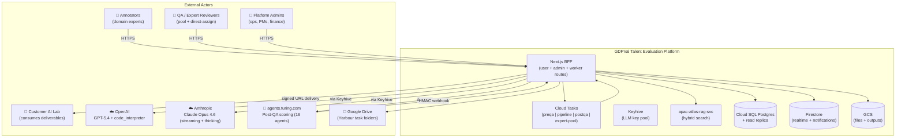
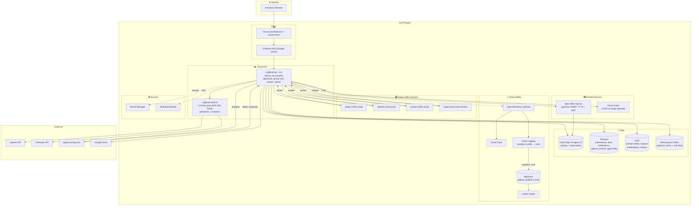
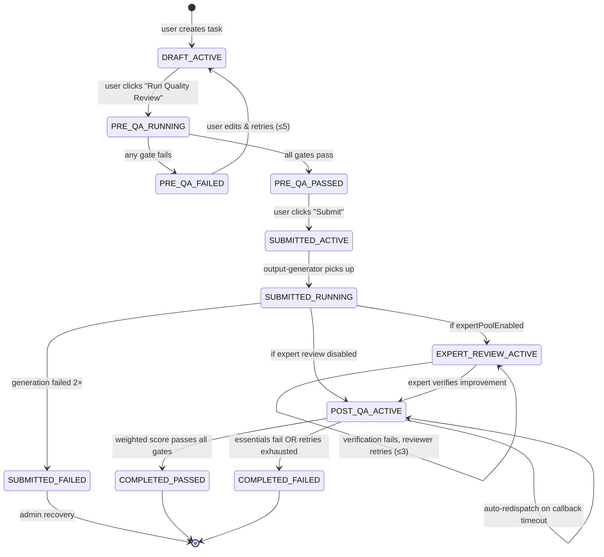
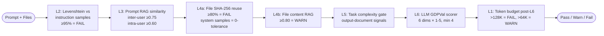
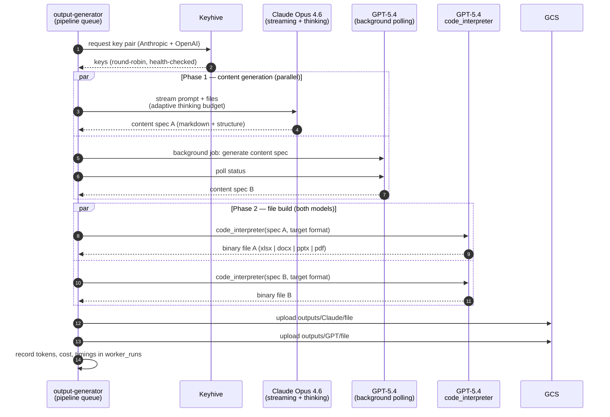
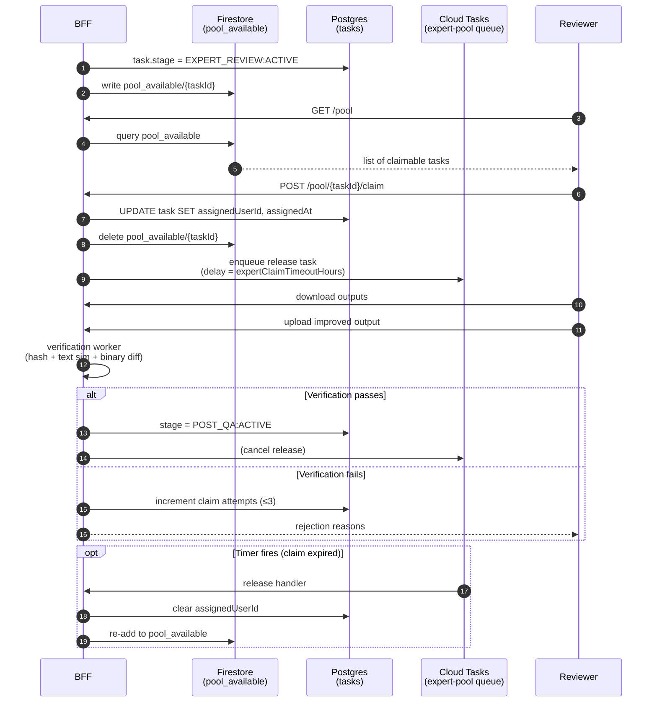
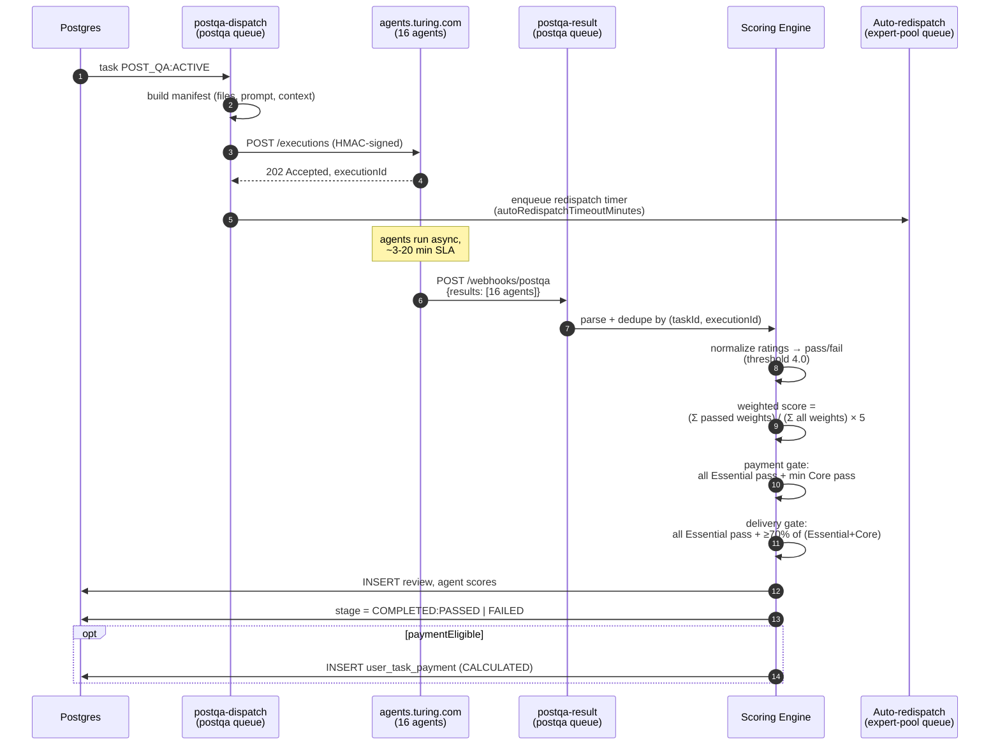
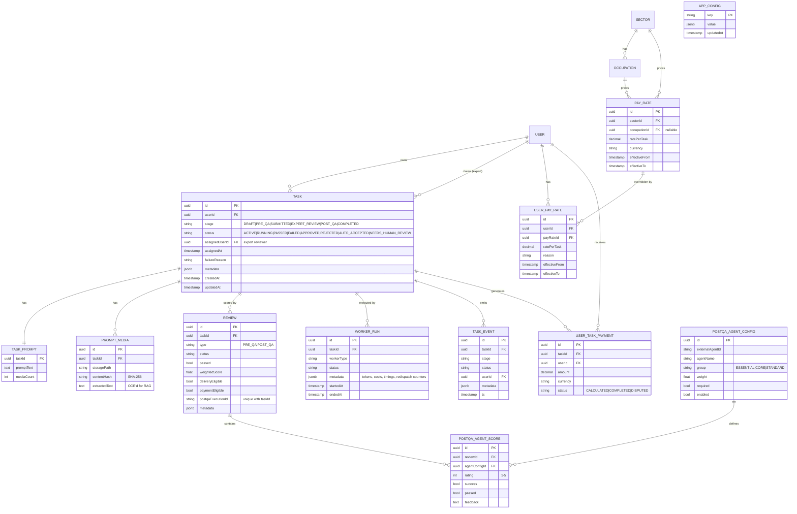
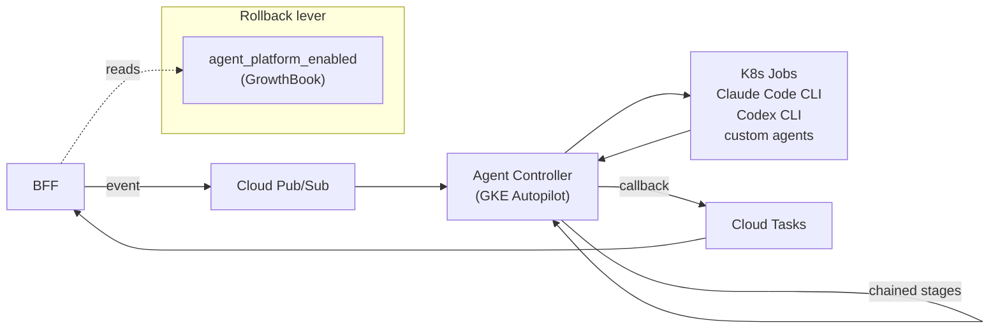

# GDPVal Talent Evaluation Platform — A System Design Journey

**Status:** Design v1 — reflecting live system + near-term roadmap
**Author:** Ashutosh Singh
**Audience:** engineers joining the project, architects evaluating the platform, future-me wondering why we built it this way

---

## Preface — why this document exists

Most architecture docs die the day they are written. They describe a frozen picture of a system, are never updated, and three months later new joiners ask the same questions that the doc was supposed to answer.

This one is written differently. It is written as a **journey**: the problem we were handed, the constraints we hit, the decisions we took, and the tradeoffs we knowingly swallowed. When you finish reading it, you should not only know *what* GDPVal is — you should know *why it looks the way it does*, and therefore what is safe to change and what is load-bearing.

If you are here to ship a feature, read §5 (task lifecycle) and §12 (data model) and you will be productive.
If you are here to reason about scale, read §17 (infrastructure), §18 (scaling axes), §19 (failure modes).
If you are here to understand the business, read §1 and §11.

---

## 1. The problem we were handed

Frontier AI labs needed benchmark datasets that look like **real knowledge-work deliverables**: the kind of thing a financial analyst, a paralegal, or a consultant would produce on a Tuesday afternoon. Not synthetic puzzles. Not coding contests. Actual work product — Excel models with formulas, slide decks with charts, legal memos with citations.

The OpenAI **GDPVal** rubric defines what "good" looks like: occupation fit, work-product realism, context grounding, professional complexity, feasibility, format fidelity. A task earns delivery credit only when an external panel of agent scorers signs off along all those axes.

Our job was to build the production line that turns **human-written prompts** and **reference files** into **LLM-generated deliverables** that pass that rubric — at a cost that makes the unit economics work.

Three forces pulled at the design from the start:

1. **Quality is non-negotiable.** A bad task does not just waste money — it poisons the customer's evals. Every task must pass a multi-stage quality gauntlet before it ships.
2. **Cost of human labor dominates.** Annotators are paid per task. Every minute we save them, and every task we reject *early* before they have invested time, bends the curve.
3. **The rubric will change.** OpenAI will tighten it. We will add customers. The scoring layer must be reconfigurable without a redeploy.

Everything downstream flows from those three.

---

## 2. Design principles (locked)

1. **Humans write prompts; LLMs generate deliverables.** The annotator's job is the *instruction*, not the *output*. This reverses the naive labeling workflow and is the central cost lever.
2. **Reject early, reject cheap.** Pre-QA runs in seconds and kills obviously bad prompts before we spend a dollar on generation. A task that fails Pre-QA costs us ~$0.05. A task that fails Post-QA cost us $5+.
3. **Scoring is data, not code.** The 16 Post-QA agents, their weights, their pass thresholds, the Essential/Core split, the payment and delivery gates — all live in `app_configs`, tunable from the admin panel without a deploy.
4. **Async by default, idempotent always.** Every long-running step is a Cloud Task. Every worker is safe to replay. Task state is the source of truth; worker runs are observability, not control flow.
5. **PostgreSQL for truth, Firestore for speed.** Business state is authoritative in Postgres (Prisma). Firestore is a read cache and real-time fan-out for the UI. When they disagree, Postgres wins.
6. **Keys are a service, not a secret file.** Every LLM call goes through **Keyhive**, which owns encryption, rotation, health, and cost attribution. Keyhive can be rolled forward independently of the BFF.
7. **Pay for effort, deliver on quality.** Payment eligibility and delivery eligibility are *separate* gates on the same scoring data. A task can pay the annotator without shipping to the customer. This is a fairness decision, not a technical one — it keeps the pipeline honest.
8. **One Docker image, one codebase.** Next.js monolith + `SERVICE_ROLE` env routing. BFF, worker, admin are the same build. This keeps deploys trivial and preserves optionality when we do split later.
9. **Ready to leave Cloud Run.** Long-running workers are already abstracted behind Cloud Tasks URLs. Moving to GKE Autopilot is an env-var flip, not a rewrite.

---

## 3. System Context — who talks to the platform



The platform is, at its heart, a **state machine for tasks** with four asynchronous worker lanes (pre-QA, pipeline, post-QA, expert pool) feeding back into one Postgres row.

---

## 4. Full deployment view



Two observations worth internalizing before you read on:

- **The BFF is the same binary in every Cloud Run service.** `SERVICE_ROLE` flips which routes are exposed. This is why you will see `/api/internal/*` (worker) and `/api/admin/*` paths side by side in `src/app/api/`.
- **Cloud Tasks is both a queue and a timer.** The `expert-pool` queue does not just move work — it fires a delayed task that releases a claim if the reviewer does not return in time. This is the whole "pool countdown" mechanic.

---

## 5. The task lifecycle — from draft to delivered

This is the single most important diagram in the doc. Spend a minute on it.



The state machine has two dimensions — `stage` (6 values) and `status` (8 values) — because history taught us that a single flat enum collapses under the weight of rework loops. Separating them lets us add states like `EXPERT_REVIEW:NEEDS_HUMAN_REVIEW` without migrating the table.

### 5.1 The happy path, narrated

An annotator logs in, picks a sector (say, *Finance & Insurance*) and an occupation (*Financial Analyst*). The UI shows them the GDPVal rubric inline — this is deliberate. We want them to see the scoring criteria *while they write*, not at the end.

They write a prompt (~500 words describing the deliverable they want), upload 1–3 context files (a PDF 10-K, a CSV of historical prices, perhaps a company memo). Client-side gates catch obvious mistakes: a prompt that is mostly copied from our instruction samples, a file they have already submitted.

They click **Run Quality Review**. The BFF writes a `PRE_QA:RUNNING` row, enqueues a Cloud Task to the `preqa` queue, and returns a 202. The UI subscribes to the Firestore `gdpval_reviews` document and watches the score roll in.

Behind the scenes, the preqa worker runs seven gates in sequence (§6). If they pass, the task lands on `PRE_QA:PASSED`. The user sees a green banner and a **Submit** button.

They click submit. The BFF enqueues to the `pipeline` queue. The output-generator (§7) runs two LLMs in parallel — Claude and GPT — produces content specs, converts them to binary deliverables (XLSX, DOCX, PPTX, PDF) via GPT's `code_interpreter`, and lands the files in GCS at `outputs/{ModelName}/`.

At this point the task branches. If `expertPoolEnabled` is true (§8), the task enters the expert pool — another human reviews the outputs, picks the better one, refines it, and resubmits. If the pool is off, the task goes straight to Post-QA.

Post-QA (§9) dispatches the task to `agents.turing.com` with a manifest pointing at the outputs. Sixteen agents score it asynchronously. The result arrives as an HMAC-signed webhook. A worker reads it, runs the weighted scoring, decides payment and delivery eligibility, writes a `Review` row, and flips the task to `COMPLETED:PASSED` (or `COMPLETED:FAILED`).

If the payment gate passed, a `user_task_payments` row is created in `CALCULATED` status. An admin later batches these into `COMPLETED`.

**Total wall-clock time: ~3–8 minutes for a happy-path task.** Of that, ~70% is spent waiting for OpenAI's `code_interpreter` to build files.

---

## 6. Pre-QA — seven gates that earn their keep

Pre-QA exists because of one brutal observation: **without it, 40% of submitted tasks failed Post-QA.** With it, that dropped below 8%. The gates are not pretty, but they pay for themselves every week.



A few things are worth calling out:

- **The gate numbers are not the execution order.** They are *historical* — L1 existed first, then we added L2, L3, etc. The execution order is driven by cost: cheap deterministic checks first, LLM calls last. Renumbering would break every dashboard that references `gate_L4a_failures`, so we live with it.
- **L3 uses two thresholds.** Inter-user similarity (someone else's task) is allowed to be more similar (0.75) than intra-user (your own previous tasks, 0.60). This is because we want annotators to *diversify their own portfolio* more aggressively than they avoid other people's work — pattern collapse is worse than overlap.
- **L4a has a zero-tolerance variant.** Reusing *any* of our instruction-sample files is an instant fail. This catches the "I'll just resubmit the example" mode.
- **L5 is the youngest gate and the most contested.** It scores complexity based on output-document signals (tables, formulas, charts, analytical verbs). It is configured as warning-by-default because it produces a non-trivial false-positive rate. When we tune it higher, yield drops; when we tune it lower, Post-QA fails spike. We live on the efficient frontier.
- **L6 is an LLM call.** It is ~$0.02 per task and catches the subtle misses — prompts that are unique, well-formatted, but ask for something outside the occupation's scope. Worth every cent.

All thresholds live in `app_configs` and are tunable from `/admin/config` without a deploy.

### 6.1 RAG, and why we use Reciprocal Rank Fusion

The prompt-similarity and file-content gates both call `apac-atlas-rag-svc`. It is a hybrid search engine: **dense vectors** (pgvector HNSW, cosine similarity) plus **sparse full-text search** (Postgres FTS). We fuse the two lanes with **Reciprocal Rank Fusion** (RRF, k=60) because the score scales are incompatible — cosine similarity is 0–1, FTS rank is unbounded, and averaging them is nonsense.

The subtle point: the number we compare against our business thresholds (0.75, 0.60, 0.80) is the **cosine similarity of the top hit**, *not* the RRF score. RRF is used only to pick the top hit from the fused result set. The threshold must remain interpretable as "how similar."

---

## 7. Output generation — two phases, two models, one file

This is the LLM-heavy stage and the single largest cost line.



**Why two phases.** Phase 1 is pure reasoning — "given this prompt and these files, what should the deliverable contain?" Phase 2 is pure code generation — "here is a spec, produce an xlsx." Separating them lets us pick the best model for each job independently and lets us rerun Phase 2 alone if a file build fails without burning Phase 1 tokens again.

**Why two models.** Downstream Post-QA scores both outputs and keeps the better one. This is the cheapest way to hedge against a bad generation — we pay for two generations but only ship the winner. Cost: ~$3–5/task. Post-QA yield improvement from diversity: ~12%. Worth it.

**Phase 1 is parallel; phase 2 is sequential per model.** Claude streams, so we get feedback immediately. GPT uses the background-job API because for long specs (8K+ output tokens) streaming times out on Cloud Run's 60-minute wall.

After generation, **L1 (token budget)** runs as a post-check. A task that produced >128K tokens is rejected — the customer's eval harness can't consume it. Between 64K and 128K produces a warning. This is cheaper to detect after generation than to predict before.

---

## 8. The expert pool — humans as quality multipliers

The expert pool is the optional middle layer between generation and Post-QA. It exists for a specific economic reason: **Post-QA is expensive**. A human spending 10 minutes fixing an obviously-broken output is cheaper than shipping that output to Post-QA, failing, and regenerating.



**Two sources of truth, deliberately.** Firestore holds the pool listing (`pool_available`) for fast, real-time fan-out to reviewers browsing `/pool`. Postgres holds the authoritative claim (`tasks.assignedUserId`). Firestore is always written *after* Postgres, and on read the UI reconciles if they disagree. It is eventual consistency, and we accept it.

**The timer is a Cloud Task.** When a reviewer claims a task, we enqueue a delayed Cloud Task on the `expert-pool` queue. If the reviewer returns in time, we do nothing (the task fires against a completed claim and is a no-op). If they don't, the task fires and releases the claim back to the pool. No polling, no cron.

**Verification is a multi-signal diff.** We don't just accept whatever the reviewer uploads. We compare against the original output with four signals (content hash, text similarity, binary diff, file size delta) and reject uploads that look like trivial edits. Fraud vector: a reviewer who claims tasks and uploads unchanged outputs would otherwise collect per-task fees.

---

## 9. Post-QA — scoring as configuration

Sixteen agents score a completed task along the GDPVal rubric. The scoring itself lives on `agents.turing.com`. Our platform's job is to dispatch, receive the webhook, and apply the eligibility math.



### 9.1 Why payment and delivery are separate gates

A task that passes the Essentials but only hits 60% of Core items is a legitimate piece of work — the annotator did their job, the model just had a rough day. We pay them. But we do not ship it to the customer because their eval requires the Core items too.

This bifurcation fell out of a real incident: in the early months, we had a week where Post-QA pass rates dropped 15% because an upstream model regression broke chart rendering. Annotators were doing good work and not getting paid. We patched the definition of "done" that same week. The two-gate design has been in place since.

### 9.2 Idempotent webhooks

Turing Agents will retry webhooks. Sometimes twice, occasionally three times. Every `postqa-result` call is idempotent via a unique constraint on `(taskId, postqaExecutionId)`. A duplicate POST lands on an existing Review row, updates nothing, and returns 200. This is boring and important.

### 9.3 Auto-redispatch — the callback safety net

Webhooks get lost. DNS flaps. Turing Agents restart. Relying on an external webhook as your only signal is a recipe for tasks that live forever in `POST_QA:ACTIVE`.

Two layers catch this:

1. **Event-driven redispatch.** When we dispatch, we *also* enqueue a delayed Cloud Task (on the `expert-pool` queue, which doubles as our generic timer) for `autoRedispatchTimeoutMinutes` (default 15). If that timer fires and the task is still `POST_QA:ACTIVE`, we redispatch.
2. **Cron fallback.** A recovery cron runs every 2 minutes, scans for stuck `POST_QA:ACTIVE` tasks, and redispatches those the event-driven layer missed (e.g., timers that got lost themselves).

Both layers check `autoRedispatchAttempts < autoRedispatchMaxAttempts` (default 3) and `autoRedispatchIntervalMinutes` (default 15) to prevent flooding. The task metadata records `attempts`, `lastAt`, `reason`, `source` — so a postmortem can tell whether a task was saved by the event layer or the cron.

---

## 10. Recovery — the cron that earns its salary

Every long-running system has a cron that catches the things async systems drop. Ours is `recover-stale-workers`, running every 2 minutes.

| Situation | Action |
|---|---|
| `PRE_QA:RUNNING` older than timeout | Mark FAILED, notify user |
| Worker run `FAILED` with retries remaining | Re-enqueue original Cloud Task |
| 3 consecutive worker failures on same task | Mark stage FAILED, dead-letter for admin |
| Stage complete but next stage never started | Re-enqueue the next Cloud Task |
| Expert claim older than `expertClaimTimeoutHours` | Release back to pool |
| `POST_QA:ACTIVE` with no dispatch in flight | Trigger auto-redispatch |

The cron is *not* authoritative — it catches edge cases the event-driven system missed. If you find yourself adding core business logic here, you have a design smell: fix the Cloud Task chain instead.

---

## 11. Payment management — rates, overrides, audit

The payment system is small in code but load-bearing in trust. Annotators are paid per delivered task. A rate error is a payroll incident.

### 11.1 Rate resolution

```
Effective rate for (user, task) =
    user_pay_rates[user, sector, occupation]   if exists     -- per-user override
  else pay_rates[sector, occupation]           if exists     -- occupation rate
  else pay_rates[sector, occupation=null]                     -- sector default
```

All rates are time-windowed (`effectiveFrom`, `effectiveTo`). A rate change for "Financial Analyst" in Finance applied on April 1 does not rewrite payments for tasks completed in March.

### 11.2 Flow

```
task → COMPLETED:PASSED with paymentEligible=true
  → auto-calc: fetch effective rate, INSERT user_task_payments (status=CALCULATED)
  → admin reviews /admin/payments
  → admin batch-marks COMPLETED
  → optional DISPUTED transition for chargebacks
```

### 11.3 Audit

Every mutation — rate create, user adjustment, batch status change — writes to an append-only audit trail (`pay_rate.create`, `user_pay_rate.adjust`, `payment.batch_update`). Finance can reconstruct any payment decision.

---

## 12. Data model (ERD)



**Two modeling calls worth remembering:**

- `WORKER_RUN` is a metadata sidecar, **not control flow**. The task state machine does not read worker_runs. If a worker_run row is missing, the task still works. This separation keeps the state machine small and lets us change observability without migration pain.
- `APP_CONFIG` is schemaless JSONB, keyed by feature area (`analytics`, `postqaScoring`, `payments`, `antiFraud`). Every admin panel screen writes here. A deploy never touches it; an admin always can.

---

## 13. The real-time layer

Firestore is our real-time fan-out. It is not authoritative for anything that pays money.

| Collection | Purpose | Written by | Read by |
|---|---|---|---|
| `appConfig` | Config cache for clients | Admin SDK (on config mutate) | Browser (read-only) |
| `submissions` | Per-task UI snapshot | BFF on state transition | Task detail page |
| `gdpval_reviews` | Pre-QA progress | preqa worker | Review page (onSnapshot) |
| `expert_reviews` | Pool task status + countdown | BFF + expert-pool release | Pool dashboard |
| `pool_available` | Pool task listing | BFF on enter/exit pool | `/pool` page (query) |
| `users` | User profile + metrics | BFF | User settings |
| `notifications` | Bell icon feed | Admin SDK | Browser (onSnapshot) |

Write ordering rule: **Postgres first, Firestore second.** If Postgres fails, Firestore is not written. If Firestore fails, the UI lags briefly until the next state change catches it up. A small reconciliation cron sweeps orphaned Firestore rows (< 0.1% of rows) nightly.

---

## 14. Agent platform — where we are, where we are going

Today, scoring happens on `agents.turing.com` — an external service we call over HTTPS, hand a manifest of file URLs, and await a webhook.

That is fine for now, but the roadmap (`docs/AGENT_PLATFORM_ARCHITECTURE.md`) points at a richer architecture:



Three forces drive the move:

1. **Agent diversity.** Today we use Turing Agents' scoring rubric. Tomorrow we want custom agents (CLI-driven Claude Code, in-house evaluators, customer-specific rubrics). K8s Jobs are the right container for that.
2. **Cost attribution.** When agents run in our cluster, we see their tokens on our Keyhive ledger. Currently we just see Turing Agents' invoice.
3. **Chaining.** A future scoring workflow might be Essential gate → Core gate → domain-expert human only if borderline. That is a DAG, not a single call. An Agent Controller owns that DAG.

The migration is behind a **GrowthBook flag** (`agent_platform_enabled`). Fallback to the current Turing Agents path is a flag flip.

---

## 15. Analytics & observability

The platform emits structured logs that double as analytics events:

```
{"message": "analytics: task_submitted", "taskId": "...", "userId": "...", "sector": "...", "occupation": "...", ...}
```

A Cloud Logging sink filters `jsonPayload.message=~"^analytics:"` and routes matching rows to BigQuery (`gdpval_analytics_local`). Looker Studio reads from BigQuery.

Events we track (non-exhaustive):

- User: `account_created`, `signed_in`
- Task: `task_created`, `task_submitted`, `pre_qa_started`, `pre_qa_completed`, `post_qa_started`, `post_qa_completed`, `task_completed`, `task_failed`, `output_generated`
- Payment: `payment_calculated`, `payment_completed`, `payment_disputed`

Admin dashboards at `/admin/analytics` read the same `TaskEvent` table directly from Postgres for live views: user progression funnel, stage durations (avg / median / P95), sector trends, payment KPIs.

**Why not a dedicated analytics pipeline.** Because one will not ship for six months and we need numbers today. Structured logs → sink → BigQuery buys us 80% of the value for 10% of the build cost, and we can replace the sink with Pub/Sub → Dataflow whenever we need sub-minute latency. We don't yet.

Traces: OpenTelemetry SDK in the Next.js runtime, exported to Cloud Trace. Every Cloud Task handler opens a span; every outbound LLM call is a child span with model, tokens, latency, cost.

---

## 16. Anti-fraud — the full picture

Gates 2, 3, 4a, 4b, 5, 6, 7 collectively form the fraud defense. In plain English, they catch:

| Fraud mode | Caught by |
|---|---|
| Copy-paste an instruction sample | L2 (Levenshtein) |
| Recycle your own earlier prompt | L3 (intra-user RAG) |
| Copy a colleague's prompt | L3 (inter-user RAG) |
| Re-upload a sample file | L4a (SHA-256, zero-tolerance) |
| Re-upload your own previous file | L4a (hash ratio) |
| Upload a plagiarized file with a byte flipped | L4b (content RAG) |
| Write a verbose-but-shallow prompt | L5 (complexity gate) |
| Write a well-formed prompt outside the occupation | L6 (LLM rubric) |
| Submit, wait for generation, reject, resubmit unchanged | L7 (output structural density) |

Plus non-gate defenses:

- **Expert verification diff** (§8) catches reviewers who claim tasks and upload trivial edits.
- **Rate limits** per user per sector per day, configurable.
- **Submission velocity anomalies** (>N tasks/hour) trigger admin review.

All fraud-relevant thresholds are in `app_configs` under the `antiFraud` key. A suspected fraud ring can be throttled live without a deploy.

---

## 17. Infrastructure — where everything runs

### Cloud Run services

| Service | Role | Resources | Scaling |
|---|---|---|---|
| `x-gdpval-svc` (prod) | BFF monolith | 2Gi RAM, 2 CPU | 1–100 instances |
| `x-gdpval-qa` | QA env BFF | 2Gi RAM, 2 CPU | 1–20 |
| `x-gdpval-workflow` (dev) | Dev BFF | 1Gi RAM, 1 CPU | 0–5 |
| `x-gdpval-keyhive` | LLM key pool | 512Mi RAM, 1 CPU | 1 (persistent) |

### Cloud Tasks queues

| Queue | Workers | Prod rate | Prod concurrency |
|---|---|---|---|
| `preqa` | review-worker, gdpval-reviewer | 100/s | 100 |
| `pipeline` | harbour-worker, output-generator, rag-ingest | 10/s | 20 |
| `postqa` | postqa-dispatch, postqa-result | 100/s | 100 |
| `expert-pool` | expert-review-release, auto-redispatch timer | 10/s | 50 |

### Data

- **Cloud SQL Postgres 15** — primary + read replica, Prisma ORM, PgBouncer in front.
- **Firestore** — per-document rules in `firestore.rules`, composite indexes in `firestore.indexes.json`.
- **GCS bucket** — prompt media, generated outputs, embeddings.
- **Google Drive** — Harbour task folders (per-task hierarchy, shared with annotator + reviewer).
- **Memorystore Redis** — optional; used for session cache and rate limiting when deployed.

### Service-role routing (one image, many services)

```
SERVICE_ROLE env var → Next.js route guard:
  bff     → user routes + auth + webhooks
  worker  → /api/internal/* only
  admin   → /api/admin/* only
  unset   → all routes (monolith / local dev)
```

This is enforced by a middleware at request entry. Routing is a 3-line file; do not overthink it.

### CI/CD

| Workflow | Trigger | Deploys |
|---|---|---|
| `deploy.yml` | push → develop | dev |
| `deploy-qa.yml` | push → qa | QA |
| `deploy-prod.yml` | push → main | prod |
| `deploy-keyhive-qa.yml` | manual | Keyhive |
| `db-migrate.yml` | manual | Prisma migrate deploy |
| `deploy-firestore-rules.yml` | firestore config change | rules + indexes |

### Where we are going (GKE Autopilot, optional)

Long-running workers (output-generator, harbour-worker, rag-ingest, preqa reviewers) are candidates for GKE Autopilot:

- **Cluster:** `gdpval-workers-{qa|prod}`.
- **Routing:** Cloud Tasks already dispatches by URL. Flip env vars (`PIPELINE_SERVICE_URL`, `PREQA_SERVICE_URL`, `POSTQA_SERVICE_URL`) to point at K8s Ingress.
- **Rollback:** unset the env vars → traffic returns to Cloud Run. Zero code changes.

The case for the move is Cloud Run's 60-minute wall. Most pipeline work finishes in 5–15 min, but Phase-2 file builds for large spreadsheets occasionally hit 40+. When we see Cloud Run timeouts cross 1% of pipeline jobs, we flip.

---

## 18. Scaling axes & first thing that breaks at 10×

Today: ~500 concurrent annotators, ~200 submissions/hour peak, ~10K tasks/month.

At 10× (5K annotators, 2K submissions/hour, 100K tasks/month):

| Layer | First bottleneck | Mitigation |
|---|---|---|
| BFF Cloud Run | Cold-start latency under burst | Min-instances + concurrency tuning |
| `postqa` queue | Turing Agents throughput | Negotiate capacity or flip to in-house agent platform (§14) |
| `pipeline` queue | OpenAI code_interpreter rate limits | Keyhive multi-key rotation; pre-warm sessions |
| Postgres writes | `task_events` + `worker_runs` hot tables | Partition by month; move events to BigQuery-only |
| Firestore reads | `pool_available` list-query hotspot | Shard by sector; TTL pool entries |
| Cloud Run 60-min wall | Phase 2 for complex deliverables | Migrate pipeline workers to GKE (§17) |
| Keyhive | Single instance SPOF | Multi-replica with sticky sessions |
| Auto-redispatch cron | Scan cost on huge `POST_QA:ACTIVE` set | Indexed query with time + status + attempts |

Nothing in the system is fundamentally unable to scale. The honest answer is: every 3 months we will re-evaluate which of the mitigations above has moved to the top.

---

## 19. Failure-mode table

| Failure | Blast radius | Recovery |
|---|---|---|
| Cloud Run instance dies mid-request | 1 in-flight request; Cloud Tasks retries worker | transparent |
| Postgres 5-min outage | All writes fail; tasks pause mid-stage | graceful, Cloud Tasks retries on resume |
| Firestore outage | UI stale; business logic unaffected | UI refresh on restoration |
| Keyhive down | All new LLM calls fail | Cloud Tasks retries; critical — page oncall |
| OpenAI / Anthropic outage | Pipeline queue backs up | other provider's lane still works (lose model diversity) |
| Turing Agents webhook lost | Task stuck in `POST_QA:ACTIVE` | auto-redispatch at T+15min (§9.3) |
| Turing Agents full outage | Post-QA backlog grows | drain on restore; flip to in-house agents if extended |
| Cloud Tasks outage | No new work starts | on restore, queue drains; long jobs already running complete |
| GCS write failure (Phase 2) | Output files missing | worker retry; after 2 attempts → `SUBMITTED:FAILED` |
| Rogue LLM output (prompt injection) | Contained: output is data, not code; reviewed by agents | no execution path, isolated |
| Malicious annotator submits payload files | Files are opaque blobs to the system; only OCR'd text reaches RAG | Cloud Vision sandboxed; size/type guards |

---

## 20. Security posture

- **Auth:** Firebase Auth (Google OAuth) + JWT validation middleware. Admin role gated by claim + server-side role check on every admin route.
- **Keys:** All LLM API keys encrypted (AES-256-GCM) at rest in Keyhive. Never in env vars, never in git. Rotation: hot-swap in Keyhive, zero BFF downtime.
- **Webhook integrity:** Post-QA callback is HMAC-signed with `WEBHOOK_SIGNING_SECRET`. Unsigned or replayed callbacks are rejected.
- **Firestore rules:** per-collection, per-document. Users can only read their own `users/{uid}` and `notifications/{uid}`. Pool listings are read-only; claims go through the BFF.
- **Audit:** every admin mutation and payment transition writes an audit row.
- **Secrets:** Secret Manager. Workload Identity binds Cloud Run service account → Secret Manager accessor. No SA keys on disk.
- **Data:** CMEK available on Cloud SQL and GCS. VPC-SC perimeter around the project.

---

## 21. Plugin-style extensibility

While we are not a formal plugin platform (yet), every domain-variable piece of the system is configuration, not code:

| Variability | Where it lives |
|---|---|
| GDPVal scoring rubric (weights, pass thresholds) | `app_configs.postqaScoring` |
| Anti-fraud thresholds | `app_configs.antiFraud` |
| Expert pool on/off + claim timeout | `app_configs.expertReview` |
| Auto-redispatch policy | `app_configs.postqaAutoRedispatch` |
| Payment rates | `pay_rates` + `user_pay_rates` |
| Post-QA agent set | `postqa_agent_configs` |
| LLM model selection | `app_configs.pipeline` |
| Sector/occupation taxonomy | `pay_rates_sector_occupation.csv` import |

A new customer with a different rubric = new `postqa_agent_configs` rows + new `app_configs.postqaScoring` value. No deploy.

---

## 22. Open decisions (to lock as we grow)

1. **When do we migrate to GKE?** Trigger: Cloud Run timeout rate > 1% on `pipeline` queue.
2. **When do we stand up in-house agents?** Trigger: Turing Agents cost per task > 1.5× internal estimate, or we need custom rubrics.
3. **Should `task_events` move to BigQuery-only?** Trigger: Postgres `task_events` table > 100M rows, or admin dashboards slow.
4. **Are two generations (Claude + GPT) still worth 2× cost?** Re-measure quarterly against yield lift.
5. **Expert pool or direct-assign?** Right now both work; pool is default. At scale, direct-assign may win on latency.
6. **Firestore or Postgres LISTEN/NOTIFY for real-time?** Firestore now; revisit when we need finer access control.

---

## 23. 3-week onramp plan (for a new engineer)

**Week 1 — read and run.**
- Day 1: Read this doc end to end. Read `README.md`, `CLAUDE.md`, `AGENTS.md`.
- Day 2: Run the stack locally. Submit a task in dev. Fail Pre-QA on purpose. Watch the Firestore doc update live.
- Day 3: Read `docs/TASK_STATE_MACHINE.md`, `docs/SPEC.md`.
- Day 4: Read `docs/ANTI_FRAUD.md`, `docs/POSTQA_SCORING.md`.
- Day 5: Pair on a small bug. Do not touch state-machine code yet.

**Week 2 — ship something real.**
- Pick a gate threshold to expose in admin config, or a new analytics event.
- Write a Vitest unit test and a Playwright E2E.
- Ship to dev, then QA.

**Week 3 — own a surface.**
- Take on a production bug in Pre-QA, Post-QA scoring, payments, or the expert pool.
- Pair on the fix. Write a postmortem-style PR description.
- By end of week 3, you should be able to answer any question about §5–§11 without looking at the code.

---

## 24. The book-journey summary

The core insight of GDPVal is an inversion: **we are not paying humans to produce training data. We are paying humans to specify it, and we are paying LLMs to produce it.** Every architectural decision follows from that inversion.

- **Pre-QA matters because rejecting a prompt costs cents, while rejecting a generated deliverable costs dollars.**
- **Two-model generation matters because picking the better of two outputs is cheaper than regenerating when one fails.**
- **The expert pool matters because 10 minutes of human polish beats an hour of Post-QA retry loops.**
- **Post-QA scoring lives in config because the rubric will change — weekly in the early months, monthly at steady state.**
- **Keyhive matters because the cost of an LLM key leak is, at this scale, not a hypothesis.**
- **Payment and delivery are separate gates because fairness to annotators and fairness to customers are different problems.**
- **Firestore is a cache because the UI's need for speed is different from finance's need for truth.**
- **Cloud Run is enough until it isn't, and when it isn't, the migration path is an env-var flip.**

None of these are clever individually. Collectively, they are the platform.

---

**Designed by: Ashutosh Singh.**
