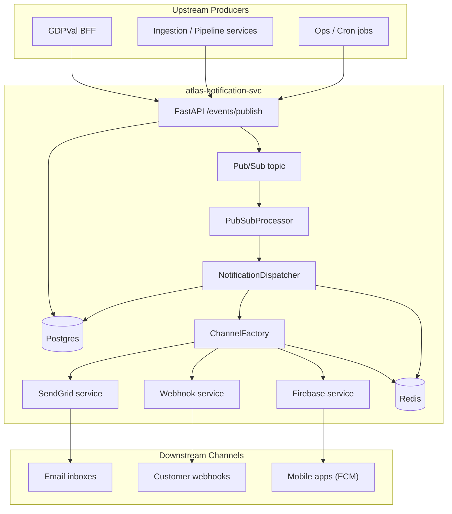
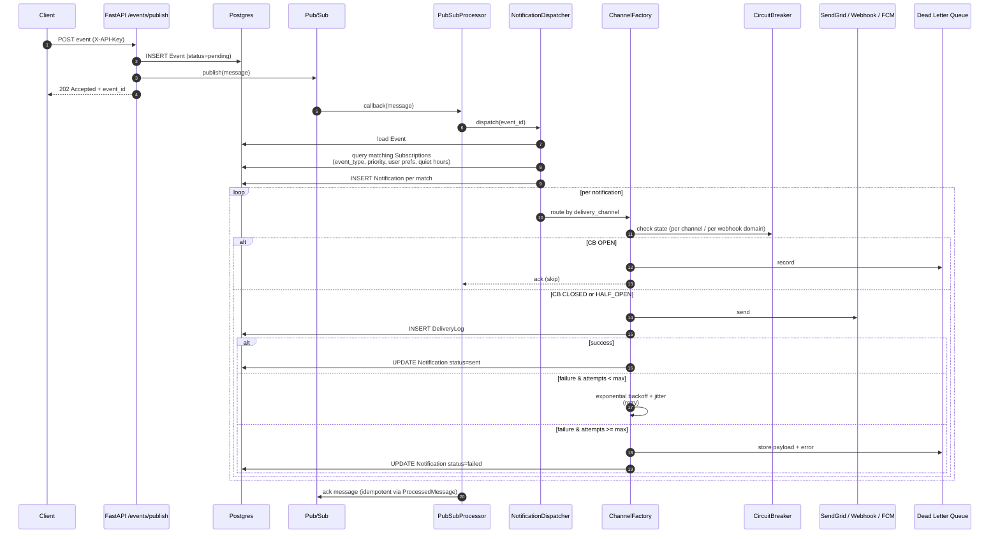
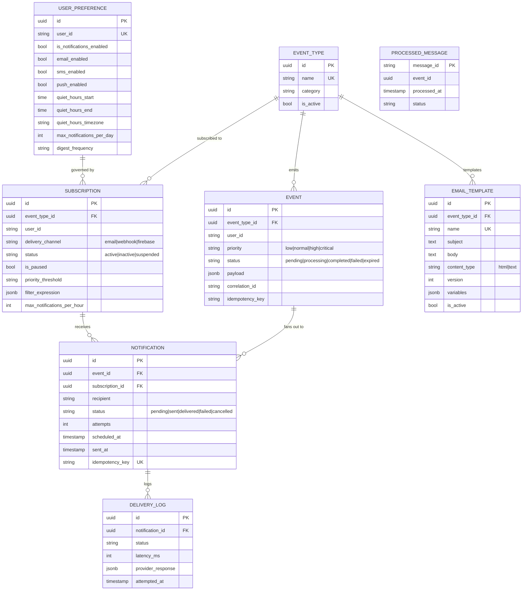

# Atlas Notification Service — Platform Design

**Status:** Design v1 — reflecting the current system
**Author:** Ashutosh Singh
**Audience:** engineers maintaining or integrating with the service, reviewers sizing the platform for new use cases

---

## Preface — why this document exists

Notification infrastructure is the kind of thing nobody thinks about until it breaks. When an order confirmation does not arrive, when a pipeline alert never pages, when a webhook silently drops — that is when the platform becomes visible.

This document describes **atlas-notification-svc**: a multi-channel, event-driven delivery platform that sits between every upstream Turing service that wants to *emit something* and every downstream channel that should *receive something*. It is written as a journey: what we built, why we built it that way, where it is strong, and — honestly — where it is not.

If you want to integrate with the service, read §4 (API surface) and §6 (delivery pipeline).
If you are reasoning about reliability, read §7 (retries, circuit breaker, DLQ) and §15 (scalability — honestly).
If you want the architectural picture, read §3 and §5.

---

## 1. The problem

Every service in the Turing platform needs to notify someone — annotators about task status, ops about pipeline health, customers about deliverables, on-call about incidents. Building that channel-specific logic per service was how we ended up with six half-broken email senders, three webhook retryers, and zero visibility into what actually got delivered.

Atlas solves that by being **the** notification plane:

- One place to register event types.
- One place for users to manage preferences and quiet hours.
- One place that knows about retries, circuit breakers, DLQs, and audit trails.
- One place to look when something did not get delivered.

---

## 2. Design principles

1. **Publish fast, deliver async.** The HTTP publish path returns 202 in milliseconds. Everything interesting happens behind Pub/Sub.
2. **Every delivery is an observation.** Every attempt writes a `DeliveryLog` row. If it is not in the log, it did not happen.
3. **Resilience is infrastructure, not per-channel.** Retries, circuit breakers, and DLQ are shared services — SendGrid, webhooks, and FCM all get the same treatment for free.
4. **Idempotency at every boundary.** Pub/Sub redelivery is normal; duplicate notifications are a bug. `ProcessedMessage` is the dedupe table.
5. **Config over code.** Channels, thresholds, rate limits, and templates are database rows, not deploys.
6. **Optional Redis.** Dev works without Redis; prod runs with it. The system degrades gracefully when the cache is gone.
7. **Boring cloud-native.** Cloud Run + Cloud SQL + Pub/Sub + Secret Manager. No exotic primitives.

---

## 3. Architecture — the four phases

Internally, the service is organized into four phases that build on each other:

```
┌─────────────────────────────────────────────────────────────┐
│ API LAYER — FastAPI                                         │
│   /events/publish · /subscriptions · /admin/* · /health     │
└──────────────────────────┬──────────────────────────────────┘
                           │ publish
                           ▼
                ┌──────────────────────┐
                │  Google Pub/Sub      │
                └──────────┬───────────┘
                           │ callback
┌──────────────────────────▼──────────────────────────────────┐
│ PHASE 1 — Core Intelligence                                 │
│   PubSubProcessor → NotificationDispatcher                  │
│   ChannelFactory (strategy) · ServiceFactory (DI)           │
├─────────────────────────────────────────────────────────────┤
│ PHASE 2 — Resilience                                        │
│   CircuitBreaker (Redis-backed) · RetryService · DLQ        │
├─────────────────────────────────────────────────────────────┤
│ PHASE 3 — Observability                                     │
│   OpenTelemetry traces · Prometheus metrics · structlog JSON│
├─────────────────────────────────────────────────────────────┤
│ PHASE 4 — Performance                                       │
│   L1+L2 Caching · Scaling signals · DB optimizer            │
└──────────────────────────┬──────────────────────────────────┘
                           │
┌──────────────────────────▼──────────────────────────────────┐
│ DELIVERY SERVICES                                           │
│   SendGrid (email) · Webhook (HTTP) · Firebase (FCM)        │
└──────────────────────────┬──────────────────────────────────┘
                           │
┌──────────────────────────▼──────────────────────────────────┐
│ DATA                                                        │
│   Postgres 15 (tables) · Redis (cache + CB state)           │
└─────────────────────────────────────────────────────────────┘
```

The four phases are not deployable units — they are layers inside the same process. But keeping them named and separated is how we stay sane when extending.

---

## 4. System context



---

## 5. Tech stack

| Concern | Choice | Version |
|---|---|---|
| Language | Python | 3.11 |
| HTTP framework | FastAPI | 0.104.1 |
| ASGI server | Uvicorn | 0.24.0 |
| ORM | SQLAlchemy (async) | 2.0.23 |
| DB driver | asyncpg | 0.29.0 |
| Migrations | Alembic | 1.12.1 |
| Database | Postgres | 15 (Cloud SQL) |
| Cache + CB state | Redis (aioredis) | 2.0.1 |
| Event bus | Google Cloud Pub/Sub | 2.18.4 |
| Email | SendGrid SDK | 6.10.0 |
| Push | firebase-admin | 6.2.0 |
| Webhook HTTP | requests | 2.31.0 |
| Tracing | OpenTelemetry | 1.21.0 |
| Metrics | prometheus-client | 0.19.0 |
| Logging | structlog | 23.2.0 |
| Retry | tenacity + backoff | 8.2.3 / 2.2.1 |
| Templating | Jinja2 | 3.1.2 |
| Config | pydantic-settings | 2.6.1 |
| Secrets | Google Secret Manager | 2.16.4 |

---

## 6. The delivery pipeline



Things worth noticing:

- **The API path is short.** Validate → write Event → publish to Pub/Sub → 202. Nothing on the happy path blocks on a downstream channel.
- **Dispatch is where fan-out happens.** One event can produce N notifications (one per matching subscription). Each is delivered independently.
- **Retries and circuit breakers are orthogonal.** Retries handle transient failures on one attempt; circuit breakers handle sustained failure of a whole channel.

---

## 7. Reliability — the resilience phase in depth

### 7.1 Retries

- Exponential backoff (default 1s → 2s → 4s) with ±10% jitter.
- Max attempts default 3, configurable per channel.
- Retryable exceptions are *classified*: transient network errors retry, auth failures do not.
- Every attempt writes a `DeliveryLog` row — retries are visible.

### 7.2 Circuit breakers

- One breaker per channel (SendGrid, Firebase) and **per webhook domain**.
- States: `CLOSED` → `OPEN` on 5 consecutive failures → `HALF_OPEN` after 60s probe window → `CLOSED` on 2 successes.
- State is held in Redis so all Cloud Run replicas agree. If Redis is down, the breaker falls back to per-process state (which is noisy but not broken).
- A failing customer webhook does not stall the email channel. That is the whole point.

### 7.3 Dead Letter Queue

- Captures payloads after retries are exhausted.
- DLQ rows carry the original `operation_id`, error context, attempt history, and enough payload to replay.
- Admin endpoints (`/api/v1/admin/notifications/{id}/retry`) can replay.
- Default 30-day retention, then archive.

### 7.4 Idempotency

- `ProcessedMessage` table keyed by Pub/Sub `message_id`. If the same message is redelivered, the dispatcher no-ops.
- Clients can also supply their own `idempotency_key` on publish to dedupe at the Event layer.
- `Notification.idempotency_key` carries a unique constraint — double-dispatch of the same Notification cannot create duplicates.

### 7.5 Rate limiting & quiet hours

- Per-user daily limit (`UserPreference.max_notifications_per_day`).
- Per-subscription hourly limit.
- Quiet hours (`quiet_hours_start`, `quiet_hours_end`, timezone) — messages are skipped or deferred per policy.
- Exceeding limits returns 429 on publish; exceeding subscription-level limits silently suppresses.

---

## 8. Channels

| Channel | Provider | Async? | Features |
|---|---|---|---|
| Email | SendGrid | sync SDK, wrapped via thread pool | dynamic templates, tracking, bounce handling |
| Webhook | HTTP (requests) | sync, per-domain CB | HMAC signatures, custom headers, SSL verify |
| Push | Firebase FCM | sync SDK | device targeting, topic subscriptions |
| SMS | — | framework present | not yet implemented |
| WebSocket / in-app | — | subscription model present | not yet implemented |

Delivery services are **synchronous** (the SDKs are sync; wrapping them in `httpx` would be more complex than it is worth). The dispatcher is async and calls them via the thread pool. This is the right tradeoff at our scale; when we need true async delivery, we will revisit.

---

## 9. API surface

```
POST   /api/v1/events/publish             # publish an event (202 Accepted)
GET    /api/v1/subscriptions              # list / filter
POST   /api/v1/subscriptions              # create
GET    /api/v1/subscriptions/{id}
PUT    /api/v1/subscriptions/{id}
DELETE /api/v1/subscriptions/{id}         # soft delete

GET    /api/v1/health                     # fast liveness-ish check
GET    /api/v1/health/liveness            # k8s liveness
GET    /api/v1/health/readiness           # DB + Redis + Pub/Sub reachable
GET    /api/v1/health/detailed            # per-component detail
GET    /api/v1/health/metrics             # Prometheus scrape

/api/v1/admin/system/*                    # status, stats, CB state, start/stop
/api/v1/admin/notifications/*             # list, retry, delivery logs
/api/v1/admin/event-types/*               # CRUD for event type catalog
```

**Event publish contract:**

```json
POST /api/v1/events/publish
X-API-Key: ...
X-Correlation-ID: optional

{
  "event_type": "order.created",
  "user_id": "user_123",
  "priority": "high",        // low | normal | high | critical
  "payload": { ... },
  "metadata": {
    "source": "gdpval-bff",
    "version": "1.0",
    "idempotency_key": "..."
  }
}
```

---

## 10. Templating

- **Engine:** Jinja2.
- **Storage:** `email_templates` table in Postgres.
- **Scope:** per-event-type, versioned, with soft-delete (`is_active`).
- **Variables:** declared in JSON schema on the template row; dispatcher validates event payload against it before render.
- **Rendering:** dispatcher renders `subject` + `body` with event payload + user context, stores rendered content in the `Notification` row, then hands off to SendGrid.

---

## 11. Data model



---

## 12. Observability

- **Tracing:** OpenTelemetry spans on every publish, Pub/Sub message, dispatch, and delivery attempt. Correlation ID propagated across the chain.
- **Metrics (Prometheus):** message rate, error rate by channel, P95/P99 latency, queue depth, delivery success %, CB state transitions, cache hit rate, DB pool stats.
- **Logs:** structlog JSON → Cloud Logging. Every log line carries `correlation_id`, `event_id`, and `user_id` where applicable.
- **Health:** `/liveness`, `/readiness`, `/detailed`, `/metrics`. Readiness checks DB + Redis + Pub/Sub so rolling deploys wait for real dependencies.

---

## 13. Security

- **Authn:** `X-API-Key` for publish, `X-Admin-API-Key` for admin. Secrets in Google Secret Manager; loaded via pydantic-settings.
- **Authz:** Role scopes (`admin`, `service`, `user`) enforced at the FastAPI dependency layer.
- **Transport:** TLS everywhere; webhook delivery defaults to SSL verify on.
- **Webhook integrity:** HMAC signature on outbound webhooks so consumers can verify.
- **PII:** email addresses and phone numbers are stored plaintext in `UserPreference`. Logs mask sensitive fields; full values are only in DB. (If PII residency becomes a requirement, this is where the work lives.)
- **Audit:** every mutation via admin API writes created/updated timestamps; `DeliveryLog` is the delivery audit trail.

---

## 14. Deployment

- **Runtime:** Cloud Run (`asia-southeast1`).
- **Image:** multi-stage Dockerfile, `python:3.11-slim`, non-root user.
- **Environments:** `turing-delivery-apac-dev` (deploy on `develop`) and `turing-delivery-apac-prod` (deploy on `main`).
- **CI/CD:** GitHub Actions, pre-commit (ruff, mypy), Cloud Build, Artifact Registry.
- **Infra:** Cloud SQL Postgres 15 (per env), Pub/Sub topic + subscription (per env), Memorystore Redis (prod), Secret Manager for all credentials.
- **Resources (prod):** 512 MiB / 250 mCPU per instance, autoscale 1–10, rolling updates.
- **Config:** environment variables, loaded via `pydantic-settings`. No hot-reload.

---

## 15. Scalability — honestly

Let me be direct here, because "scalable" is a word that gets abused.

**What this platform is:** a solid, well-engineered mid-scale notification service. It has the right resilience patterns (retries, circuit breakers, DLQ, idempotency) and the right observability hooks (traces, metrics, structured logs). It was built with production care, not as a prototype.

**What this platform is not:** it is not Twilio. It is not an enterprise-grade notification platform handling billions of messages a day with multi-region failover, cross-region replication, and 99.99 % SLOs. We did not build for that, and we did not need to.

### Where it comfortably sits today

| Dimension | Comfortable range | Notes |
|---|---|---|
| Sustained throughput | **~100 msg/s** | Targeted and tested |
| Burst throughput (5-min window) | **~200 msg/s** | Pub/Sub absorbs bursts well |
| Per-tenant rate limit | 1,000 events/hr (configurable) | Protects downstream providers |
| Concurrent Cloud Run instances | 1–10 (autoscale) | Each is stateless |
| Database | Single Cloud SQL primary | Handles current write load with room |
| Delivery SLA target | 99.5 % within 5 minutes | Not five nines |

At 100 msg/s steady-state this service is cruising. At 200 msg/s it is healthy. At 500 msg/s it would start to sweat and the scaling story below kicks in.

### Where it will break first when load grows

| Bottleneck | When it bites | Mitigation |
|---|---|---|
| **Dispatcher DB queries** | Every event triggers a subscription lookup and N inserts | Cache subscriptions in Redis; already cache-ready |
| **SendGrid rate limit** | ~100 req/s per API key | Multi-key rotation; provider-level queueing |
| **Webhook 30s timeouts** | Slow customer endpoints block worker threads | Shorter timeouts + async HTTP (httpx migration) |
| **Sync delivery via thread pool** | Thread contention under high fan-out | Move delivery services to async-first |
| **Single Cloud SQL primary** | Write contention on `DeliveryLog` table | Partition `DeliveryLog` by month; consider read replica |
| **In-memory DLQ (if not persisted)** | DLQ lost on restart | Enable DB-backed DLQ in prod |
| **Pub/Sub ack deadline** | Slow dispatch under burst causes redeliveries | Tune `max_lease_duration`, increase workers |

### The honest framing

This is **a good notification service for a mid-sized platform**. It is over-engineered enough to be reliable — circuit breakers per webhook domain, distributed CB state in Redis, proper DLQ, OpenTelemetry everywhere — and right-sized enough that we are not paying for headroom we do not use.

If Turing grows to the point where Atlas is sending millions of notifications a day across multiple regions, we will need to rearchitect: partition by tenant, move to a streaming framework (Dataflow or Kafka Streams), introduce regional failover, harden the DLQ into a proper replayable store. That is a different service.

For today's scale — GDPVal, pipeline alerts, customer deliveries, ops notifications — it fits comfortably, with meaningful headroom, and the scaling path is known.

---

## 16. Failure modes

| Failure | Blast radius | Recovery |
|---|---|---|
| Cloud Run instance dies mid-callback | Pub/Sub redelivers; idempotency protects | transparent |
| Postgres 5-min outage | Publish returns 5xx; Pub/Sub holds published messages | drain on restore |
| Redis outage | CB state falls back to per-process; cache misses to DB | degraded but functional |
| SendGrid outage | Email CB opens → email DLQ fills → other channels unaffected | drain DLQ on restore |
| One webhook customer's endpoint is down | Per-domain CB opens → that customer only | transparent to others |
| Pub/Sub outage | No new dispatch; API still writes Events | catch-up dispatch on restore |
| Bad template (renders to empty body) | Notification fails, DLQ captures, admin replays | manual fix |
| Runaway publisher | Rate limit returns 429 | client backs off |

---

## 17. Non-obvious decisions

1. **Synchronous delivery services wrapped in a thread pool.** We have async everywhere else, but SendGrid / firebase-admin / `requests` are sync SDKs. Wrapping them via `asyncio.to_thread()` is simpler than rebuilding on `httpx` and fast enough at our scale.
2. **Official Pub/Sub callback pattern, not `streaming_pull_future`.** Google's docs describe both; the callback pattern has cleaner shutdown semantics. We bridge back into async via `to_thread`.
3. **Per-webhook-domain circuit breakers.** A single flaky customer cannot take down email delivery or other customers' webhooks.
4. **Redis is optional.** Local dev does not require it. Production should use it; graceful degradation means "partial observability of CB state," not "service down."
5. **Event publish returns 202 without confirming dispatch.** The alternative (wait for Pub/Sub publish confirmation) adds latency for no correctness benefit given idempotency.
6. **Two dedupe layers.** `ProcessedMessage` (Pub/Sub message_id) protects against broker redelivery. `Event.idempotency_key` protects against client retries. Both exist because both failures happen.
7. **DLQ is operational, not automatic.** We do not auto-replay from DLQ on a schedule — humans decide. Automatic replay of a poison message is a pager incident waiting to happen.

---

## 18. Open questions to close as we grow

1. Move delivery services to async HTTP (`httpx`) once we outgrow the thread pool.
2. Persist DLQ to Postgres by default (today it is in-memory unless configured otherwise).
3. Partition `DeliveryLog` by month once the table crosses ~100 M rows.
4. Introduce a digest worker for `digest_frequency` (hourly / daily / weekly) — infrastructure present, scheduler not.
5. Add SMS as a first-class channel when demand appears (Twilio most likely).
6. Decide on a multi-region story if the service ever carries customer-visible SLAs beyond 99.5 %.

---

## 19. Summary

Atlas is a **mid-scale, well-engineered, event-driven notification platform**. It does four things well:

- **Publish fast** (202 in milliseconds, nothing blocks on downstream).
- **Deliver reliably** (retries, per-channel and per-domain circuit breakers, DLQ, idempotency).
- **Report honestly** (OpenTelemetry + Prometheus + structlog; every attempt is a log row).
- **Scale predictably** (stateless Cloud Run, clear bottleneck list, known mitigations).

It is not enterprise-grade. It is good — deliberately good — for the scale Turing operates at today, with room to double or triple before the first real re-architecture is needed.

---

**Designed by: Ashutosh Singh.**
