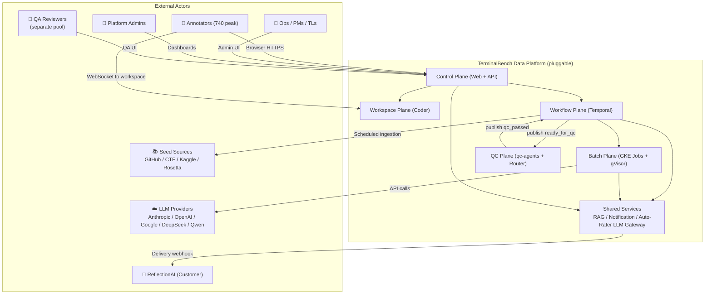
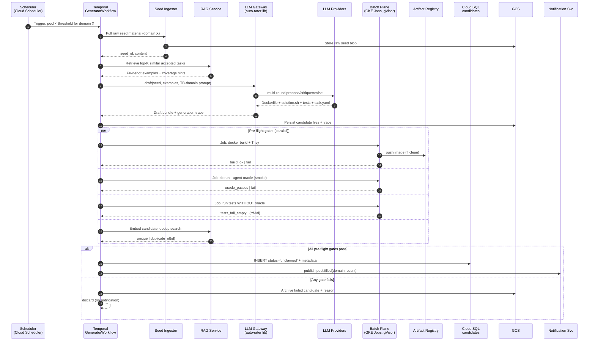
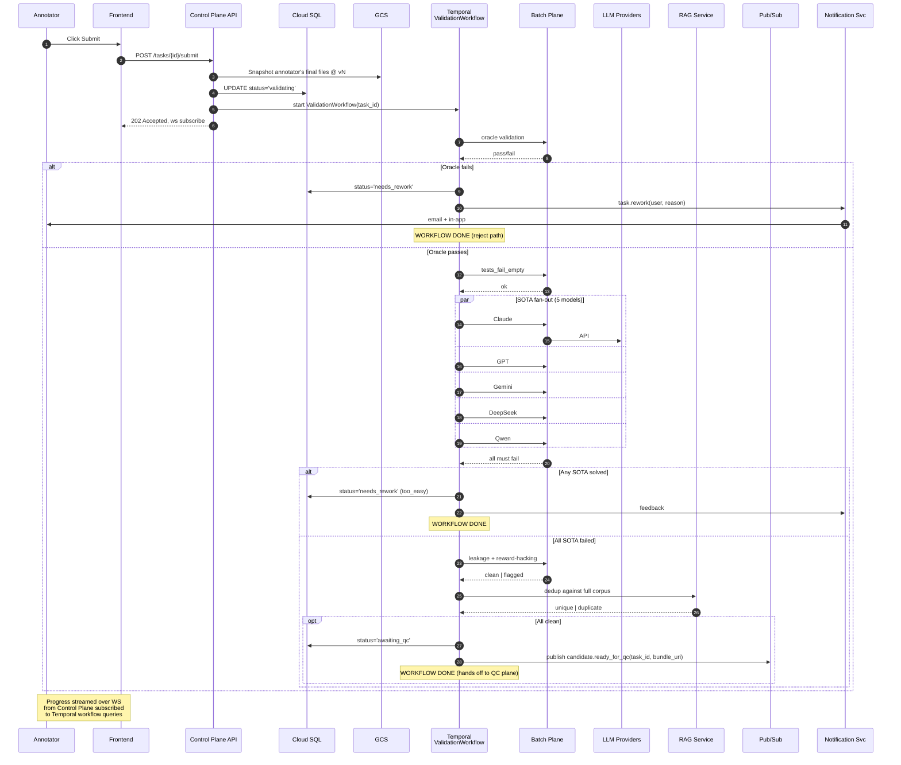
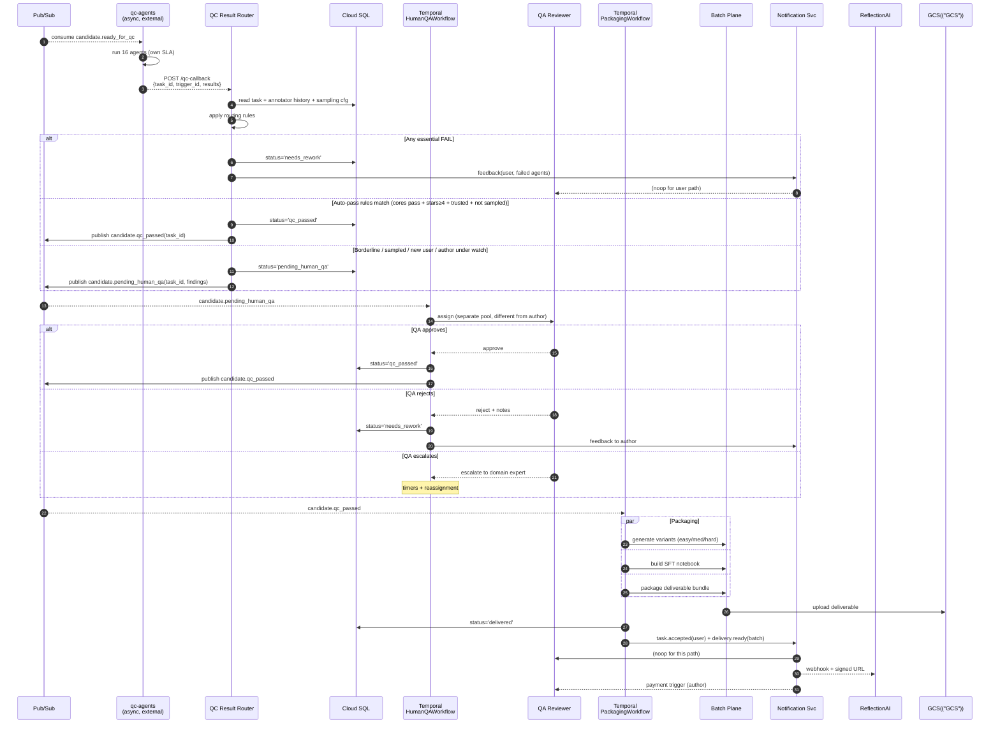
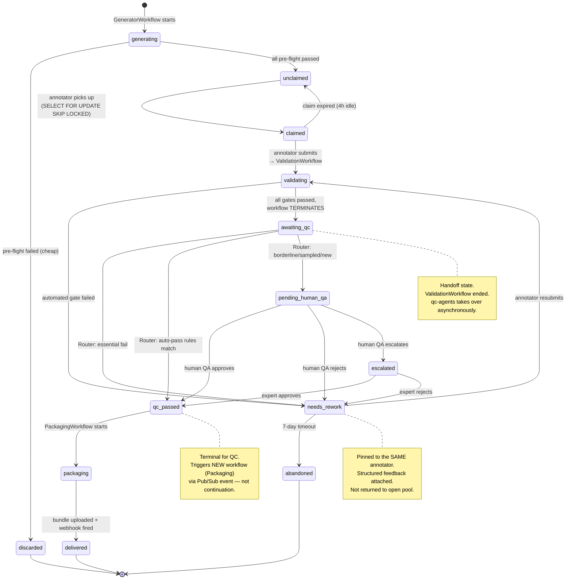
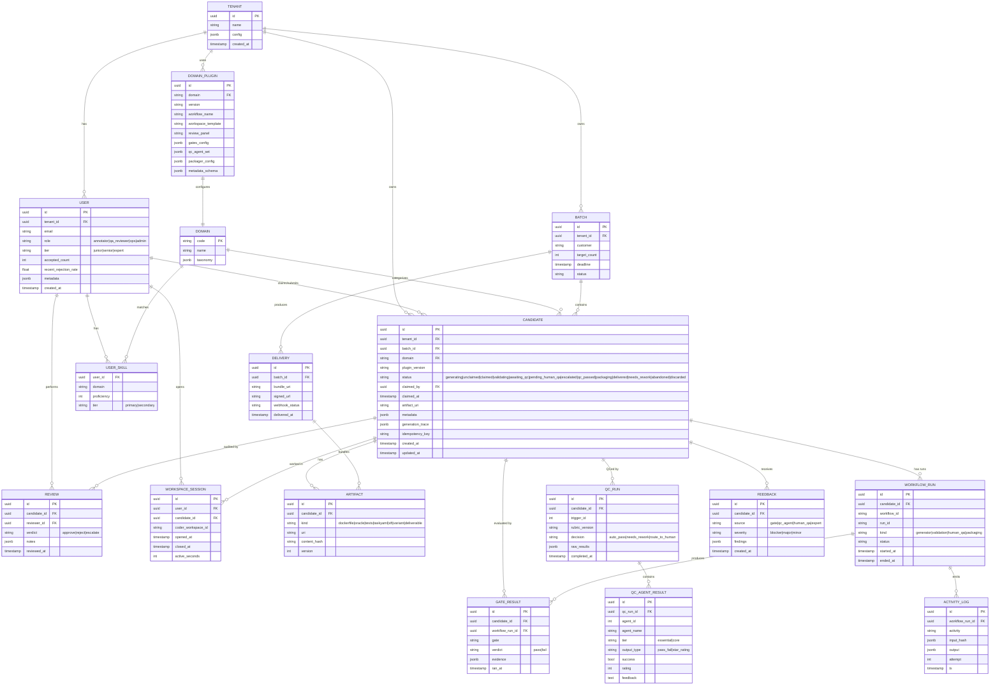

# TerminalBench Data Platform — Final Design

**Status:** Design v1 — ready to build against
**Target:** 25k tasks in 12 weeks for ReflectionAI ($15M delivery), pluggable for future customers / domains
**Unit cost target:** ≤ $90/task (vs ~$200 baseline)

---

## 1. Design principles (locked)

1. **Pluggable platform, not a project.** TB today, other domains tomorrow. Every domain is a plugin bundle (workflow + workspace template + review panel + gates + packager).
2. **No pod-local state.** Every stateful primitive is a managed service.
3. **No home-grown versions of mature OSS primitives.** Temporal for workflows. Coder for workspaces. Not our own.
4. **Humans are certifiers, not authors.** LLM pipeline drafts → human fixes and signs off. This is where the cost win lives.
5. **QC is an independent arbiter.** Runs async, outside the producing workflow, on its own SLA. qc-agents.turing.com is the QC backbone.
6. **Multi-tenant from commit #1.** `tenant_id` on every row, every bucket prefix, every IAM binding.
7. **Durable workflows.** Nothing depends on a pod staying alive. Every long-running step is a Temporal activity with idempotency.
8. **Burn compute to save human time.** Labor ≈ $0.67/minute, LLM calls ≈ $0.01–$1.00 each. Trade freely.

---

## 2. Reuse map — what we build vs. lift vs. integrate

| Source | Role | Effort |
|---|---|---|
| **`agents.turing.com`** | QA stage backbone (async arbiter, 16+ tiered agents) | 1–2 days integration |
| `apac-atlas-rag-svc` | Dedup, seed retrieval, coverage analysis | Use as-is |
| `apac-atlas-notification-svc` | All notifications (annotator, ops, customer) | Use as-is |
| `apac-auto-rater-service` | `LLMGateway` library for multi-provider LLM calls | 1 day |
| **Build new** | Seed ingestion · TB prompt library · Sandbox execution (GKE Jobs + `tb` CLI) · Pre-flight gates · Pool + assignment · Workspace integration (Coder) · Plugin contract · Temporal workflows · QC Result Router · TB-specific qc-agent definitions | ~4 weeks |

---

## 3. System Context — who talks to the platform



---

## 4. Full deployment view — every GCP service, every internal component

```mermaid
graph TB
    subgraph Internet["🌐 Internet"]
        User["Annotator Browser"]
        CustomerBucket["ReflectionAI GCS bucket<br/>(cross-project IAM)"]
    end

    subgraph GCP["GCP Project: tb-platform"]
        direction TB

        subgraph Edge["Edge"]
            LB["External HTTPS LB<br/>+ Cloud Armor (WAF, DDoS)"]
            IAP["Identity-Aware Proxy<br/>(Google SSO)"]
            CDN["Cloud CDN (static assets)"]
        end

        subgraph ControlPlane["🟦 Control Plane (GKE Autopilot)"]
            FE["Next.js Frontend<br/>(TanStack Query, shadcn/ui)"]
            API["FastAPI async<br/>Auth | Tasks | Pool | Assignment"]
            AdminAPI["Admin API<br/>Dashboards | Tenants | Audit"]
            QAUI["QA Review UI<br/>(for flagged tasks)"]
            Router["QC Result Router<br/>(webhook handler, thin)"]
        end

        subgraph WorkspacePlane["🟩 Workspace Plane (GKE Standard, gVisor+sysbox pool)"]
            CoderSrv["Coder Server (control)"]
            subgraph WS["Per-User Workspaces (up to ~500 concurrent)"]
                W1["Pod: user-1<br/>VS Code + xterm + DinD<br/>tb CLI | task files"]
                W2["Pod: user-2"]
                WN["Pod: user-N"]
            end
            CoderSrv --> W1
            CoderSrv --> W2
            CoderSrv --> WN
        end

        subgraph WorkflowPlane["🟨 Workflow Plane (GKE Autopilot, Temporal self-hosted)"]
            TSvr["Temporal Server<br/>(frontend/history/matching/worker)"]
            TWG["Workers: GeneratorWorkflow"]
            TWV["Workers: ValidationWorkflow"]
            TWH["Workers: HumanQAWorkflow"]
            TWP["Workers: PackagingWorkflow"]
        end

        subgraph BatchPlane["🟥 Batch Plane (GKE Standard, gVisor pool, KEDA-scaled)"]
            JOracle["Job: tb run --agent oracle"]
            JSota["Jobs: SOTA eval × 5"]
            JLeak["Job: leakage + reward-hacking"]
            JBuild["Job: docker build + Trivy"]
            JDedup["Job: dedup embedding"]
            JVariant["Job: variant generator"]
            JSFT["Job: SFT notebook builder"]
            JPkg["Job: deliverable packager"]
        end

        subgraph QCPlane["🟧 QC Plane (async, external)"]
            QC["qc-agents.turing.com<br/>16+ agents · essential & core tiers<br/>pass/fail + star_rating"]
        end

        subgraph SharedSvc["🟪 Shared / Reusable Services"]
            ARLib["auto-rater<br/>(LLMGateway library only)"]
            RAG["apac-atlas-rag-svc<br/>Hybrid search (vec+BM25+MMR)<br/>Dedup / Seed retrieval / Coverage"]
            Notif["apac-atlas-notification-svc<br/>Email · Push · Webhook<br/>DLQ · Circuit Breaker · Retry"]
        end

        subgraph DataServices["💾 Managed Data Services"]
            SQL[("Cloud SQL Postgres<br/>+ PgBouncer<br/>tasks, pool, users, audit,<br/>Temporal history")]
            Redis[("Memorystore Redis<br/>sessions, rate limit,<br/>idempotency, cache")]
            GCS[("GCS Buckets<br/>task-artifacts/<br/>deliverables/<br/>transcripts/")]
            AR[("Artifact Registry<br/>Trivy-scanned images")]
            VDB[("Vertex AI Vector Search<br/>(used by RAG)")]
        end

        subgraph Messaging["📡 Messaging"]
            PS["Pub/Sub topics:<br/>candidate.generated<br/>task.submitted<br/>candidate.ready_for_qc<br/>candidate.qc_passed<br/>notification.*"]
            CT["Cloud Tasks<br/>(scheduled retries,<br/>webhook delivery)"]
        end

        subgraph Observability["🔭 Observability & Ops"]
            OTel["OpenTelemetry Collector"]
            Prom["Managed Prometheus"]
            Trace["Cloud Trace"]
            Log["Cloud Logging"]
            Graf["Grafana"]
            PD["PagerDuty"]
        end

        subgraph Security["🔒 Security / Config"]
            SM["Secret Manager"]
            WI["Workload Identity"]
            KMS["Cloud KMS (CMEK)"]
            VPC["VPC-SC Perimeter"]
            FF["GrowthBook (feature flags)"]
        end
    end

    User -->|HTTPS| LB
    LB --> IAP
    IAP --> CDN
    IAP --> FE
    FE --> API
    FE -->|WS via Coder| CoderSrv
    API --> AdminAPI
    API --> QAUI

    API --> SQL
    API --> Redis
    API --> GCS
    API -->|start_workflow| TSvr
    API -->|publish| PS
    API -->|events via| Notif

    CoderSrv -->|provision pod| W1
    W1 -->|task files| GCS
    W1 -.optional local check.-> LLMPath(("LLM providers"))

    TSvr --> SQL
    TSvr --> TWG
    TSvr --> TWV
    TSvr --> TWH
    TSvr --> TWP

    TWG -->|dispatch batch| PS
    TWV -->|dispatch batch| PS
    TWP -->|dispatch batch| PS
    TWG -->|seed + dedup| RAG
    TWG -->|LLM calls| ARLib

    PS -->|KEDA scale| BatchPlane
    JOracle --> GCS
    JSota -->|LLM API| LLMPath
    JLeak --> GCS
    JBuild --> AR
    JDedup --> RAG
    JVariant --> GCS
    JSFT --> GCS
    JPkg --> GCS
    JPkg -->|via| Notif

    TWV -->|publish ready_for_qc + terminate| PS
    PS --> QC
    QC -->|webhook callback| Router
    Router --> SQL
    Router -->|publish qc_passed OR pending_human_qa| PS
    PS -->|qc_passed → start PackagingWorkflow| TWP
    PS -->|pending_human_qa → start HumanQAWorkflow| TWH
    TWH --> QAUI
    TWH -->|approve → publish qc_passed| PS
    TWH -->|reject → notify| Notif

    ARLib -->|multi-provider| LLMPath
    RAG --> VDB
    RAG --> SQL
    Notif --> PS
    Notif --> CT
    Notif -->|email| Ext1(("SendGrid"))
    Notif -->|push| Ext2(("Firebase FCM"))
    Notif -->|delivery webhook| CustomerBucket

    ControlPlane -.OTel.-> OTel
    WorkspacePlane -.OTel.-> OTel
    WorkflowPlane -.OTel.-> OTel
    BatchPlane -.OTel.-> OTel
    SharedSvc -.OTel.-> OTel
    OTel --> Prom
    OTel --> Trace
    OTel --> Log
    Prom --> Graf
    Graf --> PD

    ControlPlane -.IAM.-> WI
    WorkflowPlane -.IAM.-> WI
    BatchPlane -.IAM.-> WI
    SharedSvc -.IAM.-> WI
    DataServices -.CMEK.-> KMS
    API -.flags.-> FF
```



---

## 5. Generator pipeline — how the pool gets filled



---

## 6. Validation workflow — producer-side gates only (terminates at `awaiting_qc`)



**Key property:** the `ValidationWorkflow` does not wait on QC. It produces a QC-ready artifact and terminates. QC is an independent consumer.

---

## 7. QC + routing + packaging — async arbiter chain



---

## 8. Candidate state machine



---

## 9. Four Temporal workflows — each short, single-purpose

| Workflow | Triggered by | Ends at | Owns |
|---|---|---|---|
| `GeneratorWorkflow` | Scheduler (pool-low signal) | Candidate in `unclaimed` | Draft creation + pre-flight gates |
| `ValidationWorkflow` | Annotator submit | `awaiting_qc` OR `needs_rework` | Oracle + SOTA + leakage + dedup gates |
| `HumanQAWorkflow` | `candidate.pending_human_qa` event | `qc_passed` OR `needs_rework` | Reviewer assignment + escalation + timers |
| `PackagingWorkflow` | `candidate.qc_passed` event | `delivered` | Variants + SFT + bundle + delivery webhook |

**Event-driven between them. No workflow waits on another. Each replayable and auditable in isolation.**

---

## 10. QC routing rules (the single source of truth)

```python
def route(qc_results, annotator, sampling_cfg) -> Decision:
    essentials = [r for r in qc_results if r.tier == "essential"]
    cores      = [r for r in qc_results if r.tier == "core"]

    # Hard reject on any essential failure
    if any(not r.success for r in essentials):
        return Decision.NEEDS_REWORK(
            reasons=[r for r in essentials if not r.success])

    cores_ok = all(r.success for r in cores)
    stars_ok = all(r.rating >= 4 for r in cores
                   if r.outputType == "star_rating")

    sampled   = random.random() < sampling_cfg.audit_rate(annotator.tier)
    new_user  = annotator.accepted_count < sampling_cfg.new_user_threshold
    watched   = annotator.recent_rejection_rate > 0.2

    if cores_ok and stars_ok and not sampled and not new_user and not watched:
        return Decision.AUTO_PASS

    return Decision.ROUTE_TO_HUMAN(findings=qc_results)
```

---

## 11. Data model (ERD)



---

## 12. Shared service wiring

### `apac-atlas-rag-svc` — three call sites

1. **Seed retrieval** (GeneratorWorkflow): `rag.query(domain, seed_summary, k=5)` → few-shot grounding.
2. **Dedup gate** (GeneratorWorkflow + ValidationWorkflow): `rag.similar(embedding, threshold=0.88)`.
3. **Coverage dashboard** (nightly job): cluster accepted tasks; flag mode collapse.

One collection per `(tenant, domain)`. No changes to RAG.

### `apac-atlas-notification-svc` — every platform notification

| Event | Channel | Recipient |
|---|---|---|
| `task.accepted` | email + in-app | annotator |
| `task.needs_rework` | email + in-app (structured reasons) | annotator |
| `task.abandoned` | email | annotator + ops |
| `payment.triggered` | email + webhook | annotator + finance |
| `pool.depleted(domain)` | Slack | ops |
| `delivery.ready(batch)` | webhook + signed URL | customer |
| `gate.regression_detected` | PagerDuty | on-call |
| `reviewer.calibration_needed` | email | QA lead |
| `workspace.idle_suspend` | in-app | annotator |

All via Pub/Sub → notification service (circuit breaker, retry, DLQ).

### `qc-agents.turing.com` — QA arbiter

- TB-specific agent set registered per `DOMAIN_PLUGIN.qc_agent_set`.
- Triggered by `candidate.ready_for_qc` Pub/Sub event.
- Returns results via webhook to **QC Result Router** (Control Plane).
- Router applies rules, updates DB, publishes next event.
- Back-pressure: let `awaiting_qc` grow, alert ops > threshold, never block annotators.

### `apac-auto-rater-service` — library only

- Import `LLMGateway` for multi-provider LLM calls in GeneratorWorkflow.
- Not deployed as a separate service in our plane.

---

## 13. Unit-cost model at steady state

| Stage | Cost / task |
|---|---|
| Annotator labor (1.5–2 hrs, better pipeline) | ~$70 |
| qc-agents run (16 agents, LLM-backed) | ~$0.50–$1.00 |
| Human QA on ~25% flagged | 25% × 15 min × $40/hr ≈ $2.50 |
| Infra (workspace + batch + packaging) | ~$5 |
| Rework amortized (~8%) | ~$6 |
| Ops / PM | ~$3 |
| **Total** | **~$87/task** |

vs. APAC baseline $200/task. Savings ~$113/task × 25k tasks ≈ **$2.8M margin uplift** on this deal.

---

## 14. Capacity targets

- **Annotators:** 740 peak concurrent (spreadsheet), ~500 concurrent workspace pods at any moment (timezone/break discounting).
- **Workspace pods:** 2 vCPU / 4 GB / 20 GB disk each → ~1,500 vCPU peak → 1 node pool of n2-standard-32 × 50 nodes (with spot mix).
- **Throughput:** 3,063 tasks/week steady (weeks 6–10), 25,003 total over 12 weeks.
- **QC throughput:** ~3k tasks/week × 16 agents ≈ 48k agent calls/week (~7k/day peak).
- **Batch plane peak:** ~200 concurrent jobs during submission rushes.
- **Cloud SQL:** 10 replicas × 20 pool connections = 200 to PgBouncer; PgBouncer → 50 real connections to SQL.

---

## 15. Scaling axes & first thing that breaks at 10×

At 10× (7,400 annotators, 250k tasks/quarter):

| Layer | First bottleneck | Mitigation |
|---|---|---|
| Control plane | Stateless, scales with HPA | — |
| Cloud SQL | Connection count / write contention | AlloyDB + tenant sharding |
| Workspace | Node pool quota, ~15k vCPU | Regional node pools, spot mix |
| Workflow | Temporal task queue lag | Shard task queues by domain |
| Batch | KEDA scaling caps + GPU availability | Pre-reserved GPU pool + multi-region |
| QC | qc-agents throughput | Scale qc-agents cluster, pre-warm agents |
| Pub/Sub | None practically | — |
| GCS egress | Delivery bandwidth | Multi-region buckets + CDN for signed URLs |

---

## 16. Failure-mode table

| Failure | Blast radius | Recovery |
|---|---|---|
| Coder pod dies mid-session | 1 annotator; files on PV survive | auto-restart, <60s |
| Temporal worker dies mid-activity | 0 — heartbeat times out, retry on another worker | transparent |
| Cloud SQL 5-min outage | Reads fail; workspaces unaffected; Temporal pauses and resumes | graceful degradation |
| qc-agents outage (≤1h) | `awaiting_qc` grows | drains when restored; no data loss |
| qc-agents outage (>1h) | Escalation: route remaining to human QA | feature flag flip |
| Malicious annotator (container escape) | Contained by gVisor + sysbox + NetworkPolicy | no lateral movement |
| LLM provider rate-limit / outage | SOTA eval retries with backoff; fallback to fewer models | degraded, not down |
| Batch pool exhausted | Jobs queue in Pub/Sub | KEDA scales, drains |

---

## 17. Security posture

- **Identity:** Google SSO + IAP on all user surfaces; Workload Identity for services; no SA keys on disk.
- **Isolation:** gVisor + sysbox for annotator pods and untrusted batch jobs; NetworkPolicy east-west deny-default.
- **Data:** CMEK on GCS and Cloud SQL; VPC-SC perimeter; Secret Manager; Trivy gate on every image push.
- **Egress:** outbound via allowlisted proxy; no direct internet from annotator pods.
- **Audit:** every mutation logged to append-only `activity_log` table; Cloud Audit Logs on all GCP services.
- **Tenant isolation:** `tenant_id` on every row; per-tenant bucket prefix; row-level filtering middleware.

---

## 18. Observability — wired from day 1

- **Traces:** OpenTelemetry SDK everywhere → Cloud Trace.
- **Metrics:** Managed Prometheus + Grafana. Per-phase latency histograms. Task-yield rate. Reviewer SLAs. Cost-per-accepted-task.
- **Logs:** structlog JSON → Cloud Logging with trace correlation.
- **SLOs:**
  - Control-plane availability ≥ 99.9%
  - API p95 < 300 ms
  - Workspace cold-start p95 < 30 s
  - Task-yield (submitted → accepted) ≥ 70%
  - QC decision latency p95 < 2 min
  - Delivery freshness p95 < 24 h
- **Alerting:** PagerDuty on SLO burn; Slack on pool depletion, reviewer queue spikes, cost anomalies.

---

## 19. Plugin contract (how "today TB, tomorrow X")

A domain plugin is a versioned bundle registered in `DOMAIN_PLUGIN`:

| Field | What it points to |
|---|---|
| `workflow_name` | Temporal workflow class (ValidationWorkflow variant for this domain) |
| `workspace_template` | Coder Terraform template (image, CPU, tools) |
| `review_panel` | React component bundle ID (terminal replay, diff, etc.) |
| `gates_config` | JSON list of pre-flight and post-submit gate definitions |
| `qc_agent_set` | Agent IDs to run on qc-agents for this domain |
| `packager_config` | Deliverable format, GCS prefix, webhook template |
| `metadata_schema` | JSON Schema for the `CANDIDATE.metadata` JSONB column |

**Versioned (SemVer). In-flight tasks pin the plugin version at creation time.** Temporal determinism preserved: new plugin versions only apply to new candidates.

Adding a new customer/domain = new plugin repo, register, go. No platform changes.

---

## 20. 3-week build plan (parallel tracks)

**Week 1 — foundations**
- **Track A (Platform):** Terraform GCP footprint. VPC, GKE Autopilot, GKE Standard gVisor pool, Cloud SQL, Memorystore, Artifact Registry, Pub/Sub, Cloud Tasks, GCS buckets, Secret Manager, IAM, Workload Identity, IAP. *Exit gate:* `terraform apply` from zero produces working cluster.
- **Track B (Coder):** Deploy Coder on GKE. Author `tb-task` workspace template (tb CLI + DinD via sysbox + VS Code). *Exit gate:* any engineer opens a workspace with a task folder in <30s.
- **Track C (Control plane):** FastAPI async + Next.js + schema + Alembic. Tenants, users, batches, candidates, assignments, reviews, artifacts, qc_runs, audit. *Exit gate:* authenticated user can CRUD a task, every write tenant-scoped, every mutation traced.
- **Track D (Temporal):** Self-host Temporal on GKE. Scaffold four workflow stubs (Generator, Validation, HumanQA, Packaging). *Exit gate:* each workflow progresses via signals, survives worker kill.

**Week 2 — the real pipeline**
- **Track E (Phase logic):** Port APAC phase validators, taxonomy, SFT generator, packager as clean Temporal activities. Each idempotent, each emits spans.
- **Track F (Generator):** Seed ingestion + LangGraph/auto-rater LLMGateway + TB prompt library v1. Persist checkpoints. Pre-flight gates (build, oracle smoke, tests_fail_empty, Trivy, dedup via RAG).
- **Track G (Pool + assignment):** 740-annotator routing by domain × skill. Postgres `SELECT FOR UPDATE SKIP LOCKED`. Claim expiry via heartbeat. *Exit gate:* 1k simulated annotators claim without duplicate assignment under chaos.
- **Track H (Coder integration):** Control plane provisions per-task workspaces; mounts from GCS; emits ready event.
- **Track I (QC integration):** QC Result Router webhook handler. TB agent set definitions. Routing rules + sampling config. Wire `awaiting_qc` → qc-agents → router → `qc_passed` / `pending_human_qa`.

**Week 3 — scale, harden, load-test**
- **Track J (Load test):** k6 / Locust: 1k virtual annotators claiming, working for 30 min, submitting. *Exit gate:* control-plane p95 < 1s, workspace p95 < 30s, zero errors at 1k concurrent.
- **Track K (Tenant isolation):** prove no cross-reads at DB, bucket, workspace, Temporal task queue levels.
- **Track L (Observability + runbooks):** SLOs published, alerts wired, 5 runbooks written.
- **Track M (Security):** Trivy gate active, CMEK verified, VPC-SC perimeter review, audit logging confirmed.
- **Track N (Chaos drill):** kill control plane pod, kill Temporal worker, sever Cloud SQL, drop Pub/Sub sub. Recover gracefully, no data loss.
- **Track O (Second-domain spike):** scaffold a trivial second domain plugin to prove pluggability.

**Exit gate for 3 weeks:** 1k-concurrent load test passes + tenant isolation verified + chaos drill passes + observability green + runbooks exist + second-domain spike scaffolds cleanly.

---

## 21. Open decisions (to lock before building)

1. **QA reviewer pool model:** separate tier from annotators (recommended) vs peer-review.
2. **qc-agents callback shape:** webhook (preferred) vs polling.
3. **TB-specific agent set registration:** can we define agents like `Dockerfile Buildability`, `Oracle Correctness`, `Test Non-Triviality`, `Leakage Risk`, `Reward-Hacking Risk`, `Difficulty Calibration`, `Description Clarity` in qc-agents?
4. **qc-agents capacity:** 7k agent calls/day peak — negotiated?
5. **Tenant isolation model:** single DB + `tenant_id` column (recommended) vs schema-per-tenant vs project-per-tenant.
8. **Budget envelope** for monthly GCP spend.

---

## 22. Cost of *not* doing this right

- APAC tool at $200/task × 25k = **$5.0M labor cost**, $10M margin on the $15M deal.
- New platform at $87/task × 25k = **$2.2M labor cost**, $12.8M margin.
- **Delta: ~$2.8M margin on ReflectionAI alone.**
- Plus: second/third customer onboarding via plugin = ~1 week vs 3 months. Every future delivery compounds the platform bet.
- Plus: no production incident during ramp-up (APAC tool would not survive 700 concurrent users given its pod-local state and blocking DB).

---

**Designed By: Ashutosh Singh.**