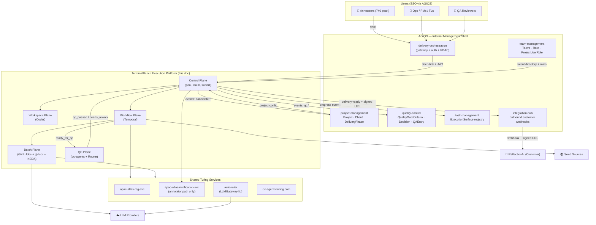
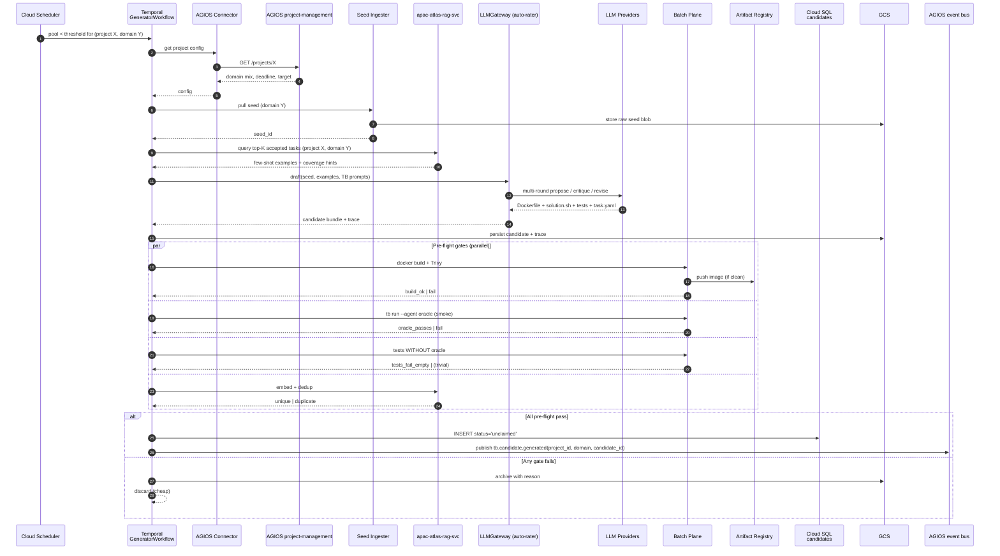
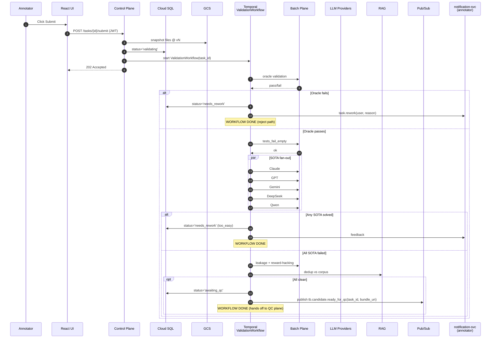
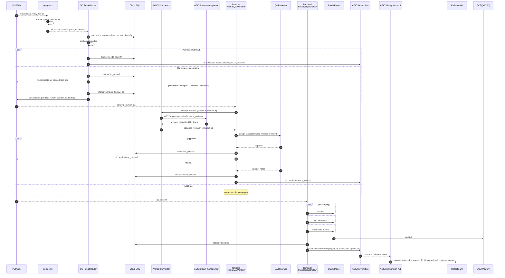
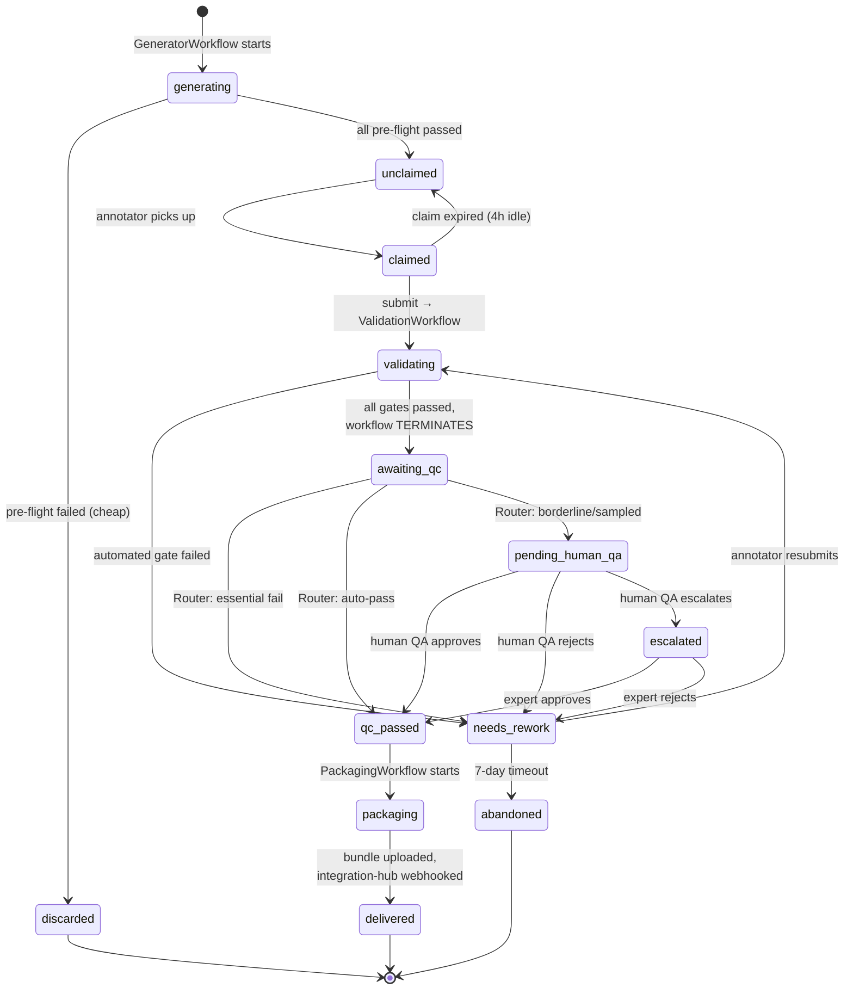
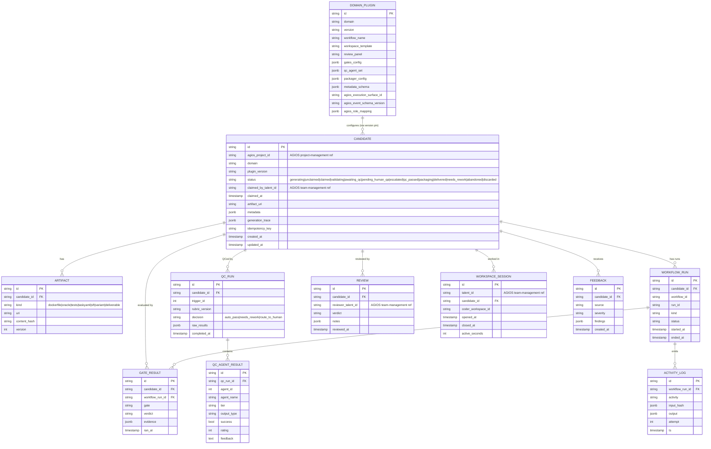

# TerminalBench Execution Platform — AGIOS-Federated Design

**Status:** Design v2 (AGIOS-federated) — ready to build against
**Target:** 25k tasks in 12 weeks for ReflectionAI ($15M delivery), pluggable for future customers / domains
**Unit cost target:** ≤ $90/task (vs ~$200 APAC baseline)
**Companion doc:** `PLATFORM_DESIGN.md` (standalone mode, kept for reference / air-gapped deployments)

---

## TL;DR — one paragraph

The TerminalBench Execution Platform is an **AGIOS-federated** service. AGIOS owns everything cross-cutting — auth, RBAC, tenants, clients, projects, talent directory, QA governance, weekly reporting, sign-off, and outbound customer webhooks — and TB consumes these via the `shared` Python kernel plus REST. TB focuses exclusively on **task execution**: LLM-driven candidate generation, per-annotator workspaces (Coder), durable workflows (Temporal), sandboxed batch evaluation (GKE Jobs + gVisor), and asynchronous QC arbitration (qc-agents.turing.com). TB registers itself in AGIOS as an **ExecutionSurface** and publishes progress events back. TB can also run **standalone** (air-gapped, `shared` imported as a library) for customers who can't adopt AGIOS.

---

## 1. Design principles (locked)

1. **Federate, don't duplicate.** Auth, users, tenants, clients, projects, talent, QA governance, outbound webhooks, audit, events all come from AGIOS `shared` kernel + domain services. TB never owns its own copy.
2. **Pluggable platform, not a project.** TB today, other domains tomorrow. Every domain is a plugin bundle (workflow + workspace template + review panel + gates + packager).
3. **No pod-local state.** Every stateful primitive is a managed service.
4. **No home-grown versions of mature OSS primitives.** Temporal for workflows. Coder for workspaces. Not our own.
5. **Humans are certifiers, not authors.** LLM pipeline drafts → human fixes and signs off. This is where the cost win lives.
6. **QC is an independent arbiter.** Runs async, outside the producing workflow, on its own SLA. qc-agents.turing.com is the QC backbone.
7. **Durable workflows.** Nothing depends on a pod staying alive. Every long-running step is a Temporal activity with idempotency.
8. **Burn compute to save human time.** Labor ≈ $0.67/minute, LLM calls ≈ $0.01–$1.00 each. Trade freely.
9. **Microservice discipline.** No cross-service FKs. All cross-service references are logical string IDs (AGIOS convention).

---

## 2. Reuse map — AGIOS first, then shared Turing services

### 2.1 From AGIOS (adopt, don't rebuild)

| AGIOS component | Role in TB platform |
|---|---|
| `shared.auth` (cookie, token, deps, internal) | **All auth.** JWT verification, service-to-service auth. No direct SSO in TB. |
| `shared.models.user` + `shared.models.base` + `shared.models.audit` | User model, base mixins, audit trail |
| `shared.events.bus` | Event publishing between TB and AGIOS services |
| `delivery-orchestration` gateway | Edge API aggregation, RBAC enforcement, routing to TB |
| `project-management` (Project, Client, DeliveryPhase, TeamAssignment, WeeklyReport) | Tenant / customer / batch / deadline model. ReflectionAI is one `Project`. |
| `team-management` (Talent, DeliveryTalent, ProjectUserRole) | Annotator directory, QA reviewer roles, skill-to-project binding |
| `quality-control` (QualityGateCriteria, QualityGateDecision, QAEntry) | Project-level QA governance, weekly dashboards, sign-off |
| `task-management` (TaskProjectModel, ExecutionSurface) | TB registers as an `ExecutionSurface`; per-project progress |
| `integration-hub` | Outbound customer webhooks (replaces `notification-svc` for customer path) |
| `taxonomy-extraction` | Complementary: document-level taxonomy, not our per-task domain tags |

### 2.2 From shared Turing services (still ours to integrate)

| Source | Role |
|---|---|
| `qc-agents.turing.com` | Per-task QC arbiter (async, external) |
| `apac-atlas-rag-svc` | Dedup, seed retrieval, coverage analysis |
| `apac-atlas-notification-svc` | **Annotator-facing only** (in-product email/push). Customer delivery via AGIOS `integration-hub`. |
| `apac-auto-rater-service` | `LLMGateway` as a Python library inside GeneratorWorkflow |
| `apac-atlas-terminal-bench` (APAC tool) | Lift logic only: phase validators, taxonomy helpers, SFT notebook generator, deliverable packager |

### 2.3 What TB still builds

- Workspace Plane (Coder templates, lifecycle integration)
- Workflow Plane (Temporal, 4 workflows)
- Batch Plane (GKE Jobs + gVisor + KEDA, all eval activities)
- Generator pipeline (seed ingestion, TB prompt library, multi-pass generation, pre-flight gates)
- QC Result Router (thin webhook handler)
- Plugin contract and TB plugin bundle
- AGIOS Connector (JWT verify, s2s lookups, event publishing, self-registration)

**Net build reduction: ~35–40% vs standalone.** Everything cross-cutting moves up to AGIOS.

---

## 3. System Context — AGIOS as the shell, TB as the execution engine



**Key property:** ReflectionAI never talks to TB. They talk to AGIOS. TB is internal execution machinery. Anyone working on a ReflectionAI-level customer sees the world through `project-management` + `quality-control` dashboards.

---

## 4. AGIOS integration contracts — the seams, precisely

This is the section the standalone design does not have. Every TB ↔ AGIOS touchpoint is listed.

### 4.1 Inbound from AGIOS

| Contract | Purpose | Mechanism |
|---|---|---|
| **JWT on every request** | Identify `project_id`, `talent_id`, `role` | `shared.auth.dependencies.require_user` in FastAPI deps |
| **`GET /api/v1/talent/{id}`** (team-management) | Lookup annotator skills, active project, quality metrics | Internal s2s via `shared.auth.internal` |
| **`GET /api/v1/projects/{id}`** (project-management) | Project config: domain mix, target count, deadline | Cached in Redis, TTL 5 min |
| **`GET /api/v1/project-user-roles?project_id=X&role=qa_reviewer`** | Reviewer pool for HumanQAWorkflow assignment | Cached, 1 min TTL |
| **`GET /api/v1/quality-gate-criteria?project_id=X`** | Project-level thresholds (e.g., IAA ≥ 95%) | Checked at batch boundary, not per-task |

### 4.2 Outbound to AGIOS (events)

Published via `shared.events.bus` (Pub/Sub under the hood):

| Event | Consumer | Purpose |
|---|---|---|
| `tb.candidate.generated` | task-management | Increment counters on `TaskProjectModel` |
| `tb.candidate.claimed` | team-management | Update talent utilization |
| `tb.candidate.accepted` | quality-control | Update `QAEntry` weekly roll-up |
| `tb.candidate.delivered` | integration-hub | Trigger customer webhook |
| `tb.candidate.needs_rework` | quality-control | Feed into weekly status |
| `tb.qc.sampled` | quality-control | IAA / audit metrics |
| `tb.workspace.session` | team-management | Time tracking / billing |

### 4.3 Self-registration at boot

TB Control Plane, on boot, POSTs to task-management:

```json
POST /api/v1/execution-surfaces
{
  "name": "terminal-bench",
  "surface_type": "task_generation",
  "url_template": "https://tb.agios.turing.com/tasks/{external_id}",
  "is_active": true,
  "configuration": {
    "plugin_version": "1.0.0",
    "domains": ["software-engineering", "security", "sysadmin", ...],
    "supports_variants": true,
    "supports_sft_notebook": true
  }
}
```

This is how AGIOS discovers TB and lets PMs attach projects to it.

### 4.4 Customer delivery handoff

TB does **not** webhook ReflectionAI directly. Instead:

1. `PackagingWorkflow` finishes building the deliverable bundle in GCS.
2. TB generates a V4-signed URL valid for 7 days.
3. TB publishes `tb.candidate.delivered(project_id, bundle_uri, signed_url, manifest)` to the event bus.
4. `integration-hub` consumes the event, looks up the customer's webhook endpoint from `project-management.integrations`, signs the payload with the customer's shared secret, POSTs it, handles retry / DLQ.

**Benefits:** TB has no customer secrets. Customer webhook configuration lives in AGIOS with audit. Changing a customer endpoint doesn't redeploy TB.

---

## 5. Deployment view — TB footprint only (AGIOS is its own footprint)

```mermaid
graph TB
    subgraph AGIOSedge["AGIOS (separate deployment)"]
        DOGW["delivery-orchestration gateway<br/>(auth, RBAC, routing)"]
    end

    subgraph GCP["GCP Project: tb-exec"]
        direction TB

        subgraph ControlPlane["🟦 Control Plane (GKE Autopilot)"]
            FE["React 19 + Vite + MUI v7<br/>(embedded in AGIOS frontend<br/>OR standalone)"]
            API["FastAPI async<br/>pool · claim · submit · review"]
            Router["QC Result Router<br/>(webhook handler)"]
            Conn["AGIOS Connector<br/>(JWT verify, s2s, events,<br/>self-registration)"]
        end

        subgraph WorkspacePlane["🟩 Workspace Plane (GKE Std, gVisor+sysbox)"]
            CoderSrv["Coder Server"]
            subgraph WS["Per-user workspaces (~500 peak)"]
                W1["Pod: user-1<br/>VS Code + xterm + DinD<br/>tb CLI | task files"]
                W2["Pod: user-2"]
                WN["Pod: user-N"]
            end
            CoderSrv --> W1
            CoderSrv --> W2
            CoderSrv --> WN
        end

        subgraph WorkflowPlane["🟨 Workflow Plane (GKE Autopilot, Temporal self-hosted)"]
            TSvr["Temporal Server"]
            TWG["Workers: GeneratorWorkflow"]
            TWV["Workers: ValidationWorkflow"]
            TWH["Workers: HumanQAWorkflow"]
            TWP["Workers: PackagingWorkflow"]
        end

        subgraph BatchPlane["🟥 Batch Plane (GKE Std, gVisor, KEDA-scaled)"]
            JOracle["tb run --agent oracle"]
            JSota["SOTA × 5 parallel"]
            JLeak["leakage + reward-hacking"]
            JBuild["docker build + Trivy"]
            JDedup["dedup embedding"]
            JVariant["variant generator"]
            JSFT["SFT notebook builder"]
            JPkg["deliverable packager"]
        end

        subgraph QCPlane["🟧 QC Plane (external)"]
            QC["qc-agents.turing.com<br/>(async arbiter)"]
        end

        subgraph SharedSvc["🟪 Shared Turing Services (external)"]
            ARLib["auto-rater LLMGateway<br/>(Python lib)"]
            RAG["apac-atlas-rag-svc"]
            NotifA["notification-svc<br/>(annotator only)"]
        end

        subgraph DataServices["💾 Managed Data (GCP)"]
            SQL[("Cloud SQL Postgres<br/>+ PgBouncer<br/>TB-local: candidates,<br/>artifacts, workflow_runs,<br/>qc_runs, etc.")]
            Redis[("Memorystore Redis<br/>project cfg cache,<br/>talent cache,<br/>idempotency keys")]
            GCS[("GCS<br/>task-artifacts/<br/>deliverables/<br/>transcripts/")]
            AR[("Artifact Registry<br/>Trivy-scanned images")]
        end

        subgraph Messaging["📡 Messaging (GCP)"]
            PS["Pub/Sub topics<br/>tb.candidate.*<br/>tb.qc.*<br/>tb.workspace.*<br/>(published to AGIOS bus)"]
        end

        subgraph Observability["🔭 Observability"]
            OTel["OTel Collector"]
            Prom["Managed Prometheus"]
            Trace["Cloud Trace"]
            Log["Cloud Logging"]
            Graf["Grafana"]
        end

        subgraph Security["🔒 Security"]
            SM["Secret Manager"]
            WI["Workload Identity"]
            KMS["Cloud KMS (CMEK)"]
        end
    end

    DOGW -->|JWT + deep-link| API
    DOGW -->|JWT + WS| CoderSrv

    API --> Conn
    Conn -->|s2s lookup| DOGW
    API --> SQL
    API --> Redis
    API --> GCS
    API -->|start_workflow| TSvr
    API -->|publish| PS
    API -->|in-app notifications| NotifA

    TSvr --> SQL
    TSvr --> TWG
    TSvr --> TWV
    TSvr --> TWH
    TSvr --> TWP

    TWG -->|dispatch batch| PS
    TWV -->|dispatch batch| PS
    TWP -->|dispatch batch| PS
    TWG -->|seed + dedup| RAG
    TWG -->|LLM calls| ARLib

    PS -->|KEDA| BatchPlane
    JBuild --> AR
    JDedup --> RAG
    JSota --> ARLib

    TWV -->|ready_for_qc + terminate| PS
    PS --> QC
    QC -->|webhook callback| Router
    Router --> SQL
    Router -->|qc_passed OR pending_human_qa| PS
    PS --> TWH
    PS --> TWP
    TWH -->|talent lookup| Conn
    TWP -->|publish delivered event| PS
    PS -->|consumed by AGIOS integration-hub| DOGW

    ControlPlane -.OTel.-> OTel
    WorkflowPlane -.OTel.-> OTel
    WorkspacePlane -.OTel.-> OTel
    BatchPlane -.OTel.-> OTel
    OTel --> Prom
    OTel --> Trace
    OTel --> Log

    ControlPlane -.IAM.-> WI
    WorkflowPlane -.IAM.-> WI
    BatchPlane -.IAM.-> WI
    DataServices -.CMEK.-> KMS
```



**Removed vs standalone design:** IAP, direct Google SSO, tenant/user tables, custom RBAC middleware, CORS/public LB. All inherited from AGIOS.

---

## 6. Generator pipeline — how the pool gets filled



---

## 7. Validation workflow — terminates at `awaiting_qc`



---

## 8. QC + routing + packaging — async arbiter chain



---

## 9. Candidate state machine



---

## 10. Four Temporal workflows

| Workflow | Triggered by | Ends at | Owns |
|---|---|---|---|
| `GeneratorWorkflow` | Scheduler (pool-low per project×domain) | Candidate `unclaimed` | Seed, draft, pre-flight gates |
| `ValidationWorkflow` | Annotator submit | `awaiting_qc` OR `needs_rework` | Oracle + SOTA + leakage + dedup |
| `HumanQAWorkflow` | `pending_human_qa` event | `qc_passed` OR `needs_rework` | Reviewer lookup (team-management), assignment, escalation, timers |
| `PackagingWorkflow` | `qc_passed` event | `delivered` | Variants + SFT + bundle + delivery event |

**Event-driven between them via AGIOS event bus. No workflow waits on another.**

---

## 11. QC routing rules

```python
def route(qc_results, annotator_metrics, sampling_cfg) -> Decision:
    essentials = [r for r in qc_results if r.tier == "essential"]
    cores      = [r for r in qc_results if r.tier == "core"]

    # Hard reject
    if any(not r.success for r in essentials):
        return Decision.NEEDS_REWORK(
            reasons=[r for r in essentials if not r.success])

    cores_ok = all(r.success for r in cores)
    stars_ok = all(r.rating >= 4 for r in cores
                   if r.outputType == "star_rating")

    sampled   = random.random() < sampling_cfg.audit_rate(annotator_metrics.tier)
    new_user  = annotator_metrics.accepted_count < sampling_cfg.new_user_threshold
    watched   = annotator_metrics.recent_rejection_rate > 0.2

    if cores_ok and stars_ok and not sampled and not new_user and not watched:
        return Decision.AUTO_PASS

    return Decision.ROUTE_TO_HUMAN(findings=qc_results)
```

Annotator metrics (`accepted_count`, `recent_rejection_rate`, `tier`) come from `team-management.Talent` via AGIOS Connector.

---

## 12. Data model — TB-local only (AGIOS owns the rest)

No `TENANT`, `USER`, `USER_SKILL`, `BATCH`, `DELIVERY` tables in TB — all owned by AGIOS. TB references AGIOS entities via **logical string IDs, no FKs**.



All tables inherit `shared.models.base.AGIOSBase` + `shared.models.audit.AuditMixin` from the AGIOS shared kernel. Table prefix: `dos_tb_*` following AGIOS convention.

---

## 13. Plugin contract

A domain plugin is a versioned bundle registered in `DOMAIN_PLUGIN`:

| Field | What it points to |
|---|---|
| `workflow_name` | Temporal workflow class (ValidationWorkflow variant for this domain) |
| `workspace_template` | Coder Terraform template (image, CPU, tools) |
| `review_panel` | React component bundle ID (terminal replay, diff, etc.) |
| `gates_config` | JSON list of pre-flight + post-submit gate definitions |
| `qc_agent_set` | qc-agents agent IDs for this domain |
| `packager_config` | Deliverable format, GCS prefix, manifest schema |
| `metadata_schema` | JSON Schema for `CANDIDATE.metadata` |
| `agios_execution_surface_id` | Our ExecutionSurface registration in AGIOS |
| `agios_event_schema_version` | Event contract version we emit |
| `agios_role_mapping` | Map AGIOS talent roles → plugin-internal roles |

**Versioned (SemVer). In-flight candidates pin the plugin version at creation time. New versions only apply to new candidates.** Temporal determinism preserved.

Adding a new customer / domain = new plugin repo → register → go. No platform changes.

---

## 14. Unit-cost model at steady state

| Stage | $/task |
|---|---|
| Annotator labor (1.5–2 hrs) | ~$70 |
| qc-agents (16 agents, LLM-backed) | ~$0.50–$1.00 |
| Human QA on ~25% flagged | ~$2.50 |
| Infra (workspace + batch + packaging) | ~$5 |
| Rework amortized (~8%) | ~$6 |
| Ops / PM (AGIOS side) | ~$3 |
| **Total** | **~$87/task** |

vs APAC baseline $200/task → **~$2.8M margin uplift on ReflectionAI alone.**

---

## 15. Capacity targets

- **Annotators:** 740 peak concurrent; ~500 concurrent workspaces at any moment.
- **Workspace pods:** 2 vCPU / 4 GB / 20 GB each → ~1,500 vCPU peak → node pool of n2-standard-32 × 50 nodes with spot mix.
- **Throughput:** 3,063 tasks/week steady, 25,003 total over 12 weeks.
- **QC:** ~48k agent calls/week (~7k/day peak).
- **Batch:** ~200 concurrent jobs during submission bursts.
- **Cloud SQL:** 10 API replicas × 20 pool conns → 200 to PgBouncer → 50 real.

---

## 16. Scaling — 10× analysis

| Layer | First bottleneck | Mitigation |
|---|---|---|
| Control plane | stateless | HPA |
| Cloud SQL | connection count | AlloyDB upgrade, shard by project |
| Workspace | node pool quota | regional pools, spot mix |
| Workflow | Temporal task queue lag | shard queues by domain |
| Batch | KEDA cap + GPU scarcity | pre-reserved GPU pool, multi-region |
| QC | qc-agents throughput | scale qc-agents cluster |
| Pub/Sub / AGIOS event bus | none practically | — |
| GCS egress | delivery bandwidth | multi-region buckets + CDN |

---

## 17. Failure modes

| Failure | Blast radius | Recovery |
|---|---|---|
| Coder pod dies mid-session | 1 annotator; PV survives | auto-restart <60s |
| Temporal worker dies mid-activity | 0 | heartbeat timeout → retry elsewhere |
| Cloud SQL 5-min outage | reads fail; workspaces unaffected; Temporal pauses | graceful degrade |
| qc-agents outage ≤1h | `awaiting_qc` grows | drains when back |
| qc-agents outage >1h | escalation | feature-flag fallback to human QA |
| AGIOS down | TB can't validate JWT / lookup talent; claims pause | graceful read-only on workspaces; full restore when AGIOS returns |
| Container escape attempt | contained by gVisor + sysbox + NetworkPolicy | no lateral movement |
| LLM provider outage | SOTA eval retries; degrades to fewer models | degraded, not down |

---

## 18. Security posture — thinner (inherits from AGIOS)

Inherited from AGIOS:
- Identity: Google SSO via `shared.auth`
- JWT verification + RBAC: `shared.auth.dependencies`
- Audit: events bus → AGIOS audit log
- Tenant isolation: `project_id` claim in JWT, enforced in every handler

Still ours:
- gVisor + sysbox on workspace and batch node pools
- NetworkPolicy deny-default east-west
- CMEK on GCS + Cloud SQL
- VPC-SC perimeter
- Secret Manager + Workload Identity
- Trivy gate on every image push
- Egress via allowlisted proxy from untrusted pods

---

## 19. Observability — wired from day 1

- **Traces:** OTel → Cloud Trace. Correlated with AGIOS traces via W3C traceparent.
- **Metrics:** Managed Prometheus + Grafana. Per-phase latency, task-yield rate, reviewer SLAs, cost-per-accepted-task, AGIOS-connector p95, qc-agents p95.
- **Logs:** structlog JSON → Cloud Logging, trace-correlated.
- **SLOs:**
  - Control-plane availability ≥ 99.9%
  - API p95 < 300 ms
  - Workspace cold-start p95 < 30 s
  - Task-yield (submitted → accepted) ≥ 70%
  - QC decision latency p95 < 2 min
  - Delivery freshness p95 < 24 h
  - AGIOS lookup p95 < 100 ms (cached), < 500 ms (uncached)
- **Alerting:** PagerDuty on SLO burn; Slack on pool depletion, reviewer queue spikes, cost anomalies, AGIOS-connector errors.

---

## 20. 3-week build plan (AGIOS-aware, smaller than standalone)

### Week 1 — foundations

- **Track A (Platform):** Terraform GCP footprint — VPC, GKE Autopilot (control + workflow), GKE Standard gVisor pool (workspaces + batch), Cloud SQL, Memorystore, Artifact Registry, Pub/Sub, GCS, Secret Manager, Workload Identity. *Exit gate:* `terraform apply` from zero → working cluster.
- **Track B (Coder):** Deploy Coder on GKE. Author `tb-task` workspace template (tb CLI + DinD via sysbox + VS Code). *Exit gate:* engineer opens a workspace with a task folder in <30s.
- **Track C (TB control plane):** FastAPI async + `shared` kernel + local schema (candidates, artifacts, workflow_runs, qc_runs, etc.) + Alembic. **No user/tenant tables.** *Exit gate:* authenticated (AGIOS JWT) user can CRUD a candidate, tenant-scoped via project_id claim.
- **Track D (Temporal):** Self-host Temporal on GKE. Scaffold 4 workflow stubs. *Exit gate:* each progresses via signals, survives worker kill.
- **Track P (AGIOS Connector):** JWT verification (`shared.auth.dependencies`), s2s client for team-management + project-management, event publisher (`shared.events.bus`), `ExecutionSurface` self-registration on boot. *Exit gate:* TB appears in AGIOS ExecutionSurface list; a real AGIOS user can deep-link to TB and be authenticated.

### Week 2 — the real pipeline

- **Track E (Phase logic):** Port APAC phase validators, taxonomy helpers, SFT generator, packager as clean Temporal activities. Each idempotent, emits spans.
- **Track F (Generator):** Seed ingestion + LLMGateway (from auto-rater) + TB prompt library v1. Persist checkpoints. Pre-flight gates (build, oracle smoke, tests_fail_empty, Trivy, dedup via RAG).
- **Track G (Pool + claim):** `SELECT FOR UPDATE SKIP LOCKED` claim. Talent routing by AGIOS talent lookup × domain × skill. Claim expiry via heartbeat. *Exit gate:* 1k simulated claims, zero duplicates under chaos.
- **Track H (Coder integration):** Control plane provisions per-task workspaces; mounts from GCS; emits ready event; handles auto-suspend.
- **Track I (QC integration):** QC Result Router webhook handler. TB agent set definitions on qc-agents. Routing rules + sampling config. Wire `awaiting_qc` → qc-agents → router → `qc_passed` / `pending_human_qa`.

### Week 3 — scale, harden, load-test

- **Track J (Load test):** 1k virtual annotators, 30-min sessions. *Exit gate:* control-plane p95 < 1s, workspace p95 < 30s, zero errors.
- **Track K (Isolation):** prove no cross-project reads at DB, bucket, workspace, Temporal queue levels.
- **Track L (Observability + runbooks):** SLOs published, alerts wired, 5 runbooks.
- **Track M (Security):** Trivy gate active, CMEK verified, audit via AGIOS bus, access review.
- **Track N (Chaos):** kill control plane pod, kill Temporal worker, sever Cloud SQL, drop qc-agents, **simulate AGIOS degradation**. Recover gracefully.
- **Track O (Second-domain spike):** scaffold a trivial second plugin to prove pluggability.

**Exit gate for 3 weeks:** load test passes + isolation verified + chaos passes + observability green + runbooks exist + second plugin scaffolds cleanly + AGIOS degradation tested.

---

## 21. Open decisions (to confirm with AGIOS team)

1. **Which AGIOS services are actually operational today?** Auth + delivery-orchestration + project-management + team-management are load-bearing for us. If any are still in-flight, we plan a **bridge mode**: TB runs with the standalone user/tenant tables from `PLATFORM_DESIGN.md`, switches to federated mode when AGIOS is ready.
2. **Does `integration-hub` handle outbound customer webhooks today?** If not, keep `apac-atlas-notification-svc` on the customer path temporarily.
3. **ExecutionSurface registration ceremony** — admin UI or code-seeded?
4. **Feature flags** — does AGIOS have one? If not, GrowthBook self-hosted.
5. **Taxonomy service overlap** — does AGIOS `taxonomy-extraction` give us per-task domain tags, or is that TB's own concern?
6. **Quality-control grain** — confirm AGIOS owns project-level sign-off only, and TB owns per-task execution-time gates.
7. **Repo layout** — standalone TB repo importing `shared` as a package (recommended) vs in-monorepo under AGIOS.
8. **Temporal hosting** — Cloud bridge weeks 0–3 vs self-host day 1.
9. **qc-agents TB agent set + capacity** — register + throughput confirmed.

---

## 22. Fallback / standalone mode

If AGIOS is not ready for any reason, or a customer requires air-gapped deployment:

- `shared` is imported as a vendored Python library, not a service dependency.
- TB re-enables its own `TENANT` / `USER` / `BATCH` / `DELIVERY` tables (the standalone ERD from `PLATFORM_DESIGN.md`).
- Auth switches to Google SSO + IAP directly on TB's edge.
- Customer webhooks go via `apac-atlas-notification-svc` directly.
- `ExecutionSurface` self-registration is a no-op.
- Event bus is internal Pub/Sub only.

**The same codebase supports both modes.** Switching is a config flag + table migration. That preserves the "inside or outside AGIOS" property.

---

## 23. What this saves vs standalone

| Dimension | Standalone | AGIOS-federated |
|---|---|---|
| Week 1 tracks | 4 | 5 (one is AGIOS Connector, smaller) |
| Schema size | 11 entities | 7 entities (no tenant/user/batch/delivery) |
| Auth | Build Google SSO + IAP + RBAC middleware | Inherit from `shared.auth` |
| User directory | Own users table + invites + roles | `team-management` |
| Customer delivery | Notification-svc direct | `integration-hub` with customer secrets vaulted |
| QA governance / weekly reporting | Build in admin UI | `quality-control` + `QAEntry` |
| Sign-off / project phases | Build | `DeliveryPhase` + `QualityGateDecision` |
| Estimated eng-week savings | — | **~1 engineer-week in Week 1**, recurring in Weeks 2–3 |

---

## 24. Cost of *not* doing this right

- APAC tool at $200/task × 25k = **$5.0M labor**, $10M margin
- New platform at $87/task × 25k = **$2.2M labor**, $12.8M margin
- **Delta: ~$2.8M margin on ReflectionAI alone**
- Plus: every future customer onboarded via plugin + AGIOS project = ~1 week vs 3 months
- Plus: ReflectionAI ramp does not survive on the APAC tool

---

**End of AGIOS-federated design. Ready to build.**
**Companion: `PLATFORM_DESIGN.md` (standalone mode reference)**
